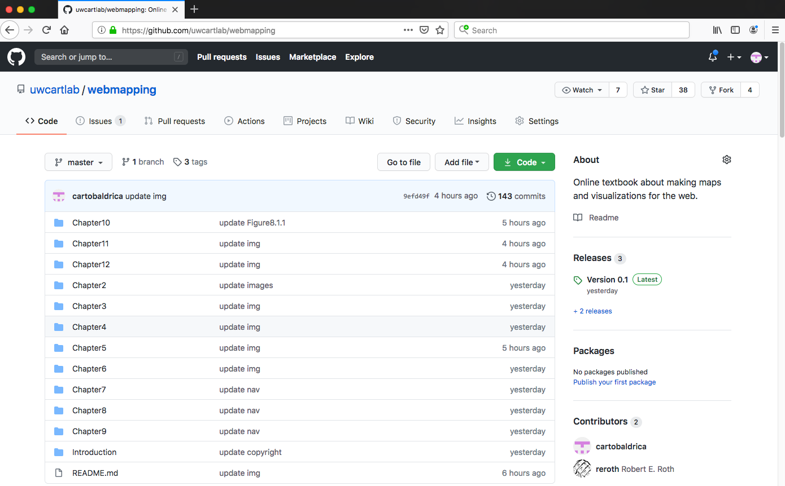
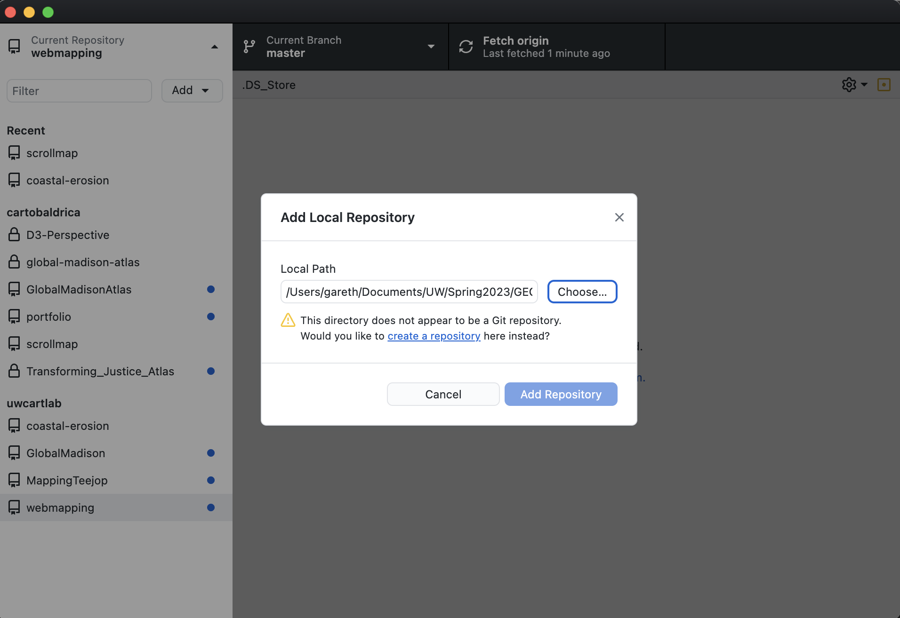
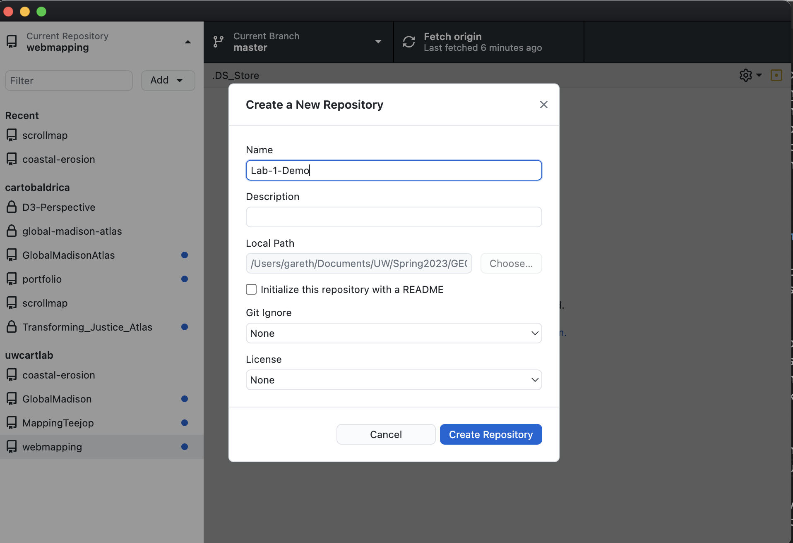
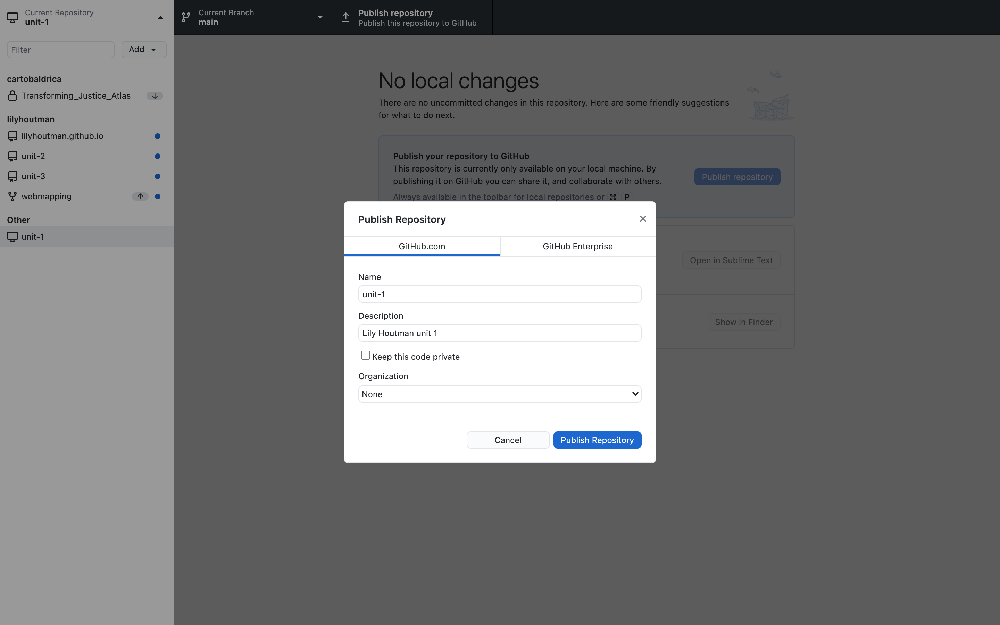

### [Return Home](../../../) | [Previous Chapter](../Introduction) | [Next Chapter](../Chapter02)

Chapter 1: Setting Up Your Workspace
=====================================

Welcome to the first chapter of Web Mapping! Chapter 1 includes three lessons and Activities 1 & 2:

*   In Lesson 1, we will introduce text editors and some basic "boilerplate" HTML used to structure your website.
*   In Lesson 2, we will discuss how to efficiently set up your web directory and host it through a localhost development server.
*   In Lesson 3, we will set-up a GitHub account you will use for cloud storage, version control, web hosting, and collaboration with other developers. If you already have used Github in other courses, this will be review. However, you still must commit a "repo" as part of the Activity 1, so please still read carefully.

After this chapter, you should be able to:

*   Set-up boilerplate for use as the base of your website
*   Build a website directory hosted on a localhost server
*   Create a GitHub repository for your website and sync it with your local directory

How to Read and Use the Lessons
-------------------------------

We break each chapter's material into a set of 3-4 lessons that you should complete sequentially, with many lessons having subsections that treat specific topics. All lessons are formatted the same way:

As you read, we include many [links](https://en.wikipedia.org/wiki/Hyperlink) that point to additional reference material. This material is for your reference only, and we recommend returning to these materials when you get stuck at different steps. Importantly, you may want to cycle back to these links towards the end of the course to debug issues specific to your final project, so it is helpful to get a sense of what information is included in the links.

> ### **Occasionally, a link does contain suggested reading, additional downloads, or specific tasks needed to complete the activities. We offset these required "actions" to make them visually obvious in the text. Please follow these directions carefully, as it will be difficult to advance in future lessons without first completing these tasks.**

    We format example code in code blocks, like this.  
    You can copy-paste this code into a text editor to make it easier to reference the line numbers.

We also include `in-line code` when referencing specific element tags, function and variable names, data values, etc. We _italicize_ the literal names of _directories_ and _files_. We **bold** and _italicize_ keywords on their first use.

We also recommend bookmarking the [W3Schools](http://www.w3schools.com/tags/default.asp) reference for a general reference on HTML, CSS, and JavaScript during the class. Also, continue to refer back to the Codecademy tutorials (Activity 2 below) as you practice your web mapping knowledge!

Lesson 1: The HTML Boilerplate
------------------------------

### I. HTML

All of your interactive mapping and visualization projects start with HTML. **_HTML_** stands for **H**yper **T**ext **M**arkup **L**anguage. We are now on the fifth revision of the HTML specification (hence **_HTML5_**). Although often referred to as “code” when used alongside CSS and other web scripting languages like JavaScript, HTML is not a programming language. It instead is a markup language composed of **_markup_** _**tags**_ that describe the content of a webpage. HTML therefore is said to “structure” otherwise unstructured text and image content, while CSS then “styles” this structure. The majority of HTML files are stored in plain text files with an ._html_ extension (e.g., _index.html_ below).

HTML **_tags_** are keywords composed of reserved words surrounded by angle brackets, such as `<html>` or `<body>`. Often these tags come in pairs designating an _**opening**_ `<html>` and _**closing**_ `</html>` tag; properly opened and closed tags are referred to as _**HTML elements**_. An HTML document is composed of HTML elements written in plain text using this tag notation. An HTML document therefore is synonymous with a webpage.

### II. Text Editors

_**Code**_ is just text that gets interpreted by various technologies (e.g., by a web browser for HTML) to complete actions or execute instructions. A _**text editor**_ is a software program that facilitates the writing of code. Text editors include features that support coding, such as color-coding reserved words in different code languages, automatically applying indentation and closing tags, and even live preview of the code. Text editors are regularly updated with new features, so it is worth continuously reviewing your choice of text editor. Popular text editors include [Visual Studio Code](https://code.visualstudio.com/), [Aptana Studio](http://www.aptana.com/), [Atom](https://atom.io/), [Brackets](http://brackets.io/), [Notepad++](https://notepad-plus-plus.org/), and [Sublime Text](http://www.sublimetext.com/).

You are welcomed to use your preferred text editor.

### III. The HTML Boilerplate

A _**boilerplate**_ is the minimum starter code needed to begin development.  For these lessons, we start with the basic _**HTML boilerplate**_ to simplify your early designs and focus on JavaScript. 

> ### **Download _[unit-1.zip](https://github.com/uwcartlab/unit-1)_ from the uwcartlab GitHub page by clicking "Code" then "Download ZIP". After placing the folder in your preferred location, unzip it, and in your text editor open _index.html_ from the _Chapter01_ folder.**

The HTML boilerplate code in _index.html_ should look like Example 1.1. Every component <ins>_must_</ins> be present in your _index.html_ file, except the `<!-- -->` comments and IE stylesheet check. Importantly: you must use _index.html_ as the name of the homepage to use the directory name as the endpoint of a web url. For instance [www.geography.wisc.edu/cartography/](http://www.geography.wisc.edu/cartography/) is the same as [www.geography.wisc.edu/cartography/index.html](http://www.geography.wisc.edu/cartography/index.html), but shorter and therefore preferred.

###### Example 1.1: Boilerplate code in _index.html_

    <!DOCTYPE html>
    <html lang="en">
        <head>
            <meta charset="utf-8">
            <meta name="viewport" content="width=device-width">
                <title></title>
    
            <!--put your external stylesheet links here-->
            <link rel="stylesheet" href="css/style.css">
            <!--[if IE<9]>
                <link rel="stylesheet" href="css/style.ie.css">
            <![endif]-->         
            <!--you can also place internal styles here;             
                place these within 
        
    </head>
    <body>
        

            Hello World!
        

    </body>
    

The result is a red rectangle 100 pixels high that takes up 80 percent of the page width, with no margin, as seen below (Figure 2.1).

###### Figure 2.1: The result of Example 2.1

You also can add a `
    

If you click on the div element in your browser, you should see:

###### Figure 2.2: The result of Example 2.2

### II. Directory Structure

For the real-world projects, internal `<style>` and `<script>` tags are much too limiting. Instead, separate the working pieces of your website into a well-organized _**directory structure**_ of files and folders to keep them neat and orderly. Like shelves in a closet, your directory structure is a strategy to keep things organized so you can find them later. You will thank yourself down the road if you begin with a good directory structure to hold and organize your files.

Generally speaking, we use the term "webpage" to describe a single HTML document and "website" to describe the entire directory structure.

> ### **In the _Chapter01_ folder of the _unit-1_ directory you downloaded, create the following folders:**
> 
> ### -   **js**
> ### -   **lib**
> ### -   **css**
> ### -   **data**
> ### -   **img**

Let's describe each of these folders in your directory structure:

*   _**js**_: This folder holds your custom JavaScript files, in which you will write the script to make your website—including its web map—dynamic and interactive.
    
*   _**lib**_: This folder holds any third-party JavaScript code libraries you choose to download and host. These will eventually include _Leaflet.js_, _D3.js_, and potentially others. Some code libraries come with their own CSS stylesheets and images; leave these within the library's directory and place the entire directory within the lib folder to avoid confusion.
    
*   _**css**_: This folder holds your custom CSS stylesheets.
    
*   _**data**_: This folder holds data files used to create your thematic web maps, and thus is not necessary for all websites.  The _data_ folder can hold CSV, GeoJSON, and other open formats that we will cover later. If you ever need to include Esri Shapefiles in your website, place these in a _shapefiles_ subdirectory of the data folder since a shapefile in itself is technically a file directory just like a website.
    
*   _**img**_: This folder holds any images used in your website.
    
Notice that the boilerplate _index.html_ file already contains two links to external files. You now can create these files using your text editor. First, create a new file and save it into the _css_ folder as _style.css_. Next, create _main.js_ in the _js_ folder, again adding a byline comment. We recommend that you put a comment as the first line of code in each file declaring your authorship (Example 2.3), since later you will be sharing this file online through GitHub:

###### Example 2.3: Authorship comment in _style.css_

    /* Stylesheet by Buck E. Badger, 2022 */

Next, add a _readme.md_ file to your _lib_, _data_, and _img_ folders. For a real project, you would include relevant files in these folders. For now, a _readme.md_ file will ensure your folders show up on GitHub (Lesson 3).

If you are unsure if you have created these files correctly, navigate to the _boilerplate_ folder of [_unit-1_](https://github.com/uwcartlab/unit-1/tree/master/boilerplate) and compare your folder to this example. Do not edit the files in your _boilerplate_ folder. You will copy this folder at the start of each unit.

> ### **Create _style.css_ and _main.js_ text files and save into the _css_ and _js_ folders of _unit-1_ respectively. Add a _readme.md_ file to all other folders.**

### III. Setting up a Development Server

As you develop your website, you will need to preview it in a browser to see what it looks like and to use the browser's helpful set of developer tools. While you can just double-click on the simple HTML examples above for preview in a browser, most websites are accessed over the internet using a server. A **_server_** is a piece of software that sends data to a browser over the internet. Figure 2.3 shows a basic server-client architecture, in which the client requests files from your website directory and the server sends them as requested. A server may be across the room, across the country, or even on the other side of the world.

###### Figure 2.3: Client-server architecture

For security reasons, browsers <ins>_only_</ins> display webpages correctly if the files are passed through a server. This complicates development, as you do not want to push every change to your website to a server just to preview it. However, you can set up a _**local development server**_ on your machine to reliably preview dynamic content such as JavaScript before you post online. As with text editors, there are many options for setting up a local development server, with many common ones requiring additional programming knowledge such as Python SimpleHTTPServer and server frameworks including [WAMP](http://www.wampserver.com/en/) (for Windows), [MAMP](https://www.mamp.info/en/) (for Mac), and [LAMP](http://lamphowto.com/) (for Linux).

We use [Prepros](https://prepros.io/) in lesson examples for simplicity. Prepros is a "preprocessor" software application that automatically compiles your website and refreshes the browser every time you save files in your web directory. Prepros works on Windows and Mac machines. If you're using [Visual Studio Code](https://code.visualstudio.com/), you can install the Live Server extension, which performs the same function. 

> ### **Preview _unit-1_ using Prepros or Visual Studio Code.** 

Lesson 3: GitHub Setup
----------------------

### I. What is GitHub?

_**[GitHub](https://github.com/)**_ is a website and project hosting service that uses the [Git](http://git-scm.com/) version control system. _**Git**_ takes a snapshot of your files at a given time, creating a backup that can be shared collaboratively when multiple developers are coding at the same time (e.g., your final project). GitHub provides an online suite of tools for cloud storage, sharing, collaboration, and hosting of your projects. It has become standard practice for open-source software developers to keep their projects on GitHub, and you will find yourself accessing various repositories or **_repos_** (i.e., web directories) on GitHub as your development experience grows. For example, the Web Mapping workbook materials are hosted at [https://github.com/uwcartlab/webmapping](https://github.com/uwcartlab/webmapping) (Figure 3.1):

###### Figure 3.1: The GitHub repository for this workbook

Let's begin with some basic GitHub terminology. You can refer back to these definitions if you are confused during these lessons, or use the [GitHub Glossary](https://docs.github.com/en/github/getting-started-with-github/github-glossary) to look up additional terms.

*   _**[Repository](https://help.github.com/en/github/getting-started-with-github/github-glossary#repository):**_ A repository is the most basic element of GitHub. They are easiest to imagine as a project's folder. A repository contains all of the project files (including documentation), and stores each file's revision history. Repositories can have multiple collaborators and can be either public or private.
*   _**[Clone](https://help.github.com/en/github/getting-started-with-github/github-glossary#clone):**_ A clone is a copy of a repository that lives on your computer instead of on a website's server somewhere, or the act of making that copy. With your clone, you can edit the files in your preferred editor and use Git to keep track of your changes without having to be online. It is, however, connected to the remote version so that changes can be synced between the two.
*   _**[Commit](https://help.github.com/en/github/getting-started-with-github/github-glossary#commit):**_  A commit, or "revision", is an individual change to a file (or set of files). A commit is like when you _save_ a file, except with Git, every time you save it creates a unique ID (a.k.a., the "SHA" or "hash") that allows you to keep record of what changes were made when and by whom. 
*   _**[Push](https://help.github.com/en/github/getting-started-with-github/github-glossary#push):**_ Pushing refers to sending your committed changes to a remote repository, such as a repository hosted on GitHub. For instance, if you change something locally, you then _push_ those changes so that others may access them.

The way Git works can be a bit confusing, even after repeated use, as it is different from your prior experience uploading and downloading files from a website through your browser. Git first creates a repository _within_ your website directory, rather than uploading an existing, local directory online. While you can see your files in the remote repository through the GitHub website, you do not use the browser to access them. Rather, the original files sit in the website directory you created on your own machine, and you sync or **_push_** those files to the remote GitHub repository whenever you make changes. 

If you are collaborating on a project with someone else, they can **_clone_** your repository from GitHub to their own machine, make changes to website files, then submit a **_pull request_** asking you to add changes back to the main repository. You can then sync or _pull_ their changes from their repository to the main repository and from there into your local website directory. Again, there are several options for using Git and GitHub collaboratively, some using command line and thus providing more control over the push, clone, and pull commands (e.g., [Git Bash](https://git-scm.com/downloads)).

For simplicity, we use [GitHub Desktop](https://desktop.github.com/) in lesson examples. GitHub Desktop is more beginner-friendly than alternatives and meshes well with the GitHub website. However, it can be difficult to make sense when something goes wrong in GitHub Desktop, sometimes requiring deleting and recreating the repo; do such destructive rebuilding only after exhausting alternatives. GitHub Desktop works on Windows and Mac machines.

### II. Setting Up a Repository

> ### **Create a GitHub account if you do not have one. Then, create a _unit-1_ repository.**

The first step to setting up GitHub is to create a GitHub account, if you do not already have one. Go to [https://github.com/](https://github.com/), enter a username, e-mail, and password, and click "Sign up for GitHub."

Then open GitHub Desktop and log in. Click "Current repository" in the upper-left corner of the application, then click "Add" and choose "Add existing repository...". Choose your _unit-1_ folder. You will then get a warning saying that there is no repository in the selected folder. That's OK! There is a tiny blue link that says "create a repository" (shown underlined in Figure 3.2), click it.

###### Figure 3.2: Creating a repository in your _unit-1_ directory

A new window will pop up (Figure 3.3). There, enter the name of your website, and click "Create repository". 

###### Figure 3.3: Setting up your _unit-1_ repository.

Once you have created the repository, open your the _unit-1_ directory on your machine and observe that three new files have been created (Figure 3.4):

*   **._git_**, a hidden folder that holds the snapshots of your files,
    
*   **._gitattributes_**, a file specifying settings for the repository, and
    
*   **._gitignore_ (optional)**, a file that lists files in the directory that should not be tracked by the repository.
    
Note, if you are using a Mac, these files may be hidden. You can view hidden files by pressing `command-shift-dot`.

###### Figure 3.4: Website directory with repository files

<ins>_Never_</ins> tamper with the directories and files inside of the _.git_ folder, and for the most part you will not need to modify directly the other GitHub files in this class. You can change settings and add to the _.gitignore_ file through the GitHub application gear menu→"Repository" settings in the upper-right corner of the application window. You also can sign in to GitHub, manage your account, and configure Git through the gear menu→"Options". 

Next, you need to publish your repository to GitHub. At the top of the page click "Publish repository". Name the repository _unit-1_ and add your name and "unit 1" as the description. Uncheck "Keep this code private" so others can see your repository. Finally, click "Publish Repository".

###### Figure 3.5: Publishing a repository from GitHub Desktop

You should end up with both a local repository in your website directory and a copy of the repository on your GitHub web page. Note that it is also possible to work in reverse order by creating a new repository on the GitHub website and then copying it over (i.e., _clone_ it) to your machine. The GitHub [Hello World Guide](https://guides.github.com/activities/hello-world/) provides details on this reverse process for future reference. We will return to this process in Activity 7.

When you are just figuring things out, you are likely to end up with one or two repositories on GitHub that you will not actually need in the future. When you are sure you no longer need a repository, you can delete it from GitHub by navigating to the repository web page, clicking the "Settings" link on the right-hand side, scrolling down to the "Danger Zone" at the bottom of the page, and clicking "Delete this repository." The GitHub crew was nice enough to take precautions to ensure that you _really_ want to delete the repository before you do it. Thus, be absolutely sure you do not need the repository again, and that no one else is contributing to it, before you delete.

### III. Learning and Using GitHub

There are a number of excellent [GitHub Guides](https://guides.github.com/) beyond the introductory guide required above. We recommend that you reference these as you build experience with GitHub. We will use most or all of the covered skills in the following lessons.

From this point, though, the key to becoming comfortable with GitHub is to use it often. This means that _every time you make a working change to your website files, you should commit your changes to your local repository and sync it with the repository on GitHub._ Working on these lessons with GitHub starts to build a public track record of your work that future employers may look at. Thus, **commit frequently and wisely**!

## Activity 1

1.  Create a website directory called _unit-1_ with an organized directory structure and boilerplate _index.html_, _style.css_, and _main.js_ files.
2.  Create a Git repository in your website directory and sync it to your GitHub account.
3.  For UW-Madison students: Submit a zip file (.zip) containing your website directory to Canvas. In the submission comments, paste a link to your GitHub account page.

## Activity 2

1.  **_Required_**: Navigate to codecademy.com and create a free account. Do _<ins>not</ins>_ sign-up for the Pro paid account.
2.  _Recommended_: If you do not have any programming experience, we recommend first completing the [Learn How to Code](https://www.codecademy.com/learn/learn-how-to-code) broad overview of programming concepts (~1 hour).
3.  _Recommended_: If you do not have experience with HTML or want a refresher, we recommend completing Lesson 1 (and only Lesson 1) of the [Introduction to HTML tutorial](https://www.codecademy.com/learn/learn-html). (~1 hour)
4.  _Recommended_: If you do not have experience with CSS or want a refresher, we recommend completing Lessons 1 and 2 of the [Introduction to CSS tutorial](https://www.codecademy.com/learn/learn-css). (~2 hours)
5.  **_Required_**: Complete Lessons 2 (Introduction), 3 (Conditionals), 4 (Functions), and 7 (Loops) of [Introduction to JavaScript](https://www.codecademy.com/learn/introduction-to-javascript). For UW-Madison students: Print a PDF (Ctrl+P in browser; save as a PDF) of your completed table of contents for these tutorials and upload to the Activity 2 assignment to confirm completion. (~8 hours)
6.  _Recommended_: Complete Lessons 5 (Scope), 6 (Arrays), 8 (Iterators), and 9 (Objects) of [Introduction to JavaScript](https://www.codecademy.com/learn/introduction-to-javascript). We will introduce and review these concepts in depth in subsequent lessons, so these tutorials are helpful but not essential foundation. (~8 hours)

_This work is licensed under a [Creative Commons Attribution 4.0 International License](http://creativecommons.org/licenses/by/4.0/).   For more information, please contact Robert E. Roth \(reroth@wisc.edu\)._

### [Return Home](../../../) | [Previous Chapter](../Introduction) | [Next Chapter](../Chapter02)

