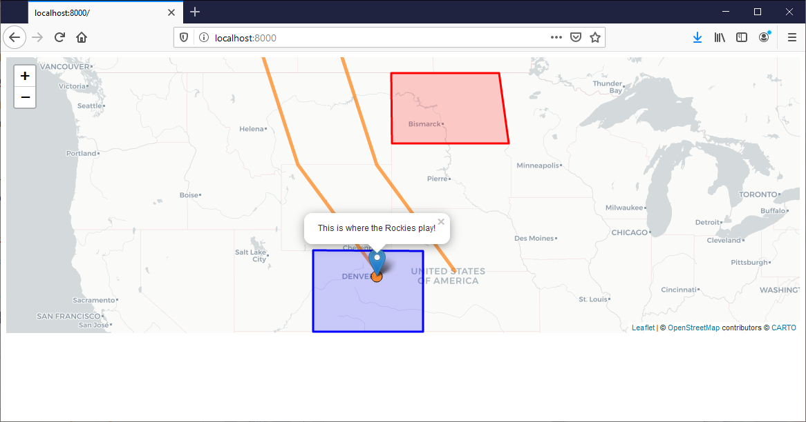
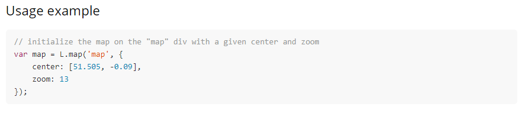
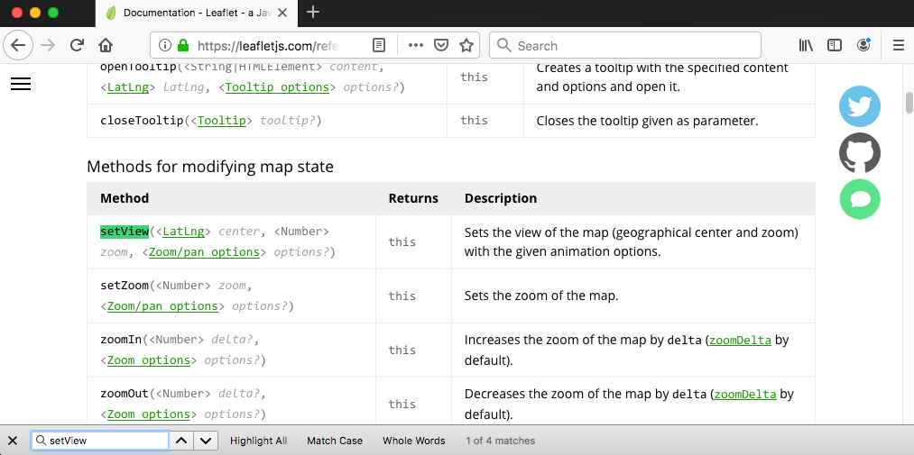
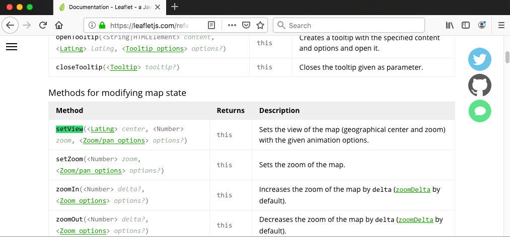
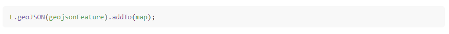
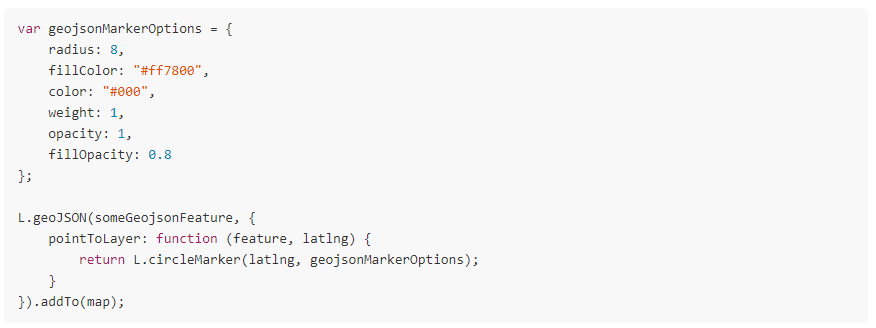
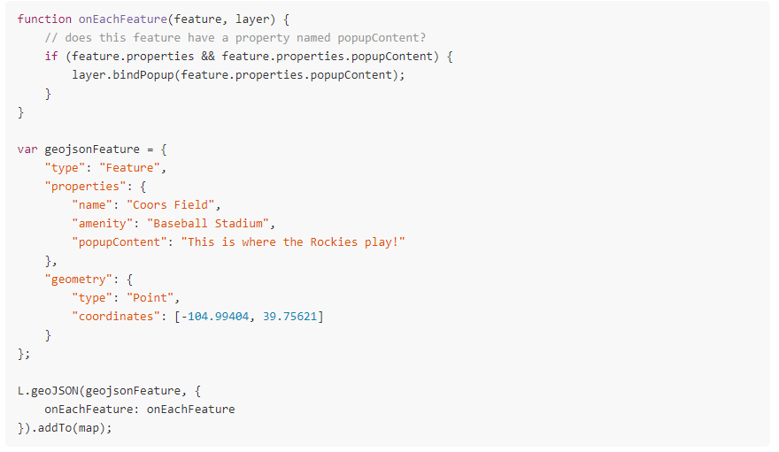
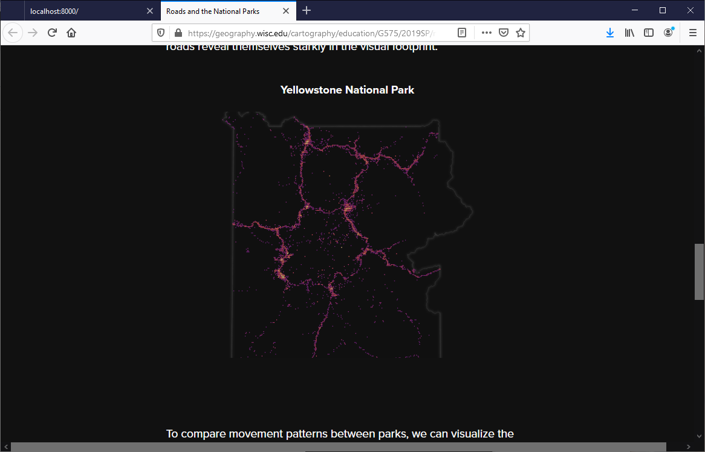
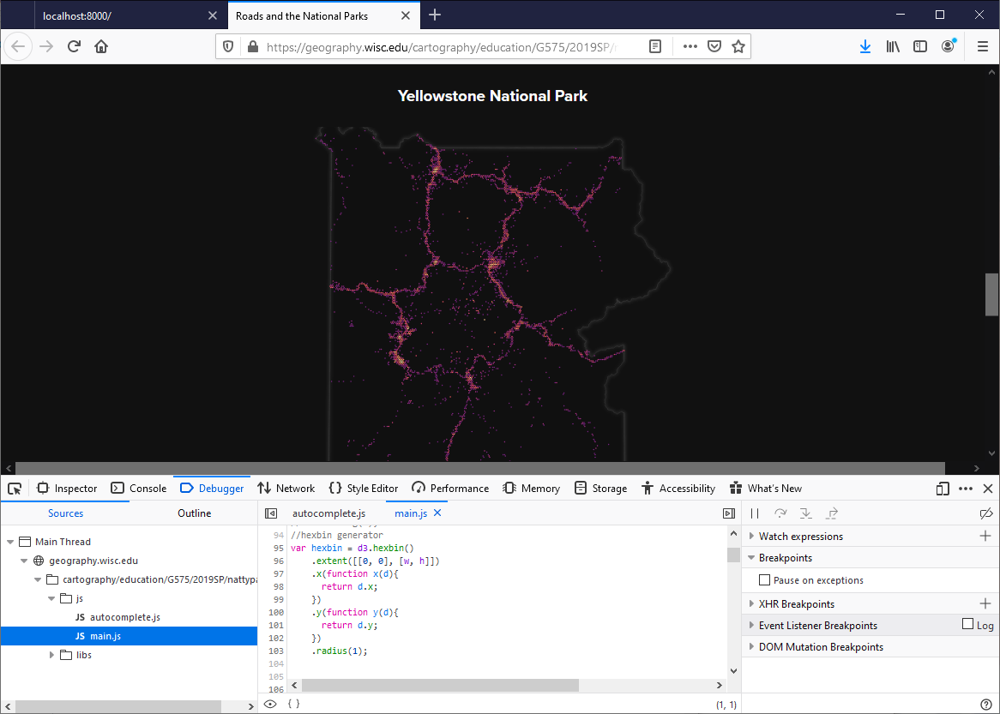
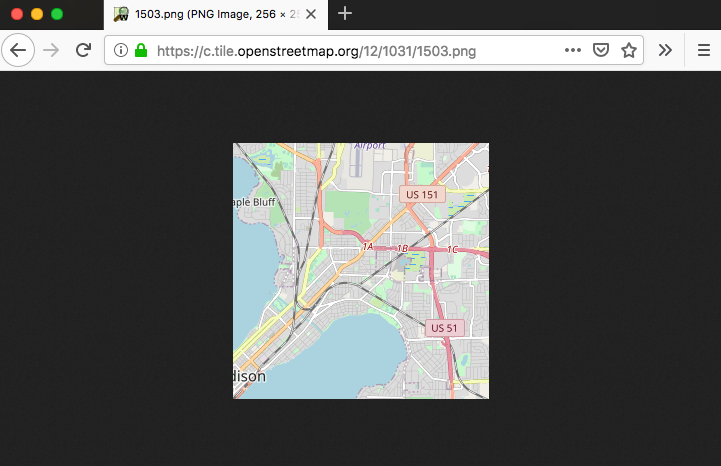

### [Return Home](../../../) | [Previous Chapter](../Chapter03) | [Next Chapter](../Chapter05)

Chapter 4: Leaflet Foundation & Using Online Resources
=====================================================

Chapter 4 transitions into the second unit for Web Mapping, which supports your Leaflet lab assignment. With a solid foundation behind you, it is time to make your first interactive web map! Chapter 4 includes four lab lessons and ends with Activity 5 requiring you to compile and map spatiotemporal data onto a slippy basemap using Leaflet. js.

*   In Lesson 1, we introduce the Leaflet open source code library and API documentation, having you complete two tutorials available through the Leaflet website that provide essential background on Leaflet.
*   In Lesson 2, we discuss how to integrate example code into your interactive web map, adapting several of the Leaflet tutorial scripts to map the _MegaCities.geojson_ file you prepared in Chapter 3.
*   In Lesson 3, we review useful resources for obtaining help from the open source software community when you are stuck on a problem.
*   In Lesson 4, we provide guidance for finding basemap tilesets and thematic overlay data. Lessons 3 and 4 are short, and provide some general guidance as you begin your first interactive web map.

After this chapter, you should be able to:

*   Read and understand API documentation for Leaflet and other JavaScript code libraries
*   Adapt examples of a problem solution to work with your custom code
*   Use online forums to seek help on problems from the open source community
*   Find appropriate data and tilesets for your Leaflet lab

Lesson 1: Leaflet Tutorials and API Documentation
-------------------------------------------------

### I. Free and Open Source Software (FOSS)

_**FOSS**_ stands for ***F***ree and ***O***pen ***S***ource ***S***oftware. Let's consider each of the components of FOSS:

*   _**Free**_ has two meanings to FOSS developers: free as in **_libre_**, or without restriction, and free as in **_gratis_**, or without cost. Free as in _libre_ has four components according to the [manifesto](https://www.gnu.org/philosophy/free-sw.html) of the Free Software Foundation:
    
    *   _Freedom to run the program as you wish, for any purpose._
    *   _Freedom to study how the program works, and change it so it does your computing as you wish._
    *   _Freedom to redistribute copies so you can help your neighbor._
    *   _Freedom to distribute copies of your modified versions to others. By doing this you can give the whole community a chance to benefit from your changes._
    
    Free as in  _libre_ enables FOSS developers to innovate through collective sharing in a way not possible with _**proprietary software**_ that is owned privately with its source code hidden as a trade secret. It is common for FOSS software like Leaflet to have dozens or even hundreds of contributors.
    
    The second meaning—free as in _gratis_—does not necessarily pertain to FOSS software. Companies can and do sell open-source software, often along with extended support provided by expert technicians they employ. That said, many FOSS code libraries—such as Leaflet—_are_ available to download and use free of charge, with the hope that users will contribute back to the project by making a monetary donation, suggesting improvements in the code, or simply promoting its use to others.
    
*   _**Open source**_ means that the source code is accessible to anyone who buys or downloads the software and can be reverse-engineered and modified to fit the needs of the user. In keeping with the four freedoms, the user also can redistribute copies of the software, modified or not. Leaflet's source code is the JavaScript of the library itself.
    
*   _**Software**_ is a set of machine-readable instructions that directs a computer's processor to perform specific operations. Thus, an interactive web map technically is lightweight software.
    

The idea of FOSS challenges campus ideas of plagiarism. In the context of FOSS software, not only may you download or copy pieces of code from the Internet to use in your own programming, <ins>_you are encouraged to do so_</ins>. However, make sure to give appropriate credit to the original author(s) of the code you reuse

### II. Introduction to Leaflet

_**[Leaflet](http://leafletjs.com/)**_ is an open-source JavaScript web mapping library. Leaflet is designed to make use of pre-rendered raster map tilesets and includes methods for geospatial data overlays and cartographic interactions. Interactive web maps using tilesets often are referred to as **_slippy maps_** given their ease in dragging to _pan_ across map tiles. The design of web maps to include a tileset base with vector overlays often is described as _**hamburger cartography**_.

The Leaflet library is available through the [Download](http://leafletjs.com/download.html) tab and includes four files as a zipped directory:

*   _leaflet.js: a_ minified version of the JavaScript code
*   _leaflet-src.js:_ a human-readable version of the JavaScript code with line breaks and indentation
*   _leaflet.css_: a stylesheet for using Leaflet
*   _images_: a subdirectory that includes images for standard Leaflet controls a CSS stylesheet, and an _images_ subdirectory

It is standard practice to include either _leaflet.js_ or _leaflet-src.js_ in the _lib_ folder of your website, but not both. We also recommend leaving the _leaflet.css_ file and _images_ subdirectory in your _lib_ folder, rather than reorganizing into the _css_ and _img_ folders of your website, to keep your original assets separate and avoid breaking references within the Leaflet library.

> ### **Create a local repository on your machine called _unit-2_. Copy a clean version of the HTML boilerplate from your _unit-1_ directory into your _unit-2_ directory. If you lost or edited the boilerplate, you can [download a clean version](https://github.com/uwcartlab/unit-1). Download [Leaflet](http://leafletjs.com/download.html), unzip it, and place the Leaflet directory into your _lib_ folder. Add a link to the _leaflet.css_ file in the `<head>` of your _index.html_ file and a script link to _leaflet-src.js_ in the `<body>`, deleting _leaflet.js_ from your _lib_ folder to use the human-readable version for this unit. Be sure to place any script links <ins>_above_</ins> the link to your _main.js_ file in the `<body>` of your _index.html_ file. Push the _unit-2_ repository to GitHub.**

With Leaflet "installed", let's take a look at some of the resources provided on the website to get started. The [Tutorials](http://leafletjs.com/examples.html) tab includes over a dozen helpful tutorials written at a beginner-level in web mapping but assuming some prior knowledge of HTML, CSS, and JavaScript. You will review two tutorials within this lesson: [_Leaflet Quick Start Guide_](http://leafletjs.com/examples/quick-start.html) and [_Using GeoJSON with Leaflet_](http://leafletjs.com/examples/geojson.html). These tutorials are excellent, and so we rely on them in the following instructions rather than replicating.

> ### **Read and follow the instructions in the [_Leaflet Quick Start Guide_](http://leafletjs.com/examples/quick-start.html) tutorial. Save your script from the tutorial in a file called _quickstartTutorial.js_ and place it in your _unit-2_ _js_ folder.**

Your script should look approximately like Example 1.1 after completing the _Leaflet Quick Start Guide_.

###### Example 1.1:  Script from the _Leaflet Quick Start Guide_ tutorial in _quickstartTutorial.js_

    /* Example from Leaflet Quick Start Guide*/
    
    var map = L.map('map').setView([51.505, -0.09], 13);
    
    //add tile layer
    L.tileLayer('https://tile.openstreetmap.org/{z}/{x}/{y}.png', {
       maxZoom: 19,
       attribution: '&copy; <a href="http://www.openstreetmap.org/copyright">OpenStreetMap</a>'
    }).addTo(map);
    
    var marker = L.marker([51.5, -0.09]).addTo(map);
    
    var circle = L.circle([51.508, -0.11], {
        color: 'red',
        fillColor: '#f03',
        fillOpacity: 0.5,    radius: 500
    }).addTo(map);
    
    var polygon = L.polygon([
        [51.509, -0.08],
        [51.503, -0.06],
        [51.51, -0.047]
    ]).addTo(map);
    
    marker.bindPopup("<strong>Hello world!</strong> I am a popup.").openPopup();
    circle.bindPopup("I am a circle.");
    polygon.bindPopup("I am a polygon.");
    
    var popup = L.popup()
        .setLatLng([51.5, -0.09])
        .setContent("I am a standalone popup.")
        .openOn(map);
    
    var popup = L.popup();
    
    function onMapClick(e) {
        popup
            .setLatLng(e.latlng)
            .setContent("You clicked the map at " + e.latlng.toString())
            .openOn(map);
    }
    
    map.on('click', onMapClick);

When completing the tutorial, be sure to add a `
` element with the `id "map"` to the `<body>` of your _index.html_ file, and assigned a `height` to `#map` in your _style.css_ stylesheet. Figure 1.1 illustrates the expected slippy map resulting from the _Leaflet Quick Start Guide_.

###### Figure 1.1: An example slippy map created during the _Leaflet Quick Start Guide_ tutorial

Leaflet.js is the foundation for Mapbox.js, maintained by a large web mapping company of the same name, and the original developer of Leaflet (Vladimir Agafonkin) is now a software engineer for Mapbox. 

The basemap in the example is called a _tileset_. There are a number of open tilesets that you can use in your Leaflet maps. The example uses an openstreetmap tileset from the [Leaflet-providers preview website](http://leaflet-extras.github.io/leaflet-providers/preview/), as shown in Example 1.2.

###### Example 1.2: Tile layer with an OpenStreetMap tileset in _main.js_

    //Example 1.1 line 5...add tile layer
    L.tileLayer('http://{s}.tile.openstreetmap.org/{z}/{x}/{y}.png', {
        attribution: '&copy; <a href="http://www.openstreetmap.org/copyright">OpenStreetMap contributors</a>'
    }).addTo(map);

For tilesets, the URL string for the tile layer has some special characters in it. The URL format reflects the standardized structure of slippy map tilesets, which consist of 256x256 pixel images in a set of nested subdirectories on the tile server. Tileset URL variables include:

*   `{z}` represents the zoom level, typically a number between 0 (very small scale; the entire globe should be visible in the browser window) and 22 (very large scale)
*   `{x}` is the horizontal coordinate, numbered left-to-right starting from 0 at the western boundary of the tileset
*   `{y}` is the vertical coordinate, which also forms the root filename of each tile image, numbered from the top (north) edge of the tileset down

> ### **After getting a basic slippy map to load, complete the [_Using GeoJSON with Leaflet_](http://leafletjs.com/examples/geojson.html) tutorial. You'll have to copy the code for the tileset and _map_ object from the _Leaflet Quick Start Guide_. Save your script from the tutorial in a new file called _geojsonTutorial.js_, placing it in your _unit-2_ _js_ folder.**

The second tutorial integrates GeoJSON data—introduced last chapter—with your slippy map via Leaflet's `L.geoJson()` method. Note that the examples given by the tutorial utilize GeoJSON `features` arrays assigned to variables, rather than a `FeatureCollection` object imported via AJAX. 

Figure 1.2 illustrates the expected slippy map resulting from the _Using GeoJSON with Leaflet_ tutorial. Lesson 2 describes how to integrate your GeoJSON data imported via AJAX with the `L.geoJson()` method.

###### Figure 1.2: An example slippy map created during the _Using GeoJSON with Leaflet_ tutorial

### III. Leaflet API Documentation

You used several Leaflet methods in the pair of tutorials to create the example slippy map with minimal discussion of how each method works and, more importantly, how each method can be customized to support your design vision. The [Leaflet API Documentation](https://leafletjs.com/reference-1.6.0.html) provides a comprehensive overview of the Leaflet methods and their syntax.

An ***API*** or ***A***pplication ***P***rogramming ***I***nterface describes the functional utility of a code library or software that is exposed for use by developers. The API _**documentation**_ is like a dictionary that defines the available functions. You already used JavaScript API documentation through [W3Schools](http://www.w3schools.com/jsref/default.asp) and the [Mozilla Developer Network](https://developer.mozilla.org/en-US/docs/Web/JavaScript/Reference). While essential for developing on the opening web, learning to read and understand the documentation can be a challenging skill to acquire, perhaps akin to learning to read scientific papers if you are used to writing for the humanities, and vice versa.

In general, API documentation provide:

*   a description of what the expression does
*   a demonstration of the syntax for its use, with variable values identified by a consistent formatting convention
*   descriptions of each parameter
*   examples of the expression in use

Leaflet's API documentation is organized as one long webpage, making it convenient to find a specific method using the browser Ctrl/Command+F feature. The Leaflet API documentation includes a persistent table of contents referencing different page sections (Figure 1.3).

###### Figure 1.3:The Leaflet API documentation.

Let's examine the Leaflet methods from the two tutorials you completed using the API documentation. The first method in the _Leaflet_ _Quick Start Guide_ is `L.map()` (Example 1.3). Note that the expression above also includes the `setView()` method, chained to `L.map()` with dot syntax, and assigns the returned value of both methods to the variable `map`.

###### Example 1.3: Using the Leaflet methods `L.map()` and `.setView()` in _quickstartTutorial.js_

    var map = L.map('map').setView([51.505, -0.09], 13);

Let's take a look at [`L.map()`](http://leafletjs.com/reference.html#map-example) in the API. The first line under the section titled "Map" describes the method's parent class (`Map`), "\[t\]he central class of the API — it is used to create a map on a page and manipulate it". Definition of [`L.map()`](http://leafletjs.com/reference.html#map-example) begins with a "Usage example" (Figure 1.4).

###### Figure 1.4: Example map instantiation script in the Leaflet API documentation

Note the difference between this usage of the method and its usage in the _Leaflet Quick Start Guide_ (Example 1.1, line 3). Figure 1.4 shows two parameters: a string (`'map'`) and an object consisting of a `center` property with an array of two coordinates (`[51.505, -0.09]`) and a `zoom` property with a number (`13`). To understand what these parameters do, examine the syntax demonstration under "Creation" (Figure 1.5).

###### Figure 1.5: Definition and syntax of `L.map()` in the Leaflet API documentation

The "Factory" column demonstrates the method, with:

*   the characters that must be added to the script verbatim in black, regular font,
*   each parameter, with the parameter's data type enclosed by carats (`<type>`; the | character means "or") and the parameter's name in green, italic font
*   a link to the section describing the object properties available for use in the _options_ object
*   a question mark after the parameter name denoting any optional parameters

The "Description" column describes in plain English what the method does. This tells you that the _id_ parameter is the `id` attribute value of an HTML `
` element that will contain the map, and the _options_ parameter is an optional (i.e., not required) object with properties for the map state options described in the next section.

The "Options" section (Figure 1.6) includes all of the options available as properties of the _options_ parameter object, organized neatly as tables categorized as "Map State Options", "Interaction Options", "Keyboard Navigation Options", "Panning Inertia Options", "Control Options", and "Animation Options". Thus, these options set and constrain the cartographic interaction.

###### Figure 1.6: Map options presented in the Leaflet API documentation

Notice that `center` and `zoom` are the first two options in the Map State Options table. The "Type" column lists the type of value for each property, with types specific to Leaflet linked to the section that describes them. The "Default" column lists any default value implemented by Leaflet unless another value is substituted, and shows `null` if there is no default value. Note that `center` is a Leaflet [`LatLng`](http://leafletjs.com/reference.html#latlng) object—which can take the form of a two-value `[latitude, longitude]` array, a plain object with `lat` and `lng` properties, or an object formed from the `L.latLng()` method—and `zoom` is a number representing the initial zoom level of the map.

Returning to the first line of the _Leaflet Quick Start Guide_ (Example 1.3), we see that `L.map()` includes only the first, required parameter—the `id` of the `
` designated to contain the map—and forgoes the _options_ object. However, it is chained to the `setView()` method, which contains two parameters: a two-value array and a single number. We quickly can lookup the `setView()` method using Ctrl/Command+F (Figure 1.7).

###### Figure 1.7: Definition and syntax of `setView()` method in the Leaflet API documentation

The `setView()` method is located under "Methods for Modifying Map State" and, based on the description, "Sets the view of the map (geographical center and zoom) with the given animation options." Basically, it does _exactly the same thing_ as the `center` and `zoom` options! There is another optional _options_ object that can be added as the third parameter, with a much more restricted set of options than available to the `L.map()` method, but it is not included in the tutorial example. However, Leaflet <ins>_requires_</ins> a starting center and zoom for any new map using either the `L.map()` _options_ object or `setView()`.

### IV. Understanding Inheritance in the Leaflet API

Next, let's look at the `L.tileLayer()` and `.addTo()` methods. `L.tileLayer` takes two parameters: a tileset URL (already discussed above) and an _options_ object containing properties for the `TileLayer` options. The `.addTo()` method is an _**inherited**_ method of `TileLayer` from the `Layer` class, meaning it is a common to every type of layer in Leaflet that adds a given layer to the map. The `.addTo()` method can be chained onto a method creating a new layer (such as `L.tileLayer()`), or called on a variable to which the new layer is assigned (Example 1.4).

###### Example 1.4: Adding a tile layer using a variable and the `addTo()` method in _quickstartTutorial.js_

    //Example 1.1 line 5...add tile layer
    L.tileLayer('http://{s}.tile.openstreetmap.org/{z}/{x}/{y}.png', {
        attribution: '&copy; <a href="http://www.openstreetmap.org/copyright">OpenStreetMap contributors</a>'
    }).addTo(map);
    
    tileLayer.addTo(map);

Let's take a look at the Leaflet API documentation for some of the methods used in the _Using_ _GeoJSON with Leaflet_ tutorial. The [`L.geoJson()`](http://leafletjs.com/reference.html#geojson) method represents a GeoJSON object or an array of GeoJSON objects and _**extends**_ the `FeatureGroup` class, meaning GeoJSON inherits methods and properties from [`FeatureGroup`](https://leafletjs.com/reference-1.6.0.html#featuregroup). A `FeatureGroup` in turn extends the [`LayerGroup`](https://leafletjs.com/reference-1.6.0.html#layergroup) class, which groups multiple Leaflet layers and handles them as if they were one layer. Think of GeoJSON, `FeatureGroup`, and `LayerGroup` as nested objects in a Venn diagram (Figure 1.8). In practical terms, such inheritance means that a GeoJSON layer can use any of the options, methods, or events specified in GeoJSON, `FeatureGroup`, and `LayerGroup`.

We will return to classes and inheritance as key concepts in object-oriented programming in Chapter 6.

###### Figure 1.8: Types of Leaflet layer groups

Based on the discussion in this lesson, you should now be able to review all of the methods used in the _Leaflet Quick Start Guide_ and _Using_ _GeoJSON with Leaflet_ tutorials using the Leaflet API documentation. Note that the [`.on()`](https://leafletjs.com/reference-1.6.0.html#evented) method works similarly to the `onEachFeature` method that we used in Week 2, but with a wider range of events available to it. 

> ### **Using the Leaflet API documentation page, find and read the description of each method used in the _Leaflet Quick Start Guide_ and _Using_ _GeoJSON with Leaflet_ tutorials. Add a comment for each method in your _quickstartTutorial.js_ and _geojsonTutorial.js_ files, describing in your own words what each method does.**

Lesson 2: Using Examples
------------------------

### I. Adapting Examples

Making use of tutorial examples requires figuring out how to integrate them into your own code. This can be tricky if you are not used to reading JavaScript. Let's return to the [_Using GeoJSON with Leaflet_](http://leafletjs.com/examples/geojson.html) tutorial and see how we can integrate it with the _MegaCities.geojson_ file from last chapter. 

> ### **Copy _MegaCities.geojson_ from _unit-1_ into the _data_ folder of your _unit-2_ _data_ website directory. Copy the _geojsonTutorial.js_ file in the _js_ folder of your _unit-2_ directory, which contains the working code from the second Leaflet tutorial, and rename the copy _adaptedTutorial.js_. Add a script link to _adaptedTutorial.js_ in _index.html_.**

The _Using GeoJSON with Leaflet_ tutorial makes use of single GeoJSON features for its data (Figure 2.1).

###### Figure 2.1: Creation of a GeoJSON feature in the _Using GeoJSON with Leaflet_ tutorial

This object represents a point feature, essentially equivalent to one element in our `FeatureCollection` in _MegaCities.geojson_ (Example 2.1).

###### Example 2.1: A GeoJSON feature in _MegaCities.geojson_

    {
        "type": "Feature",
        "properties": {
            "City": "Tokyo",
            "Pop_1985": 30.30,
            "Pop_1990": 32.53,
            "Pop_1995": 33.59,
            "Pop_2000": 34.45,
            "Pop_2005": 35.62,
            "Pop_2010": 36.83,
            "Pop_2015": 38
        },
        "geometry":{
            "type": "Point",
            "coordinates": [139.8089447, 35.6832085]
        }
    },

The _Using GeoJSON with Leaflet_ tutorial then maps the feature using the `.addTo()` method (Figure 2.2).

###### Figure 2.2: Script from the _Using GeoJSON with Leaflet_ tutorial to add the feature to the map

While the `geojsonFeature` variable is hard coded in the _Using GeoJSON with Leaflet_ tutorial, we can instead load our _MegaCities.geojson_ data dynamically using what we learned about AJAX last chapter! Example 2.2 loads _MegaCities.geojson_ once the Leaflet `map` is ready using `fetch()`.

###### Example 2.2: Loading _MegaCities.geojson_ data with AJAX and adding it to a Leaflet map in _adaptedTutorial.js_

        //load the data
        fetch("data/MegaCities.geojson")
            .then(function(response){
                return response.json();
            })
            .then(function(json){
                //create a Leaflet GeoJSON layer and add it to the map
                L.geoJson(json).addTo(map);
            })

Example 2.3 shows the complete code needed in _adaptedTutorial.js_ to adapt the _Using GeoJSON with Leaflet_ tutorial for the _MegaCities.geojson_ data.

###### Example 2.3: The complete _adaptedTutorial.js_ script to create a Leaflet map with the _MegaCities.geojson_ data

    /* Map of GeoJSON data from MegaCities.geojson */
    //declare map var in global scope
	var map;
    //function to instantiate the Leaflet map
    function createMap(){
        //create the map
        map = L.map('map', {
            center: [20, 0],
            zoom: 2
        });
    
        //add OSM base tilelayer
        L.tileLayer('http://{s}.tile.openstreetmap.org/{z}/{x}/{y}.png', {
            attribution: '&copy; <a href="http://www.openstreetmap.org/copyright">OpenStreetMap contributors</a>'
        }).addTo(map);
    
        //call getData function
        getData();
    };
    
    //function to retrieve the data and place it on the map
    function getData(){
        //load the data
        fetch("data/MegaCities.geojson")
            .then(function(response){
                return response.json();
            })
            .then(function(json){
                //create a Leaflet GeoJSON layer and add it to the map
                L.geoJson(json).addTo(map);
            })
    };
    
    document.addEventListener('DOMContentLoaded',createMap)

In Example 2.3, the variable `json`—which holds our AJAX data, the GeoJSON—takes the place of `geojsonFeature` in the tutorial.  Rather than having to create the data in the script, we bring in our external data from the _MegaCities.geojson_ file and pass it directly to `L.geoJson()`. With no options specified, Leaflet displays the features as default marker icons (from a png image stored in Leaflet's _images_ folder), as shown in Figure 2.3. Notice we are declaring our map variable in the global scope so that we have access to it in the `getData` function.

###### Figure 2.3: Leaflet map with the _MegaCities.geojson_ data shown as markers

> ### **Load _MegaCities.geojson_ in _adaptedTutorial.js_ using fetch.**

Since _megaCities.geojson_ comprises point data, we can adapt the additional styling from the _Using GeoJSON with Leaflet_ tutorial.

**pointToLayer:** The `pointToLayer` option of `GeoJSON` defines a function to convert GeoJSON points into Leaflet layers. Figure 2.4 shows use of `pointToLayer` in _geojsonTutorial.js._

###### Figure 2.4: `pointToLayer` script from the _Using GeoJSON with Leaflet_ tutorial

Example 2.4 updates pointToLayer for our _adaptedTutorials.js_ script (Example 2.4).

###### Example 2.4: Applying `pointToLayer` to AJAX data in _adaptedTutorial.js_

        //Example 2.3 load the data    
            .then(function(json){            
                //create marker options
                var geojsonMarkerOptions = {
                    radius: 8,
                    fillColor: "#ff7800",
                    color: "#000",
                    weight: 1,
                    opacity: 1,
                    fillOpacity: 0.8
                };
                //create a Leaflet GeoJSON layer and add it to the map
                L.geoJson(json, {
                    pointToLayer: function (feature, latlng){
                        return L.circleMarker(latlng, geojsonMarkerOptions);
                    }
                }).addTo(map);
            });

Figure 2.5 illustrates the results of applying the modified use of `pointToLayer`.

###### Figure 2.5: Leaflet map showing circle markers created using `pointToLayer`

**onEachFeature:** The onEachFeature option of GeoJSON calls a function once for each feature contained in the created GeoJSON object. Figure 2.6 shows the use of onEachFeature in the _Using GeoJSON with Leaflet_ tutorial.

###### Figure 2.6: `onEachFeature` script from the _Using GeoJSON with Leaflet_ tutorial

The tutorial uses `onEachFeature` to create popups based on the `popupContent` variable within the GeoJSON feature's `properties` object. The features in the _MegaCities.geojson_ file do not include a `popupContent` property. Instead, we can substitute one of our property names (e.g., `feature.properties.Pop_1990`) as the popup content, but this will not include all of our data in the popup.

Example 2.5 instead uses a loop to dynamically add each property name and value along with a surrounding paragraph (`
`) element to an HTML string stored in the variable `popupContent`. After the loop has completed adding all of the properties to the `popupContent` variable, the variable is passed as a parameter to `layer.bindPopup()`, inserting the HTML for each feature's properties into the popup.

###### Example 2.5: Applying `onEachFeature` to AJAX data in _adaptedTutorial.js_

    //added at Example 2.3 line 20...function to attach popups to each mapped feature
    function onEachFeature(feature, layer) {
        //no property named popupContent; instead, create html string with all properties
        var popupContent = "";
        if (feature.properties) {
            //loop to add feature property names and values to html string
            for (var property in feature.properties){
                popupContent += "
" + property + ": " + feature.properties[property] + "
";
            }
            layer.bindPopup(popupContent);
        };
    };
    
    //function to retrieve the data and place it on the map
    function getData(map){
        //load the data
        fetch("data/MegaCities.geojson")
            .then(function(response){
                return response.json();
            })
            .then(function(json){
                //create a Leaflet GeoJSON layer and add it to the map
                L.geoJson(json, {
                    onEachFeature: onEachFeature
                }).addTo(map);
            })  
    };

Figure 2.7 illustrates the results of applying the modified use of `onEachFeature`.

###### Figure 2.7: Leaflet map showing a popup bound to a marker using `onEachFeature`

> ### **In your _adaptedTutorial.js_ file, write a script using `pointToLayer` and onEachFeature to map each feature as a circle marker with popups.**

### II. Adapting Maps in the Wild

Not all real-world web maps have such simple and tidy code, but you can always "View Page Source" to see if you can make heads or tails of it. Some websites will minify their back-end code so it becomes unreadable, but many allow you to easily discover their inner workings in keeping with the principles of FOSS.

Figure 2.8 illustrates a project mapping the distance of Flickr images from major roads in the U.S. National Parks.

****

###### Figure 2.8: Project mapping Flickr photos in national parks.

To examine and modify the code, you can right-click on the webpage, "Inspect Element" and select the _**Debugger**_ tab (This option may vary for different web browsers). This opens developer tools (Figure 2.9), offering a look at the HTML as well as links to other open source files, including stylesheets and scripts. 

****

###### Figure 2.9: The website's Debugger tool offers access to the JS and CSS files loaded by the page.

Learning how to code from example is a skill, and it takes continued practice to become proficient. Reading and understanding other developers' scripts—which often takes the use of `console.log` statements and other debugging measures—is a big first step to mastering the art of web mapping.

Lesson 3: Using Help Forums
---------------------------

### I. Asking Questions

"Google Fu" may sound like a martial art that takes years of training to master. However, knowing how to ask a question when searching for answers online is perhaps the most important skill when programming. Phrasing a question is more difficult than it seems: if you do not understand what is going wrong with your code, how are you supposed to ask a question about it?

The first step is using the API document to come up with a set of _**keywords**_ that you can use to describe your coding problem. How about these: "Leaflet", "web map", "object", "loop", "tile layer", "marker", "data", "coordinate", "array", "element", "AJAX", "variable", "GeoJSON". Then, think of other descriptive words for your coding issue and put them together in a sentence, such as:

*   _When I finish this \[part of the script\], I want my \[subject\] to be/do/show \[outcome\]._
*   _When I finish this loop, I want my data to be an array of objects._
*   _When I finish this AJAX callback function, I want markers to appear on my map._

Or, if something is breaking:

*   _I am attempting to accomplish \[task\], but the \[subject\] is doing \[unexpected outcome\] / not doing \[expected outcome\]._
*   _I am attempting to place GeoJSON data from an AJAX response onto my Leaflet map, but the variable I am trying to use for the data is empty._
*   _I am attempting to build an array of objects with my loop, but the properties of the resulting objects are blank._

Avoid ambiguous words or phrases like "thing", "work", and "breaking" unless you qualify them with descriptions of _what_ things, the _places_ they do not work, and _how_ they are breaking. Remember, `console.log` is your best friend to narrow the possible errors. The more specific you can be about your issue, the more you can focus your own problem-solving and the more likely you will find solutions to similar problems posted by others online.

### II. StackExchange

[**_StackOverflow_**](http://stackoverflow.com/) is a platform for mutual aid problem-solving by developers. Since its creation in 2008, it has become the dominant help forum for computer code of all kinds. StackOverflow is now part of _[**StackExchange**](http://stackexchange.com/)_, an umbrella of [over 140](http://stackexchange.com/sites) online help forums covering every topic imaginable. StackOverflow is still the biggest and most dynamic of these communities. When you use a regular Internet search engine to seek problem-solving advice for your code, often the first hits will be StackOverflow pages.

All StackExchange forums use the same framework. While anyone can ask and seek answers to questions, other privileges are granted using a [merit-based system](http://stackexchange.com/tour) that tracks your use of the site and encourages two-way participation (both asking and answering questions). Some developers pride themselves on high "Reputation" scores, and some employers may even look at these scores for hiring purposes as an indication of your willingness to participate in collaborative problem-solving. You gain reputation by asking questions nobody has asked yet, answering others' questions, and having your questions and answers "voted up" by other developers who view them.

Before asking a question about a problem you are having, search for other questions about similar problems that might already have answers that clue you in to the solution. You can search the site's [Tags](http://stackoverflow.com/tags) page for keywords that pertain to your problem. Sometimes you need to wade through multiple questions that are similar but not the same as your question to find answers that make sense. Since the answers are not vetted, not all of them are useful and some may be completely incorrect! If you cannot find any answers that suit your exact problem, post a description of your problem as new question, using the bulleted guidelines above for inspiration. Include tags that make it easy for others to find your question.

_[**GISStackExchange**](http://gis.stackexchange.com/)_ is another help forum that has been incorporated into the StackExchange network. It is occasionally useful for questions related to GIS data and web mapping.

> ### **Create a StackExchange account and familiarize yourself with the StackOverflow and GISStackExchange websites.**

Lesson 4: Finding Tilesets and Data
-----------------------------------

### I. Finding Tilesets

In Lesson 1 , you completed the _Leaflet Quick Start Guide_ tutorial using either a Mapbox tileset or OSM tileset. Mapbox provides a wide range of control over the tileset style through their [Mapbox Studio tool](https://www.mapbox.com/?utm_medium=sem&utm_source=google&utm_campaign=sem%7Cgoogle%7Cbrand%7Cchko-googlesearch-pr01-mapboxbrand-br.broad-us-landingpage-search&utm_term=brand&utm_content=chko-googlesearch-pr01-mapboxbrand-br.broad-us-landingpage-search&gclid=CjwKCAiA4Y7yBRB8EiwADV1haeW8EVPR3rOJcFtTpuLfyK6vbJQwA2dU6iCVIdLMAE0CnlYViEvaLxoCa9YQAvD_BwE). Thus, you now can tailor your basemap to your UI design, and vice versa.

Do not worry if you have do not have experience using Mapbox Studio, as there are a numerous alternative tilesets that are freely available to use. You can discover the tileset source of web map examples, such a previous projects from the [UW Cartography Lab](https://geography.wisc.edu/cartography/education/G575/G575SP2019.html) using right/Command+click on the web map and navigating to "View Image" or "Open image in new tab". This will display a single tile image in its own browser tab (Figure 4.1):

###### Figure 4.1: A single slippy map tile

Note that the path to the image is shown in the URL bar. We can simply copy this path and paste it into the `L.tileLayer()` URL string parameter (Example 4.1).

###### Example 4.1: Adding a tile URL as the `L.tileLayer()` URL parameter in _main.js_

    L.tileLayer('http://c.tile.openstreetmap.org/12/1031/1503.png').addTo(map);

Now, we need to replace the elements of the URL string that are specific to that tile with tileset URL variables (Example 4.2).

###### Example 4.2: Adding variables to reference the entire tileset in _main.js_

    L.tileLayer('http://{s}.tile.openstreetmap.org/{z}/{x}/{y}.png').addTo(map);

Voilà! We are now accessing that tileset as the base layer for our custom Leaflet map.

A useful resource for accessing public tile services is the aforementioned [Leaflet Providers preview webpage](https://leaflet-extras.github.io/leaflet-providers/preview/). This page gives you a preview of all of the tilesets included in the [Leaflet-providers plugin](https://github.com/leaflet-extras/leaflet-providers). You can use the Leaflet-providers plugin to make it easy to reference any of the tilesets shown on the webpage: just download _[leaflet-providers.js](https://raw.githubusercontent.com/leaflet-extras/leaflet-providers/master/leaflet-providers.js)_ into your _lib_ folder and include a link to it in index.html, after the link to _leaflet.js_ and before the link to _main.js._

Keep in mind that while many of these tilesets are open, some (such as MapBox and Thunderforest) require an API key that you must get by registering for an account with the company providing the tileset. There may be costs and/or usage restrictions associated with these tilesets as well. Therefore, pay attention to whether there is an `apikey`, `id`, `accessToken`, or other options included in the "Plain JavaScript" section that indicate the tileset is proprietary. You may use a proprietary tileset in your lab; just beware of any fees and restrictions that it is subject to.

> ### **Browse the tilesets on the [Leaflet Providers preview page](https://leaflet-extras.github.io/leaflet-providers/preview/) to familiarize yourself with what is publicly available.**

### II. Finding Thematic Data

In Chapter 3, we discussed how to format GeoJSON data, which we also use for your first Leaflet map. However, first you need to _find_ spatiotemporal data on a topic that interests you.

Finding data can be one of the most difficult and time-consuming tasks of any mapping project. Below are some useful resources for finding data. This list is not meant to be exhaustive; many governments, agencies, and non-government organizations maintain their own websites for data access that are not included below.

*   [**The Robinson Map and Data Library**](https://geography.wisc.edu/maplibrary/) at UW-Madison stores over a terabyte of data related to Wisconsin and provides links to many more data sources under its "Collections" menu. As a student of UW-Madison, you can also access staff assistance to help you find what you are looking for. Use the library's [data request form](https://geography.wisc.edu/maplibrary/gis-data-request-form/) to get assistance.
    
*   [**Data.gov**](http://www.data.gov/) is a clearinghouse of data sources for data produced by U.S. Government agencies. It has a user-friendly interface with powerful search tools.
    
*   [**American FactFinder**](http://factfinder.census.gov/faces/nav/jsf/pages/index.xhtml) is the U.S. Census tool for finding demographic data about U.S. populations. This website is the portal to a vast warehouse of data and can be challenging to work with. Use the "Guided Search" tool to get started. The data is provided as non-spatial tables, but can be related to Census geographies in GIS software through geographic id codes.
    
*   [**UN Data**](http://data.un.org/) is a clearinghouse of global and country data produced by United Nations agencies and member countries. It includes economic, demographic, environmental, transportation, society, and other datasets.
    
*   [**The World Bank**](http://data.worldbank.org/) maintains web access to its expansive database of economic, demographic, environmental, and human development data. Their focus is obviously on economic indicators, but this is a good place to look for health, education, and greenhouse gas emissions data by country as well.
    

Once you have found data you want to use for the assignment, format it as a spreadsheet with each feature a row and each attribute a column, and include columns with a unique id for each feature, the feature name, latitude, and longitude. Then, convert your dataset into GeoJSON format.

> ### **Find and format your own thematic, sequential point data containing at least 15 point features and at least 7 sequential attribute columns. Convert your dataset to a GeoJSON file and add it to a Leaflet map in _main.js_.**

## Activity 5

1.  Create a GitHub repository called _unit-2_. As you build your Leaflet map, commit each major change to your code as often as necessary.
2.  Replace the link to _adaptedTutorial.js_ with a link to your _main.js_ file in _index.html_ and start building your custom Leaflet map for the lab assignment using the data you found. Use the code from _adaptedTutorial.js_ to use as an initial building block for _main.js_. Be sure to keep _quickstartTutorial.js, geojsonTutorial.js,_ and _adaptedTutorial.js_ in your _js_ folder for review!
3.  With all of the above tasks completed, commit your changes and sync with GitHub. Include "Activity 5" in the commit message. The repo should include four JS files: _quickstartTutorial.js, geojsonTutorial.js, adaptedTutorial.js_, and _main.js_. The _index.html_ file should link to just _main.js_ to map the GeoJSON file containing your spatiotemporal data.

_This work is licensed under a [Creative Commons Attribution 4.0 International License](http://creativecommons.org/licenses/by/4.0/).   For more information, please contact Robert E. Roth \(reroth@wisc.edu\)._

### [Return Home](../../../) | [Previous Chapter](../Chapter03) | [Next Chapter](../Chapter05)
