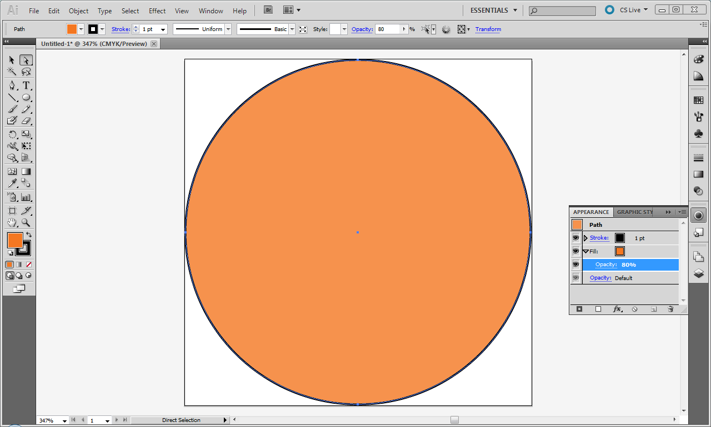
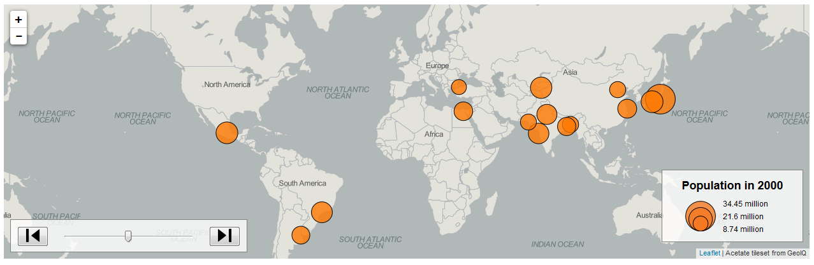

### [Return Home](../../../) | [Previous Chapter](../Chapter05) | [Next Chapter](../Chapter07)

Chapter 6: The Internal Logic of Leaflet
=======================================

Your Leaflet map should be coming along nicely after the Chapter 5 overview of interactions. In Chapter 6, we dive deeper into Leaflet's inner workings to introduce you to some advanced web programming concepts. Chapter 6 includes three lessons and culminates in the completion of your Leaflet map.

*   In Lesson 1, we contrast procedural versus object-oriented coding with JavaScript by refactoring some existing, suboptimal code from Chapter 4-5.
*   In Lesson 2, we refresh our introduction of Leaflet to look at it as a library of classes and use several of these classes to implement UI controls and a temporal legend.
*   In Lesson 3, we introduce scalable vector graphics (SVGs)—a graphics format we rely on with D3 in _unit-3_ and use SVG to build an attribute legend for our Leaflet map example.

After this chapter, you should be able to:

*   Understand how JavaScript pseudo-classes and prototypes are used by Leaflet
*   Extend Leaflet objects in your script
*   Create your own SVG graphics and integrate them with your Leaflet map

Lesson 1: Procedural and Object-oriented JavaScript
---------------------------------------------------

### I. Procedural Code Refactoring

JavaScript employs two different computer programming paradigms: [procedural programming](https://en.wikipedia.org/wiki/Procedural_programming) and [object-oriented programming](https://en.wikipedia.org/wiki/Object-oriented_programming) (OOP). ***Procedural programming*** uses individual variables, functions, and data structures to give step-by-step instructions to the processor. In contrast, ***object-oriented programming*** uses data and methods contained within complex data structures called objects. JavaScript is primarily a procedural language, but has some characteristics that allow advanced programmers to take an object-oriented approach. In the code for your Leaflet map, you have actually already used a bit of both.

The chapter tutorials use the term **_function_** to refer to a set of tasks or routines written into the _main.js_ custom script, and the term **_method_** to refer to functions that are part of a library such as Leaflet. This is an important semantic distinction. Methods are routines that look like functions but are included as part of an object. Functions belong to the domain of procedural programming: they are a set of instructions that can be used anywhere to redirect the flow of execution, and are not designated as part of a particular code package. On the other hand, code libraries use an object-oriented approach to classes and their methods so that specific ***child*** classes _inherit_ (as introduced in Chapter 5), or make use of, broader ***parent*** classes, requiring the parent method to be written just once for efficiency. 

To examine the difference, let's refactor some of the _main.js_ script from the end of Chapter 5. As you hone your programming skills, you will begin to notice places where your code is more lengthy than it needs to be and could be ***refactored***, or revised for efficiency. To start refactoring, look for code that occurs in a very similar form in multiple places in your script. In procedural programming, this repetition can be reduced by consolidating the duplicate code into its own function that can be called from multiple places to return the desired value.

In the `updatePropSymbols()` function in _main.js_ of the Leaflet map example code, we recreate our popup content for each feature with script very similar to the initial creation of our popups in the `pointToLayer()` function (Example 1.1).

###### Example 1.1: Duplicate code in _main.js_

        //CODE FROM pointToLayer() FUNCTION
        //build popup content string
        var popupContent = "
<b>City:</b> " + feature.properties.City + "
";
    
        //add formatted attribute to panel content string
        var year = attribute.split("_")[1];
        popupContent += "
<b>Population in " + year + ":</b> " + feature.properties[attribute] + " million
";
    
        //bind the popup to the circle marker    
        layer.bindPopup(popupContent, { 
        	offset: new L.Point(0,-options.radius) 
        });
    
    ...
    
    	//CODE FROM updatePropSymbols() FUNCTION
        //build new popup content string
        var popupContent = "
<b>City:</b> " + props.City + "
";
    
        //add formatted attribute to panel content string
        var year = attribute.split("_")[1];
        popupContent += "
<b>Population in " + year + ":</b> " + props[attribute] + " million
";
    
        //update popup with new content    
        popup = layer.getPopup();    
        popup.setContent(popupContent).update();

Let's improve our script by consolidating the redundant code into one procedural function that can be called from both `pointToLayer()` and `updatePropSymbols()` (Example 1.2). First, note which variables should be passed into the function as parameters: `feature.properties` and the selected `attribute` from the dataset. If you assign a different parameter name for any of these variables, make sure you also change the variable name within the function to reflect the parameter name.

###### Example 1.2: A consolidated popup-content-creation function in _main.js_

    function createPopupContent(properties, attribute){
        //add city to popup content string
        var popupContent = "
<b>City:</b> " + properties.City + "
";
    
        //add formatted attribute to panel content string
        var year = attribute.split("_")[1];
        popupContent += "
<b>Population in " + year + ":</b> " + properties[attribute] + " million
";
    
        return popupContent;
    };

You then can replace the popup creation code in each of the functions where it appears (Example 1.3).

###### Example 1.3: Calls to `createPopupContent()` in _main.js_

        //Example 1.1 line 2...in pointToLayer()
        var popupContent = createPopupContent(feature.properties, attribute);
        //bind the popup to the circle marker    
        layer.bindPopup(popupContent, {  offset: new L.Point(0,-options.radius)    });
        ...
    
        //Example 1.1 line 18...in updatePropSymbols()
        var popupContent = createPopupContent(props, attribute);    
        //update popup with new content    
        popup = layer.getPopup();    
        popup.setContent(popupContent).update();

### II. Object-oriented Code Refactoring

Our procedural refactoring reduces the size of our code by a few lines and eliminates unnecessary duplication. The function calls are essentially a stand-in for the duplicate script; you still have an ordered set of step-by-step procedures.

An object-oriented approach instead assigns the variables as properties of an object. These properties then can be inherited by other child objects. This special type of "parent" object—similar to a _class_ in many object-oriented languages—is created by a **_constructor function_**. Because this function is analogous to a class, it is convention to capitalize the first letter of a constructor function's name. Example 1.4 shows `createPopupContent()` as a constructor function (renamed `PopupContent()`).

###### Example 1.4: A constructor function based on `createPopupContent()` in _main.js_

    //Example 1.2 line 1...PopupContent constructor function
    function PopupContent(properties, attribute){
        this.properties = properties;
        this.attribute = attribute;
        this.year = attribute.split("_")[1];
        this.population = this.properties[attribute];
        this.formatted = "
<b>City:</b> " + this.properties.City + "

<b>Population in " + this.year + ":</b> " + this.population + " million
";
    };
    
    ...
    
        //Example 1.3 line 1...in pointToLayer()
        //create new popup content
        var popupContent = new PopupContent(feature.properties, attribute);
    
        //bind the popup to the circle marker    
        layer.bindPopup(popupContent.formatted, { 
        	offset: new L.Point(0,-options.radius)
        });
    
    ...
    
        //Example 1.3 line 6...in UpdatePropSymbols()
        var popupContent = new PopupContent(props, attribute);
    
        //update popup with new content    
        popup = layer.getPopup();    
        popup.setContent(popupContent.formatted).update();

In the example above (Example 1.4), the keyword `this` refers to the function's **_prototype_** property. Think of the prototype as the immediate parent of the objects that are instantiated by the constructor function. Every JavaScript object has a prototype—its parent—which defines its properties and methods. Each object instance is created using the special `new` keyword to call the constructor, passing each required parameter to the constructor function. When new `popupContent` objects are instantiated in Example 1.4 on lines 21 and 29, these objects inherit the properties and methods assigned to the prototype using `this` in the constructor. Lines 3-8 assign properties to the prototype based on the parameters passed into the constructor function.

Inheritance is a powerful feature of object-oriented JavaScript. Once an object is created from a constructor function, it has a set of default properties and methods. However, any of the defaults assigned by the constructor can be changed for individual objects created from it. For instance, imagine that you want to temporarily change the styling of your popups to show just the population and use a larger font. You can replace the `formatted` property of your `popupContent` object (Example 1.5).

###### Example 1.5: Replacing popup content in _main.js_

        //create new popup content
        var popupContent = new PopupContent(feature.properties, attribute);
    
        //change the formatting
        popupContent.formatted = "<h2>" + popupContent.population + " million</h2>";
    
        //add popup to circle marker    
        layer.bindPopup(popupContent.formatted, {          
        	offset: new L.Point(0,-options.radius)    
        });

Figure 1.1 shows the result of Example 1.5.

###### Figure 1.1: A modified popup object

Further, imagine that you want to create two styles of popups, one that maintains the original formatting and another that replaces the formatting, giving the user the option to switch between the two. You can create a second `popupContent2` with the first `popupContent` as its prototype using the `Object.create()` method (Example 1.6).

###### Example 1.6: A new type of popup in _main.js_

        //create new popup content...Example 1.4 line 1
        var popupContent = new PopupContent(feature.properties, attribute);
    
        //create another popup based on the first
        var popupContent2 = Object.create(popupContent);
    
        //change the formatting of popup 2
        popupContent2.formatted = "<h2>" + popupContent.population + " million</h2>";
    
        //add popup to circle marker    
        layer.bindPopup(popupContent2.formatted);
    
        console.log(popupContent.formatted) //original popup content

The `console.log()` statement shows that the first `popupContent` object has maintained its original format (Figure 1.2). The second `popupContent2` object inherits all of the properties and methods of the first, but then has its format changed on line 8 before binding this content to the circle marker `layer`.

###### Figure 1.2: The prototype popup maintains its original content

Prototypes and constructor functions are advanced JavaScript concepts, so we do not expect you to rely on them heavily for your Leaflet map. However, consider how you can make use of prototypes and constructors as you begin to plan your final project.

> ### **Refactor any duplicate code in your script using either procedural or object-oriented programming.**

Lesson 2: Extending Leaflet Objects
-----------------------------------

### I. Leaflet Classes

Hopefully, the previous discussion has made the workings of Leaflet a little clearer to you. Leaflet is basically a giant object (`L`) that contains an umbrella constructor function, `L.Class`. Each Leaflet "class", such as `L.Map`, accesses this constructor function to create its particular kind of object. The lowercase methods used to create these classes, such as `L.map()`, are embedded in Leaflet as aliases of the object instantiation calls (i.e., `new L.Map()`). For instance, Example 2.1 shows alias methods for `L.Map()`.

###### Example 2.1: `L.map()` alias defined in _leaflet-src.js_

    L.map = function (id, options) {
        return new L.Map(id, options);
    };

Each Leaflet class is created using an `extend()` method built into the `L.Class` constructor. The `extend` method in turn is inherited by the child class, its children, and so on. This means that new Leaflet classes can be created by _extending_ any class, and they inherit the methods and properties of all previous class "generations"—as in the case of the `L.LayerGroup`, `L.FeatureGroup`, and `L.GeoJSON` chain discussed in Chapter 4. It also means that _you_ can create custom Leaflet classes in your own script.

### II. Custom Leaflet Controls

The most common use of `extend()` in Leaflet is the `L.Control` class. Examine the [Custom Control Example](http://leafletjs.com/reference.html#icontrol) in the Leaflet API documentation to see how `L.Control.extend()` is used to create custom controls in any of the map's four corners. We immediately can apply this method to make our _sequence_ UI controls more accessible to the user by placing them on the map.

Let's start by adapting the example code in the documentation to create a new `SequenceControl` class within our `createSequenceControls()` function in _main.js_ (Example 2.2).

###### Example 2.2: custom control class in _main.js_

    //Create new sequence controls
    function createSequenceControls(attributes){   
        var SequenceControl = L.Control.extend({
            options: {
                position: 'bottomleft'
            },
    
            onAdd: function () {
                // create the control container div with a particular class name
                var container = L.DomUtil.create('div', 'sequence-control-container');
    
                // ... initialize other DOM elements
    
                return container;
            }
        });
    
        map.addControl(new SequenceControl());    // add listeners after adding control}

The value of the `extend()` method—as seen in the example above—is that it takes advantage of an existing constructor function within Leaflet to add properties and methods to the class prototype object the same way they could be added to any other kind of object. The `options` property and `onAdd()` method are tacked onto the prototype object for the `Control` class by `extend()`, and the revised object becomes the prototype for `SequenceControl`.

The `onAdd()` method creates the HTML element and child elements for the Leaflet control, along with HTML attributes and event listeners for the Leaflet control. As the name of the method implies, this script is executed when the control is added to the map. Similarly, we can add an `onRemove()` method to remove elements and event listeners from the DOM when the control is removed. Since we only are adding the control to our map, we do not need to use `onRemove()`. However, `onAdd()` _always_ is required for a new Leaflet control.

Following the documentation example, we create a new HTML `
` element within the `onAdd()` method using Leaflet's [DOM Utility](http://leafletjs.com/reference.html#domutil) and the [`L.DomUtil.create()`](http://leafletjs.com/reference.html#domutil-create) method. We also can create the `
` using JavaScript's native `document.createElement()` method, but `L.DomUtil.create()` is slightly more convenient because it automatically adds a class name (as in Example 2.2) and optionally assigns the new element to a parent element. We do <ins>_not_</ins> want to use native JavaScript for this, as we need to define the new Leaflet control without adding it to the DOM immediately.

We _can_ use native JS for the next step, which is to place our `"range-slider"` _inside_ of the `SequenceControl`. To do this, we simply move the line that creates the `"range-slider"` into the `onAdd()` method, appending it to the `container` element (Example 2.3).

###### Example 2.3: Moving the slider into the Leaflet control in _main.js_

            //Example 2.2 line 8
            onAdd: function () {
                // create the control container div with a particular class name
                var container = L.DomUtil.create('div', 'sequence-control-container');
    
                //create range input element (slider)
                container.insertAdjacentHTML('beforeend', '<input class="range-slider" type="range">')
    
                return container;
            }

Figure 2.1 shows the resulting slider as an extended `L.Control` in the lower-left corner of your map .

###### Figure 2.1: A slider on the map

You similarly can move the step buttons into the `SequenceControl` by placing them in `onAdd()` (Example 2.4).

###### Example 2.4: Moving the skip buttons into the Leaflet control in _main.js_

            //Example 2.3 line 1
            onAdd: function () {
                // create the control container div with a particular class name
                var container = L.DomUtil.create('div', 'sequence-control-container');

                //create range input element (slider)
                container.insertAdjacentHTML('beforeend', '<input class="range-slider" type="range">')

                //add skip buttons
                container.insertAdjacentHTML('beforeend', '<button class="step" id="reverse" title="Reverse"></button>'); 
                container.insertAdjacentHTML('beforeend', '<button class="step" id="forward" title="Forward"></button>');
    
                return container;
            }

Figure 2.2 shows the resulting step buttons as part of the extended `L.Control`. Note that the slider and step buttons are now part of the same extended Leaflet control called `SequenceControl`. 

###### Figure 2.2: Step buttons added

We need to make several additional adjustment from our original code to have the _sequence_ UI controls extending `L.Control`, rather than sit in a separate `
` element outside of the map. First, if you use the slider, you will notice that dragging the marker also causes the map to move—an undesirable response. Likewise, clicking the step buttons in rapid succession causes the map to zoom in. In both cases, executing of the _sequence_ operator triggers a second operator _(pan_ versus _zoom_) because the map's default event listeners still are active and `SequenceControl` is part of the map.

We can deactivate the map's mouse event listeners for the area covered by the `SequenceControl` control container using [`L.DomEvent.disableClickPropagation()`](https://leafletjs.com/reference-1.4.0.html#domevent-disableclickpropagation) (Example 2.5).

###### Example 2.5: Stopping map event listeners on the container

            //Example 2.4 line 1
            onAdd: function () {
                // create the control container with a particular class name
                var container = L.DomUtil.create('div', 'sequence-control-container');
    
                ...
    
                //disable any mouse event listeners for the container
                L.DomEvent.disableClickPropagation(container);
    
                return container;
            }

Second, we need to modify our styles in _style.css_ to better position our slider and buttons in the control container. We also remove the right panel. If any of the Example 2.6 styles are unfamiliar, remember that you can look them up on [W3Schools](http://www.w3schools.com/cssref/).

###### Example 2.6: Styles for the sequence control container and slider in _style.css_

    #map {
        height: 400px;
        width: 100%;
        display: inline-block;
    }
    ...
    
    .sequence-control-container {  
        width: 350px;  
        height: 30px;  
        background-color: rgba(255,255,255,0.8);  
        padding: 10px;  
        line-height: 45px;  
        text-align: center;  
        border: solid gray 1px;  
    }  
    
    .range-slider {  
        width: 250px;  
    }  
    
    .step {  
        width: 40px;  
    }  
    
    .step img {  
        width: 100%;  
        height: auto;  
    } 

Lastly, make sure you add the event listeners for your slider and step buttons **after** adding the controls; otherwise you are trying to attach listeners with to HTML elements that have not been created yet.

    	onAdd: function (){  
    		//adding slider and step buttons
      	.....
    	}  
    });  
    
    map.addControl(new SequenceControl());  
    
    //SET SLIDER ATTRIBUTES AND ATTACH LISTENERS HERE

Figure 2.3 shows our beautiful new UI controls.

###### Figure 2.3: Leaflet custom control with _sequence_ UI elements

> ### **Create a new Leaflet control and move your sequence UI controls within it so that they float above the map.**

### III. Temporal Legend

The final requirement of the Leaflet map assignment is a temporal legend for the _sequence_ operator and an attribute legend for the proportional symbols. Let's start with the more straightforward temporal legend. We will build the attribute legend using SVG in Lesson 3.

First, create a new extended `L.Control` control for the temporal legend using a new `createLegend()` function (Example 2.7). Call the extended control `LegendControl` and place it in the bottom-right corner of the map. You can change the position of all controls to customize your design after you get their functionality working. Add a call to the new `createLegend()` function in the AJAX callback.

###### Example 2.7: Adding a legend control in _main.js_

    function createLegend(attributes){
        var LegendControl = L.Control.extend({
            options: {
                position: 'bottomright'
            },
    
            onAdd: function () {
                // create the control container with a particular class name
                var container = L.DomUtil.create('div', 'legend-control-container');
    
                //PUT YOUR SCRIPT TO CREATE THE TEMPORAL LEGEND HERE
    
                return container;
            }
        });
    
        map.addControl(new LegendControl());
    };

At this point, you should have a good idea of how to create the temporal legend based on the attribute names in your GeoJSON dataset. Rather than walking through all the steps here, we will let you adapt script for the popups to populate the temporal legend.

**Keep in mind that the temporal legend needs to update with each _sequence_ interaction**. Thus, we recommend that you add your temporal legend script to the `updatePropSymbols()` function so that the legend always matches the proportional symbols.

Also, be sure to add styles for your legend container in _style.css_, otherwise the container will not show up! The legend should match the look and feel of your map elements, such as the basemap tileset, the popup styling, and the _sequence_ UI controls.

Figure 2.4 shows an example temporal legend. You will have the opportunity to check your code in Lesson 3 if you run into any problems with the temporal legend. 

###### Figure 2.4: Leaflet map with a temporal legend

> ### **Create a temporal or sequence legend on your Leaflet map.**

Lesson 3: Using SVG Graphics
----------------------------

### I. Introduction to SVG

Thematic maps typically require an attribute legend to define the meaning of the map symbols. It is conventional for a proportional symbol map to include a legend of nested circles representing the minimum, maximum, and one or more intermediate values.

You could create your attribute legend using static HTML `
` or `` elements. However, Leaflet uses SVG graphics to dynamically create its circle markers and other vector linework, so it makes sense to replicate the circle markers using SVG for the legend. Additionally, you will need to understand how SVG works to complete the D3 map in the next unit, so a basic introduction to the SVG standard now will help you in the future.

***SVG***, or ***S***calable ***V***ector ***G***raphics, is the web standard vector graphics format. As with vector geospatial data introduced in Chapter 3, [_**vector graphics**_](https://gistbok.ucgis.org/bok-topics/vector-formats-and-sources) use points, lines, and polygon fills to represent image elements. In contrast, [<ins>_**raster graphics**_</ins>](https://gistbok.ucgis.org/bok-topics/raster-formats-and-sources) (such as the ***png*** or ***P***ortable ***N***etwork ***G***raphics format), much like raster geospatial data, use a continuous grid of pixels.

SVG uses XML markup, making it relatively human-readable and easy to integrate with HTML. Microsoft initially had its own Vector Markup Language (VML), and Internet Explorer was the last major browser to adopt SVG support. Accordingly, IE 8 and below do not support SVG, the primary reason is most boilerplate websites check for this browser. Fortunately, there are increasingly fewer users of these older browser versions, so we will not be concerned with this problem in this workbook.

The [SVG standard](https://www.w3.org/TR/SVG11/) describes the [elements](https://developer.mozilla.org/en-US/docs/Web/SVG/Element) and [attributes](https://developer.mozilla.org/en-US/docs/Web/SVG/Attribute) available as part of an SVG drawing. Every SVG graphic begins with the tag `<svg>`, within which every other SVG element is nested.

### II. Importing SVG from Adobe Illustrator

SVG provides a link between vector artwork software such as Adobe Illustrator and web graphics. Illustrator can save graphics as SVG, which then can be added to a webpage. Although SVG circles are quite simple to code from scratch, we start with Illustrator in this lesson to demonstrate how the SVG export works. This method can be applied to more complex graphics as well.

Let's start with a simple 180-pixel diameter circle drawn with the Ellipse Tool in Illustrator (Figure 3.1).

###### Figure 3.1: A circle in Illustrator

Notice we are using the same colors and fill opacity (80%) as our Leaflet circle markers. Save your circle as an SVG using "File"→"Save As". Choose "SVG" from the dropdown menu, choose a logical place to save the file, and click "Save". Accept the defaults on the next window and click "Save".

Once you have saved the SVG file, you can open it in your text editor to view the SVG content (Example 3.1).

###### Example 3.1: Circle SVG code

    <?xml version="1.0" encoding="utf-8"?>
    <!-- Generator: Adobe Illustrator 15.1.0, SVG Export Plug-In . SVG Version: 6.00 Build 0)  -->
    <!DOCTYPE svg PUBLIC "-//W3C//DTD SVG 1.1//EN" "http://www.w3.org/Graphics/SVG/1.1/DTD/svg11.dtd">
    <svg version="1.1" id="Layer_1" xmlns="http://www.w3.org/2000/svg" xmlns:xlink="http://www.w3.org/1999/xlink" x="0px" y="0px"
         width="180px" height="180px" viewBox="0 0 180 180" enable-background="new 0 0 180 180" xml:space="preserve">
    <circle fill="#F47821" fill-opacity="0.8" stroke="#000000" stroke-miterlimit="10" cx="90" cy="90.001" r="89.5"/>
    </svg>

Compare this code to the circle example on the [Mozilla SVG documentation](https://developer.mozilla.org/en-US/docs/Web/SVG/Element/circle) page. The SVG content starts with the opening `<svg>` tag (line 4), with the rest generated by Illustrator and thus can be deleted.

We can copy and paste this `<svg>` tag and insert it into the `<svg>` of our boilerplate _index.html_ file to draw the circle in a webpage (Example 3.2). Here, you could add `id` and `class` attributes, allowing you to restyle through CSS and modify through JavaScript code.

###### Example 3.2: SVG circle in boilerplate _index.html_

    <body>
        <svg id="Layer_1" width="180px" height="180px">
            <circle fill="#F47821" fill-opacity="0.8" stroke="#000000" stroke-miterlimit="10" cx="90" cy="90.001" r="89.5"/>
        </svg>
    </body>

Figure 3.2 renders the circle in a browser.

###### Figure 3.2: The SVG circle

In addition to importing SVG code to HTML, you also can export SVG graphics created by your script. Simply use the Inspector on the SVG object, then Right-/Command-Click on its code in the HTML tab and choose "Copy"→"Outer HTML" (Figure 3.3). Then paste the code into a new document in your text editor and save it as a file with a _.svg_ suffix. Your can open your new SVG file in Illustrator or any other graphics software that supports SVG. Notably, many news rooms actually generate much of the map through interactive coding with libraries such as D3, exporting different portions of their dynamic graphics as SVGs for static reproduction in print!

###### Figure 3.3: saving an SVG from the browser

Before moving on, let's briefly look at the code on line 3 of Example 3.2. The SVG `<circle>` element creates our circle. It has several attributes that define and style it. These are:

*   `fill`: the fill color of the circle
    
*   `fill-opacity`: the fill opacity of the circle
    
*   `stroke`: the stroke color of the circle
    
*   `stroke-miterlimit`: the limit on the ratio of miter length to stroke width at line segment joins. Irrelevant for circles but added by Illustrator as a generic attribute for strokes.
    
*   `cx`: the x-axis (horizontal) coordinate of the circle's center point
    
*   `cy`: the y-axis (vertical) coordinate of the circle's center point
    
*   `r`: the radius of the circle
    

### III. SVG in Leaflet

You might expect that Leaflet passes the options from the `L.CircleMarker options` object to SVG `<circle>` elements that it creates. In fact, this class does create SVG elements, but they are `<path>` elements rather than `<circle>` elements. We can see this using the Inspector on our Leaflet map (Figure 3.4).

###### Figure 3.4: inspecting Leaflet circle markers

An SVG [`<path>`](https://developer.mozilla.org/en-US/docs/Web/SVG/Element/path) element can be used to draw any shape of line or polygon. As you can see, the stroke and fill options are set by the `options` object specified in the `pointToLayer()` function, but the circle shape definition is a bit more complicated. Instead of center coordinates and a radius, the circle's shape is set by the `d` attribute, which takes a coded string of coordinate values (Example 3.3).

###### Example 3.3: Leaflet circle marker path `d` attribute

    d="M341,186.92441514450513A15.07558485549488,15.07558485549488,0,1,1,340.9,186.92441514450513 z"

If you are interested in deconstructing this code, visit the Mozilla documentation page for the [`d` attribute](https://developer.mozilla.org/en-US/docs/Web/SVG/Attribute/d). You will become more familiar with the `d` attribute in _unit-3_ when using D3; we stick with the SVG `<circle>` element for our attribute legend.

In case you are wondering about the `<g>` elements in Figure 3.4, these are group elements that contain each `<path>`, but could contain more than one other element and be used to uniformly style all of their child elements.

### IV. Building the Attribute Legend

Returning to our attribute legend, we can use pseudocode to clarify our tasks (Example 3.4).

###### Example 3.4: Pseudocoding the attribute legend

    //PSEUDOCODE FOR ATTRIBUTE LEGEND
    Step 1. Add an `<svg>` element to the legend container
    Step 2. Add a `<circle>` element for each of three attribute values: min, max, and mean
    Step 3. Assign each `<circle>` element a center and radius based on the dataset min, max, and mean values of all attributes
    Step 4. Create legend text to label each circle

Step 1 in Example 3.4 dynamically adds an `<svg>` element to the legend container in our `createLegend()` function from Lesson 2 (Example 2.7). Since we also dynamically add each circle in Step 2, write out the opening `<svg>` tag as a string and assign it to the variable `svg`. For now, specify only the `id`, `width`, and `height` attributes for the `<svg>` element . Then append `svg` to the `container` using `insertAdjacentHTML()` (Example 3.5).

###### Example 3.5: Starting an SVG string in _main.js_

    //Example 2.7 line 1...function to create the legend
    function createLegend(attributes){
        var LegendControl = L.Control.extend({
            options: {
                position: 'bottomright'
            },

            onAdd: function () {
                // create the control container with a particular class name
                var container = L.DomUtil.create('div', 'legend-control-container');

                container.innerHTML = '
Population in 1985
';

                //Step 1: start attribute legend svg string
                var svg = '<svg id="attribute-legend" width="130px" height="130px">';

                //add attribute legend svg to container
                container.innerHTML += svg;

                return container;
            }
        });

        map.addControl(new LegendControl());

    };

Let's take a look at our legend control via the Inspector (Figure 3.5).

###### Figure 3.5: A blank SVG element that will hold our attribute legend

Step 2 of the pseudocode creates each example proportional circle for the legend. Since each legend circle will have its own `id` attribute to access it for scaling, it makes sense to create an array of circle names over which the loop can iterate (Example 3.6).

###### Example 3.6: Creating each circle in _main.js_

            //Example 3.5 line 15...Step 1: start attribute legend svg string
            var svg = '<svg id="attribute-legend" width="130px" height="130px">';
    
            //array of circle names to base loop on
            var circles = ["max", "mean", "min"];
    
            //Step 2: loop to add each circle and text to svg string
            for (var i=0; i<circles.length; i++){
                //circle string
                svg += '<circle class="legend-circle" id="' + circles[i] + 
                '" fill="#F47821" fill-opacity="0.8" stroke="#000000" cx="65"/>';
            };
    
            //close svg string
            svg += "</svg>";
    
            //add attribute legend svg to container
            container.insertAdjacentHTML('beforeend',svg);

On line 10 of Example 3.6, we assign the circle `id` attribute based on the current value of the array. Other attributes are similar to the code on line 3 of Example 3.2, except that we have left out the unnecessary `stroke-miterlimit` attribute as well as the necessary `cy` and `r` attributes. We have left out the latter two because these will be assigned dynamically depending on the dataset values for each attribute. Because they are left out, no circles will appear yet in the legend, but if you were to inspect the legend, you could see that the `<circle>` elements are all present in the DOM.

After the loop, we must add a closing `</svg>` tag to the string (line 15) before appending it to the control container.

For Step 3 of our pseudocode, we want to size and center our legend's circles based on the overall maximum, mean, and minimum values of our dataset **across all years**. Since we already are calculating the overall minimum value of our dataset for the Flannery perceptual scaling of our symbols, we can update our `calcMinValue()` function to calculate the maximum and mean statistics as well. Rename the `calcMinValue()` function to the broader `calcStats()` and store the calculated max, mean, and min values as properties in a new, globally accessible `dataStats` object that we can access from our `createLegend()` function.

###### Example 3.7: Calculating statistics for our data.

    //Line 1: variables we want to access from multiple functions  
    var map;  
    var dataStats = {};  
    
    .....  
    
    function calcStats(data){
        //create empty array to store all data values
        var allValues = [];
        //loop through each city
        for(var city of data.features){
            //loop through each year
            for(var year = 1985; year <= 2015; year+=5){
                  //get population for current year
                  var value = city.properties["Pop_"+ String(year)];
                  //add value to array
                  allValues.push(value);
            }
        }
        //get min, max, mean stats for our array
        dataStats.min = Math.min(...allValues);
        dataStats.max = Math.max(...allValues);
        //calculate meanValue
        var sum = allValues.reduce(function(a, b){return a+b;});
        dataStats.mean = sum/ allValues.length;
    
    }    
      
    .....  
    
    function getData(map){  
        
        //load the data  
        fetch("data/MegaCities.geojson")
            .then(function(response){
                return response.json();
            })
            .then(function(json){
        .....  
    
            //calling our renamed function  
            calcStats(json);  
    
        .....  
    
        });  
    };

Now that we have calculated the statistics we need to size and center our circles, we assign radius and vertical center coordinates to each circle's HTML string within our loop in the `createLegend()` function (Example 3.8).

##### Example 3.8: Dynamically assigning the last two circle attributes in _createLegend_

            //array of circle names to base loop on  
            var circles = ["max", "mean", "min"]; 
      
            //Step 2: loop to add each circle and text to svg string  
            for (var i=0; i<circles.length; i++){  
      
                //Step 3: assign the r and cy attributes  
                var radius = calcPropRadius(dataStats[circles[i]]);  
                var cy = 130 - radius;  
      
                //circle string  
                svg += '<circle class="legend-circle" id="' + circles[i] + '" r="' + radius + '"cy="' + cy + '" fill="#F47821" fill-opacity="0.8" stroke="#000000" cx="65"/>';  
            };  
      
            //close svg string  
            svg += "</svg>"; 

The radius should be calculated the same way as for the symbols on the map, so we use our `calcPropRadius()` function to get each circle's radius based on its value (line 8).

Since we would like the circles to "nest" with each having a common bottom point, we can set the center y coordinate (`cy`) by subtracting the radius from the SVG height, minus an extra pixel for the circle stroke (line 10). This makes them appear to "grow up" from the bottom rather than down from the top. With all of our circle attributes set, we can now see our legend circles (Figure 3.6).

###### Figure 3.6: A legend with circles

The SVG container in Figure 3.6 is oversized given the sizes of our circles. The horizontal position of the circles should be adjusted to make room for the legend text we will create for Step 4 of our pseudo code. For the example legend, we will adjust the following:

*   In `createLegend()`, change the `<svg>` element's `width` to `"160px"` and `height` to `"60px"`
    
*   In `createLegend()`, change each circle's `cx` attribute value to `"30"` and `cy` attribute to `"59 - radius"`
    

This gives us a much neater legend that no longer covers some of our map symbols (Figure 3.7). You should adjust these values based on the maximum circle size on your own legend.

###### Figure 3.7: A neater legend

Now we are ready for Step 4 of the pseudocode. We can create text within an SVG using [`<text>`](https://developer.mozilla.org/en-US/docs/Web/SVG/Element/text) elements. Return to the `createLegend()` function and add to the SVG to create our legend text (Example 3.9).

###### Example 3.9: Adding SVG `text` elements in _main.js_

            //Example 3.8 line 4...loop to add each circle and text to SVG string
            for (var i=0; i<circles.length; i++){
                
                //Step 3: assign the r and cy attributes            
                var radius = calcPropRadius(dataStats[circles[i]]);           
                var cy = 130 - radius;            
                
                //circle string            
                svg += '<circle class="legend-circle" id="' + circles[i] + '" r="' + radius + '"cy="' + cy + '" fill="#F47821" fill-opacity="0.8" stroke="#000000" cx="65"/>';
                
                //evenly space out labels            
                var textY = i * 20 + 20;            
                
                //text string            
                svg += '<text id="' + circles[i] + '-text" x="65" y="' + textY + '">' + Math.round(dataStats[circles[i]]*100)/100 + " million" + '</text>';
            };
    
            //close svg string
            svg += "</svg>";
    
            //add attribute legend svg to container
            container.insertAdjacentHTML('beforeend',svg);

This adds a `<text>` element with a unique id and content for each circle to the SVG (line 8).  Notice that we evenly space out each `<text>` element's `y` coordinate attribute for readability. 

Finally, we need to update the legend title whenever the year is changed. We've already set this up by creating a `` element within the legend title string with a `class` of "year". The only thing we need to do now is access that element whenever the year changes and include the currently selected year. We'll do this at the top of the `updatePropSymbols()` function (Example 3.10).

###### Example 3.10 Update temporal legend title with current year

        function updatePropSymbols(attribute){
            var year = attribute.split("_")[1];
            //update temporal legend
            document.querySelector("span.year").innerHTML = year;

This completes our legend and the basic requirements for the Leaflet map (Figure 3.8)!

###### Figure 3.8: Example Leaflet map with a finished legend

> ### **Create an attribute legend for your Leaflet map based on the minimum, mean, and maximum attribute values across all attributes in your dataset.**

_This work is licensed under a [Creative Commons Attribution 4.0 International License](http://creativecommons.org/licenses/by/4.0/).   For more information, please contact Robert E. Roth \(reroth@wisc.edu\)._

### [Return Home](../../../) | [Previous Chapter](../Chapter05) | [Next Chapter](../Chapter07)
