### [Return Home](../../../) | [Previous Chapter](../Chapter06) | [Next Chapter](../Chapter08)

Chapter 7: Collaborating with Github
===================================

You have been working individually with GitHub for six chapters now, and completed your first major interactive map with Leaflet hosted through GitHub! Chapter 7 provides additional guidance for working _collaboratively_ with GitHub to support a group project. Chapter 7 includes three relatively short lessons and an activity to set-up a collaborative repository serving the basis of a group project.

*   In Lesson 1, we briefly refresh your memory on GitHub concepts and introduce the Markdown language for documentation and collaboration on GitHub.
*   In Lesson 2, we provide instructions for setting-up a collaborative repository and using Markdown to plan a group project.
*   In Lesson 3, we summarize best practices for collaboratively coding with GitHub.

After this chapter, you should be able to:

*   Access and commit to a collaborative GitHub repo
*   Write a readme file in Markdown
*   Use GitHub as a platform for collaborative coding

Note: The Chapter 7 lessons support what could be conceptualized as a group final project in a classroom setting, but cover skills important to collaborative coding on any group project. If you are working through this chapter by yourself and not in a classroom setting, create a second GitHub account using an alternate email address to practice the collaborative coding concepts described below, as these will be valuable once entering a group work environment. This lesson is not required to continue with solo coding in D3 in _unit-3_.

Lesson 1: Collaborating through GitHub
==========================

### I. GitHub Collaborative Coding Functionality

As introduced in Chapter 1, _**[GitHub](https://github.com/)**_ is a website and project hosting service that uses the _**[Git](http://git-scm.com/)**_ version control system to take snapshots of your files at a given time, creating a backup that can be shared collaboratively when multiple developers are coding at the same time on a group project. Before discussing GitHub as a collaborative coding tool, it is helpful to refresh [core GitHub terminology](https://help.github.com/en/github/getting-started-with-github/github-glossary). 

We primarily focused on GitHub concepts used for solo coding in Chapter 1:

*   _**[Repository](https://help.github.com/en/github/getting-started-with-github/github-glossary#repository):**_ A repository is the most basic element of GitHub. They are easiest to imagine as a project's folder. A repository contains all of the project files (including documentation), and stores each file's revision history. Repositories can have multiple collaborators and can be either public or private.
*   _**[Clone](https://help.github.com/en/github/getting-started-with-github/github-glossary#clone):**_ A clone is a copy of a repository that lives on your computer instead of on a website's server somewhere, or the act of making that copy. With your clone you can edit the files in your preferred editor and use Git to keep track of your changes without having to be online. It is, however, connected to the remote version so that changes can be synced between the two.
*   _**[Commit](https://help.github.com/en/github/getting-started-with-github/github-glossary#commit):**_  A commit, or "revision", is an individual change to a file (or set of files). A commit is like when you _save_ a file, except with Git, every time you save it creates a unique ID (a.k.a., the "SHA" or "hash") that allows you to keep record of what changes were made when and by whom. 
*   _**[Push](https://help.github.com/en/github/getting-started-with-github/github-glossary#push):**_ Pushing refers to sending your committed changes to a remote repository, such as a repository hosted on GitHub. For instance, if you change something locally, you then _push_ those changes so that others may access them.

You should be conformable with cloning, committing, and pushing through Chapter 6. In Chapter 7, we combine these concepts with GitHub techniques supporting collaborative coding.

*   _**[Fork](https://help.github.com/en/github/getting-started-with-github/github-glossary#fork):**_ A fork is a personal copy of another user's repository that lives on your account. Forks allow you to freely make changes to a project without affecting the original. Forks remain attached to the original, allowing you to submit a pull request to the original author to update with your changes. You can also keep your fork up to date by pulling in updates from the original.
*   _**[Branch](https://help.github.com/en/github/getting-started-with-github/github-glossary#branch):**_ A branch is a parallel version of a repository. It is contained within the repository, but does not affect the primary or `main` branch allowing you to work freely without disrupting the "live" version. When you've made the changes you want to make, you can merge your branch back into the `main` branch to publish your changes.
*   _**[Fetch](https://help.github.com/en/github/getting-started-with-github/github-glossary#fetch):**_ Fetching refers to getting the latest changes from an online repository without merging them. Once these changes are fetched you can compare them to your local branches (the code residing on your local machine).
*   _**[Merge](https://help.github.com/en/github/getting-started-with-github/github-glossary#merge):**_ Merging takes the changes from one branch (in the same repository or from a fork), and applies them into another. This often happens as a pull request (which can be thought of as a request to merge), or via the command line. A merge can be done automatically via a pull request via the GitHub web interface if there are no conflicting changes, or can always be done via the command line. 
*   _**[Pull](https://help.github.com/en/github/getting-started-with-github/github-glossary#pull):**_ Pull refers to when you are fetching _in_ changes _and_ merging them. For instance, if someone has edited the remote file you are both working on, you should _pull_ in those changes to your local copy so that it is up to date.
*   _**[Pull request](https://help.github.com/en/github/getting-started-with-github/github-glossary#pull-request):**_ Pull requests are proposed changes to a repository submitted by a user and accepted or rejected by a repository's collaborators.

Specifically, a large focus for this chapter is on the additional features of GitHub, particularly merging, pulling, and forking.

### II. GitHub Group Communication

Collaborative coding, like other collective projects, relies on effective group communication. Some of this communication should occur outside of GitHub, either offline in person or online via email or (preferably) work messaging platforms like [Slack](https://slack.com/features). As a first step, determine what communication platform your group will use and when you generally are able to touch base about the group project.

The next step in collaborative coding is assigning roles to each team member. For example, one member may focus on data loading and processing, another on interaction operators, and a third on layout and styling, etc. When first starting with a new collaboration, we also recommend assigning a group "facilitator" who "owns" the main branch of your code and merges major code conflicts (more below). All group members should have an equal role, and the person who "owns" the repository should not represent any hierarchy in the group. Keep in mind that it is OK if roles change a bit and that you should be helping your other team members as they get stuck.

Finally, you should assign specific development tasks to each role. We recommend using GitHub _**milestones**_ (more on these later) to decompose a group project into its functional scope and important subtasks for completing each function, assigning these milestones to different roles.

### III. GitHub Documentation with Markdown

Collaborative coding with GitHub relies as much on functions like cloning, merging, and pulling as it does on effective messaging and documentation. So far, we have emphasized the importance of commit messages that succinctly describe what changes were made so that you can track your own changes. Meaningful commit messages along with pull requests become even more important when collaboratively coding.

As your projects grow in scale, you also should add documentation to explain the repos to other collaborators (some of whom may be joining the project in the future) as well as to other interested coders who might draw on your work following the ethos of "libre" free and open source software. A _**readme**_ file acts as the metadata of software, datasets, or other repos posted to GitHub. Readme files often include information about authors and licensing, code versions and dependencies, as well as documentation and background description about the project.

GitHub readme files use _.md_ extension standards for **_Markdown_**, a simple text format similar to ._doc_, ._rtf_ and ._txt_ that makes it easy to format text on the web. The _readme.md_ file at the root level of the repo is rendered as styled text on a GitHub repo page beneath the directory structure, and thus serves as the repo's visual website. Markdown is useful for web development beyond GitHub as well; for instance, we wrote these lessons in Markdown with GitHub applying our styles automatically upon upload (Figure 7.1.1)!

###### Example 1.1: Markdown code for Chapter 1

    ### [Return Home](../../../) | [Previous Chapter](../Introduction) | [Next Chapter](../Chapter02)

    Chapter 1: Setting Up Your Workspace
    =====================================

    Welcome to the first chapter of Web Mapping! Chapter 1 includes three lessons and Activities 1 & 2:

    *   In Lesson 1, we will introduce text editors and some basic "boilerplate" HTML used to structure your website.

    *   In Lesson 2, we will discuss how to efficiently set up your web directory and host it through a localhost development server.

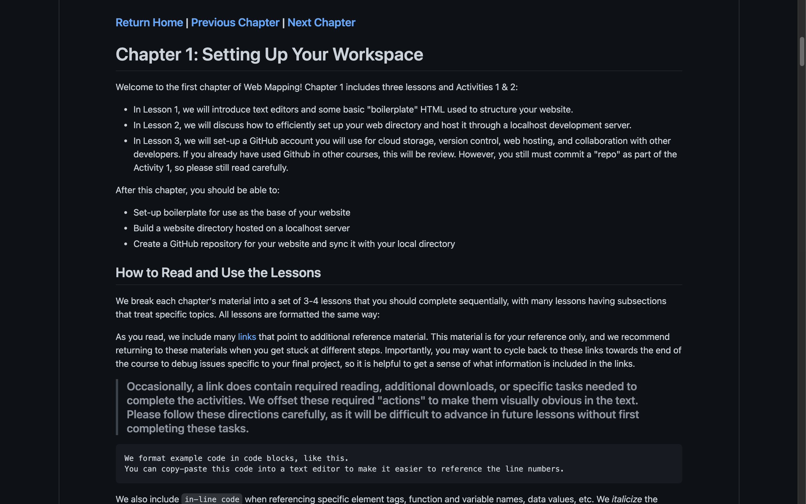

###### Figure 1.1: Using Markdown for the readme file of a GitHub repo

Using Markdown is much like using HTML (the M standing for "markup"), with [slightly nuanced syntax](https://github.com/adam-p/Markdown-here/wiki/Markdown-Cheatsheet) to covert from plain text into HTML elements rather than vice versa. Common styling syntax includes:

*   Markdown styles header using the pound/number key (`#`) to indicate its importance with one (`#`) being `h1`, three (`#` `#` `#`) being `h3`, etc. 
*   Markdown also affords emphasis styles including traditional _italics_ and **bold**. To italicize something, surround it in either a single asterisk (`*`) or underscore (`_`). To bold something, surround it in two asterisks (`*` `*`) or two underscores (`_` `_`) 
*   You also can add unordered and ordered lists. Unordered lists use a single asterisk (`*`) in front of the list elements. You can also add sub-items by adding an indent to the list item. Ordered lists simply use the number one plus a period (`1.`) in front of the list elements. Again, you can add sub-items by adding an indent to the list item. 
*   If you want the text to be in paragraph form, you can simply type in what you want without adding any additional syntax.
*   Finally, you can insert an images or external links using brackets (`[]`) for the hyperlink text and parentheses (`()`) for the link itself. If you insert an image, the image must be synced to your remote repository.

Markdown posted to GitHub is case sensitive, so make sure your folder references and file extensions (e.g., .png versus .PNG) are correct.

All GitHub repos should have a _readme.md_ for provenance and collaboration. Before working starting a collaborative repo, add a readme file styled with Markdown as documentation for your Leaflet map. Adding the readme officially concludes _unit-2_ and your Leaflet map!

###### Example 1.2: Example code for Leaflet lab

    ### **Title:** *Number of Cartographers by U.S. City*

    ### **Author:** Lambert Molleweide

    ### **Dependencies:**
    * [Leaflet 1.6](https://leafletjs.com/reference-1.6.0.html)

    ### **Code Version:**
    Last Updated: 7 March, 2021

    ### **Description:**
    This interactive proportional symbol map, built using Leaflet, demonstrates the growth of cartographers by major U.S. city from 2010 to 2020.

> ### **Add a _readme.md_ file as documentation for your Leaflet map repo that includes information about authors and licensing, code versions and dependencies, as well as documentation and background description about the project. Try the Markdown styles shown above as separate commits to get a feel for Markdown before finalizing the _readme.md_ file.**

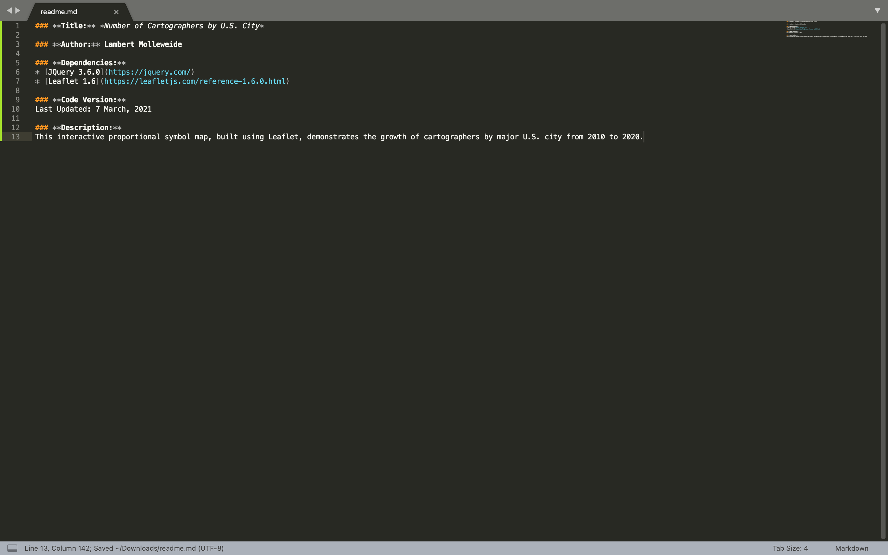
###### Figure 1.2: Example _readme.md_ file for your Leaflet map repo, in GitHub

Lesson 2: Setting Up A Collaborative Repository for a Group Project
=========================================================

### I. Downloading and Renaming the group project Repo

To get you started on your group project, we have created a [group repository template](https://github.com/uwcartlab/webmapping-final-project) under the [UWCartLab](https://github.com/uwcartlab) GitHub account.

To begin, the team facilitator should download the [group repository template](https://github.com/uwcartlab/webmapping-final-project) as a ZIP. After unzipping the file, rename the repo in accordance with your group project plans. For clarity in this lesson, we recommend renaming the repo "[year]_[projectname]". **The faciliator should publish the repository to their own GitHub account, just like in Chapter 1.**

### II. Adding Collaborators

Next, the facilitator must give all team members access to the repository, adding each additional team member as a _**collaborator**_. To add collaborators, the facilitator should open GitHub in a web browser and select the "Manage Access" tab in the "Settings" menu and click the "Add a collaborator" option, inputting each team member GitHub username one at a time (Figure 2.1).

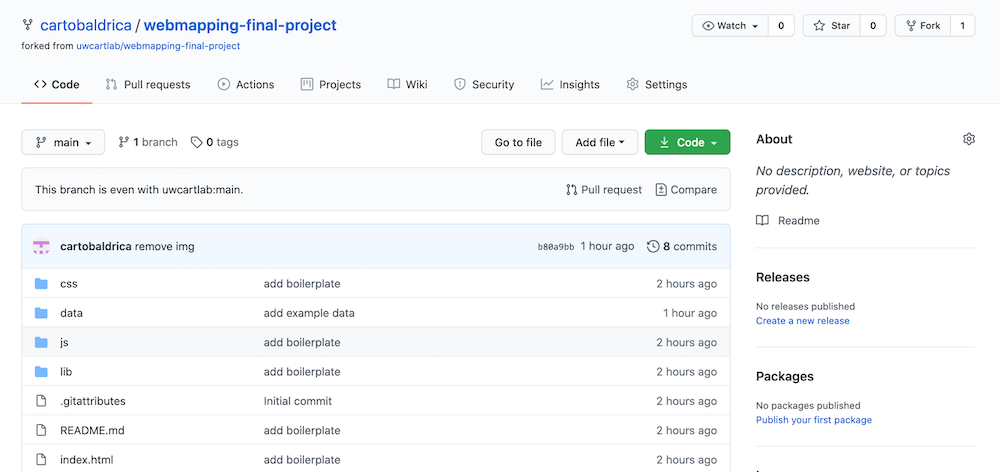

###### Figure 2.1: Adding a collaborator.

Repeat this process with each of your team members. **Team members need to accept the invitation in order to clone the repository to their desktop.** To do so, team members should login to the email associated with their GitHub account to find the invitation to your group repo. If you cannot find the email, check your spam folder, or search "\[year]_\[projectname]" and the email should show up.  Click "view invitation" and, when redirected, "accept invitation".

### III. Cloning the Group Repo to Your Desktop

Finally, each team member needs to clone the group project repository to their desktop server. Open GitHub Desktop and login, choose "Add", and then "Clone Repository". Select the repository **"\[year]_\[projectname]"** located under the header of the team facilitator's GitHub account. Figure 2.2 illustrates cloning the group project repo in GitHub desktop.

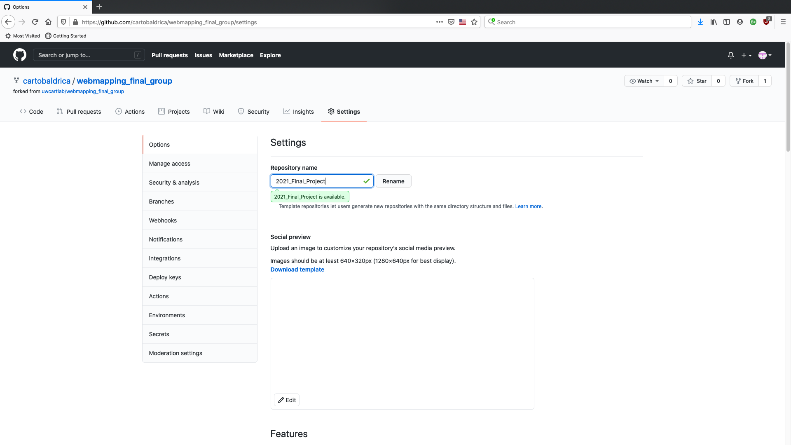

###### Figure 2.2: Cloning your group repo.

Look at the location GitHub is placing the repository on your hard drive, and keep or change this location. Select "clone" and follow the remaining instructions to clone your group repo locally. 

> ### **Confirm access to and clone your group repo.**

### IV. Making Your First Commit with Markdown

Now that you know a bit about Markdown, you are ready to start planning and organizing the group project using the _readme.md_ file. In your code editor, open the _readme.md_ file from your cloned group repository. Add your name as an ordered list element and commit your changes with “Activity 7” in the commit summary (Figure 2.3).

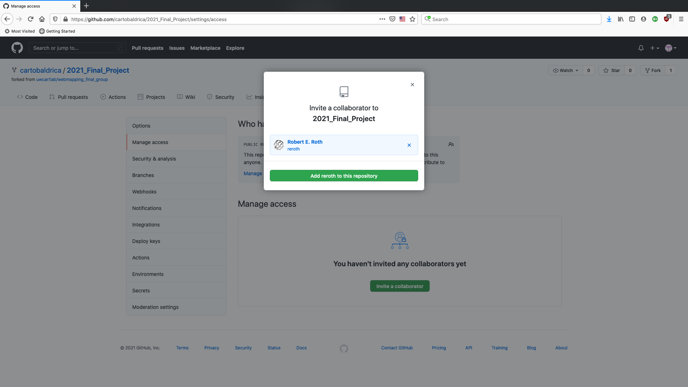

###### Figure 2.3: Adding your name in Markdown to _readme.md_.

> ### **Add your name to your cloned group repository. Commit and push your changes.**

### V. Dealing with Merge Conflicts

Sooner or later, you will run into merge _**conflicts**_ between your local code and the code in the remote repository after updates from your team members. Efficient management of merge conflicts is essential for successful collaborative coding. Luckily, Git provides a framework for identifying and resolving conflicts between code when merging.

The first conflict you should resolve is integrating all team member names. After you have committed and pushed your name, fetch origin of the repository to check for updates. If your team members have added their names, GitHub desktop will prompt you to resolve conflicts in the _readme.md_ file before you can merge the code (Figure 2.4).

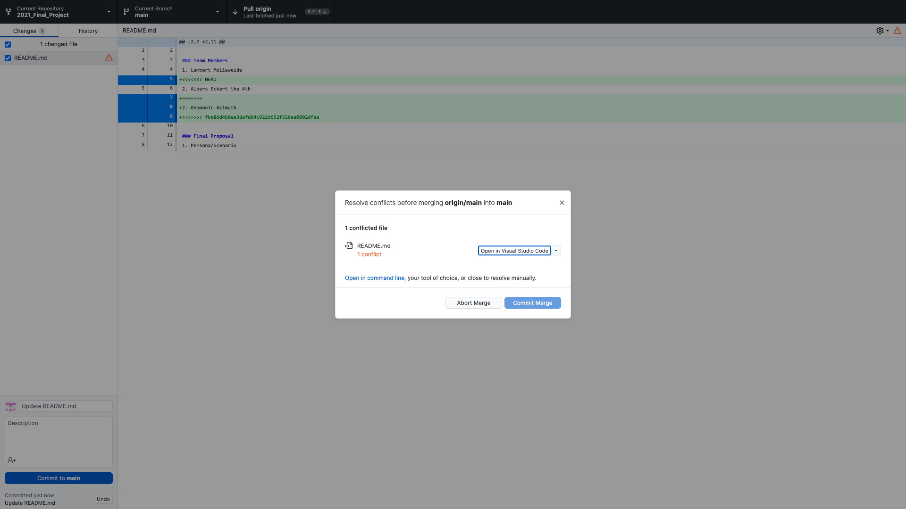

###### Figure 2.4: An error warning triggered by a merge conflict.

When you reopen the _readme.md_ file, your team members' names are now in the file as well, creating a conflict. In most text editors, these conflicts are marked within the file with a random binary ID (Figure 2.5). For our purposes, the location of the conflict is more important than the ID assigned to it.

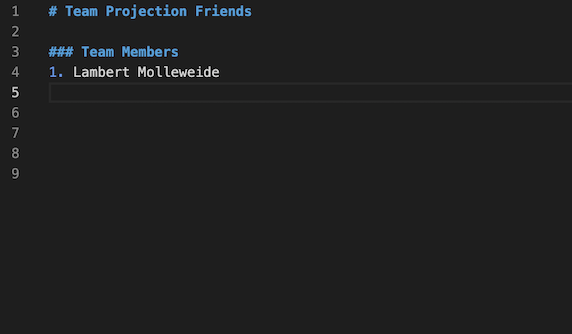

###### Figure 2.5: A conflict created when adding your team member names.

Accept the new additions to the code and merge the main branch with your local copy. GitHub desktop no longer shows any conflicts (Figure 2.6)!

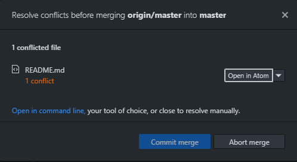

###### Figure 2.6: The revised message when conflicts are resolved, allowing a merge.

Now that you know a bit about Markdown, use the _readme.md_ to begin planning the group project (e.g., Figure 2.7). It is worth experimenting with the collaborative coding process early on, either in person or over a video call with your team members.

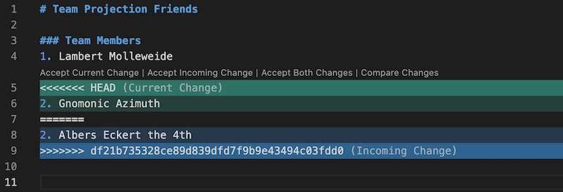

###### Figure 2.7: An example readme used for collaborative project planning. This example supports a group final project proposal for the Geography 575 course at UW-Madison and includes three components: (1) use case personas and scenarios informing the user experience design, (2) a list of functional requirements for the group project separated by representation and interaction requirements (this also should be logged as milestones in GitHub), and (3) wireframes embedded as images linked from an _img_ folder in your directory (Figure 2.7). 

Conflicts occur throughout collaborative coding and it is important to resolve them as they occur. For instance, Figure 2.8 shows a _search_ operator added by a team member to the interaction requirements in the exact same place as your _retrieve_ operator. Before adding a description to your _retrieve_ operator, resolve this conflict so that your team members can see your description to inform their future work (Figure 2.9). Conflicts grow in complexity when moving away from the simple Markdown format and into complex JavaScript coding, so experiment with the committing, pushing, and merging workflow with the _readme.md_ now to make it easier to interpret and resolve your conflicts with JavaScript later.

Instead of using a code editor, you can also resolve conflicts directly in GitHub desktop.

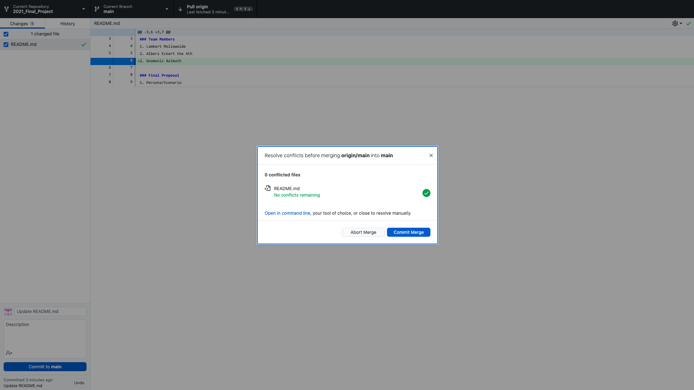

###### Figure 2.8: A merge conflict in the interaction requirements.

Lines highlighted blue will be preserved when you make the commit. 

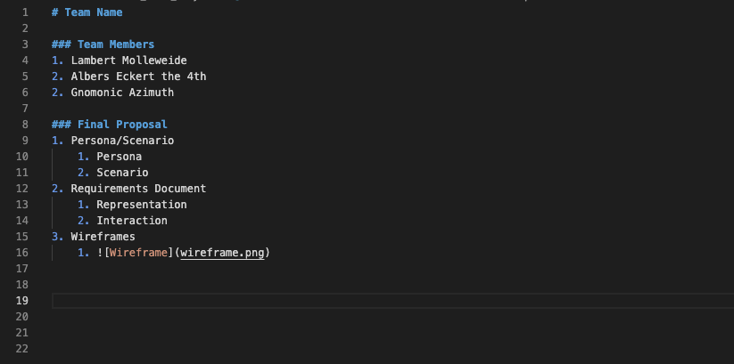

###### Figure 2.9. A view of the merge conflict with the added _search_ operator selected for preservation.

Depending on the nature of the conflict, you may need to remove the other lines added by GitHub manually. Right-click on each added line and select "Discard Changes".

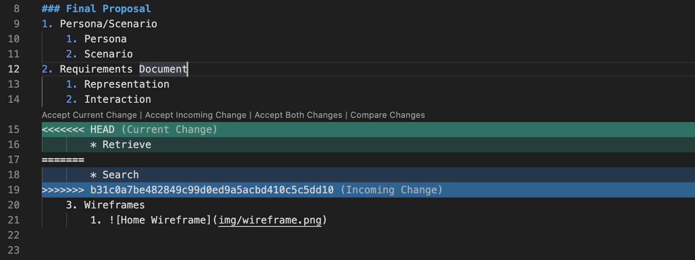

###### Figure 2.10. Discarding unwanted changes in GitHub Desktop.

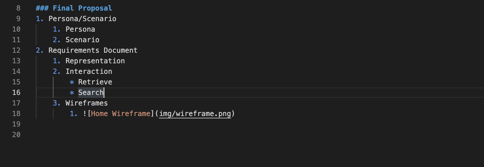

###### Figure 2.11. Resolved conflict.

There are multiple ways to resolve conflicts in GitHub, so use whichever approach works best for you.

As you move along in your project, you may want to create separate [branches](https://docs.github.com/en/github/collaborating-with-issues-and-pull-requests/about-branches) to test features without committing them to the main branch. If you are happy with the features you tested, you can open a pull request to merge the changes from your head (current) branch to a base (different, perhaps the main) branch, similar to other pull requests. 

Similar to a branch, you can _**fork**_ another user's repo. Forking is a way to create a personal copy of another user's repo. For example, if you wanted to build off of another user's code, you could fork their repo. Forked repos maintain a link to the original, allowing you to pull updates into your branch. You can also submit a pull request if you want the original author to incorporate your changes into their original repo. You will likely not need to use forking for this project.

As you get started with collaborative coding, you likely will encounter simple merge conflicts that can be resolved using GitHub Desktop. However, more complicated merge conflicts may need to be resolved using GitHub in your code editor or browser, where you can select portions of each version to retain in the group project. Alternatively, these conflicts can be resolved using [GitHub command line](https://cli.github.com/manual/), a more advanced use of the Git framework that is outside the scope of this workbook but helpful as you continue to grow your skills.

> ### **Work with your team to build the _readme.md_ file supporting your group project, merging and resolving all conflicts.**

Lesson 3: Best Practices for Collaborative Coding
=================================================

Using GitHub for collaborative coding is a skill in itself that takes experience (and some trial and error). However, it is an extremely valuable skill and often expected by many employers. As you get started, keep in mind the following best practices for collaborative coding with GitHub.

**1\. Fetch Origin Before Starting Your Work**

When working in a group, you want to make sure that you are working on the most updated version before writing new code. Failure to do this can lead to headaches, such as merge conflicts that span a number of lines and therefore are tricky to resolve as well as duplication of coding effort. Every time you begin a programming work session, **_fetch origin_** of the current branch of your code to check if new changed have been made. Figure 3.1 shows the fetch origin panel when no changes have been made.

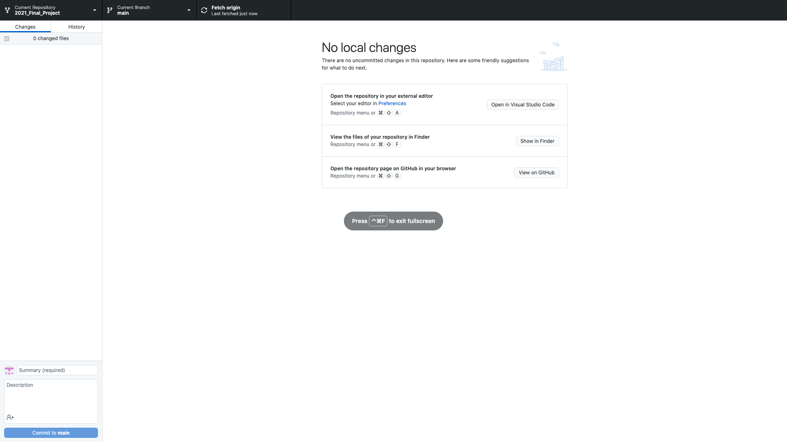

###### Figure 3.1: The fetch origin dialog when no changes have been made to the current branch

**2\. Pull the Repository Changes Before Starting your Work AND Before Pushing your Commits** 

If you fetch origin and there changes were made since you last worked on the branch, you need to pull these changes before starting to code. Figure 3.2 shows the fetch origin panel when changes do exist, requiring a pull request.

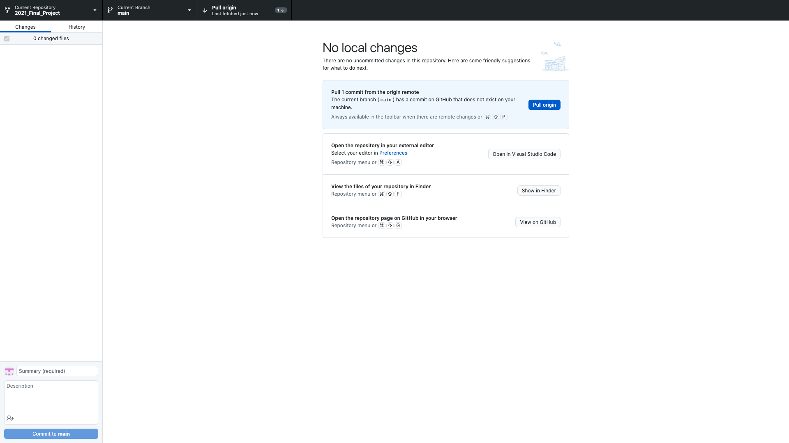

###### Figure 3.2: The fetch origin dialog when a pull request is required

**3\. Commit (Fairly) Often**

GitHub allows you to make a commit after something as small as a single character is changed. We do <ins>**_not_**</ins> recommend committing this often. Choosing how often to commit takes practice and changes with experience. To determine if it is time to commit, ask yourself the following questions:

*   If you were trying to fix something that was not working, did you eliminate, or at least resolve part of the issue?
*   Did you add a new feature to the code that is at least partially working or add a chunk of code necessary for a larger feature?
*   Did you fix a typo or rename any files?

If the answer to any of these questions is yes, then commit your changes! You can think of commits as the save button on word processors. You do not save after every word, but you should probably save when you finish a paragraph or two.

**4\. Provide Meaningful Commit Summaries**

When you make a commit, you are provided with a form fill-in interface allowing you to add a summary of the changes (Figure 3.3). These summaries are critical to collaborative coding, as they indicate to your team what you accomplished as well as provide a brief history of changes in case the team needs to revise or undo any work.

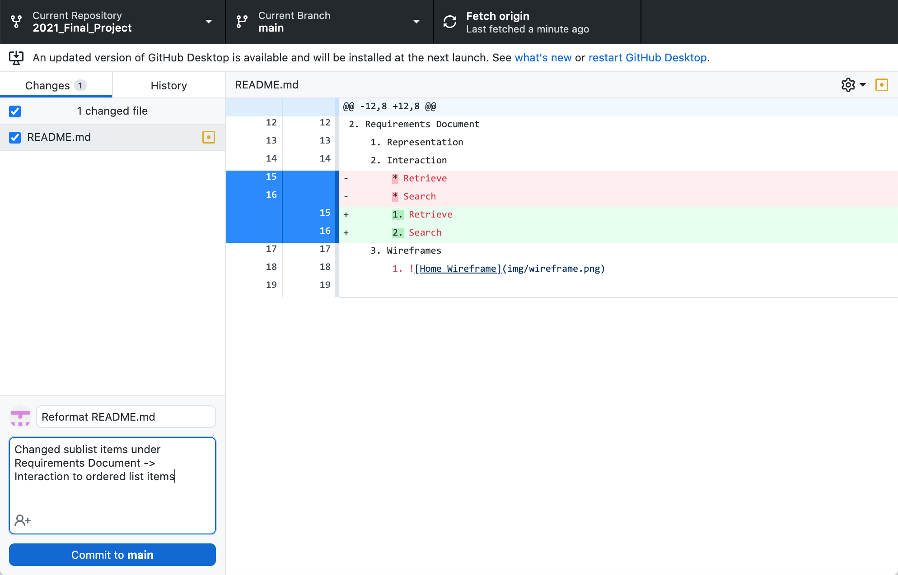

###### Figure 3.3: Adding a meaningful commit summary is essential for collaborative coding

The top fill-in area is for the title of your commit message and the bottom is for the description of the commit. _**Never**_ commit with the default summary listed such as “Changed main.js”, as this making locating a specific commit difficult if you need to revert to it later. Instead, write a concise summary of what changes were made. We recommend using the following action verbs:  "Fix", "Add", or "Change": "Fix the calculateRadius function", "Add the legend feature"; "Change the initial zoom level".

**5\. Add a Short Description to Your Commits**

In the description, it is good practice to elaborate briefly on your summary. You can talk about why the change was needed, what parts of the code were affected, what is different about the code logic, etc.

**6\. Pull the Origin, Then Push Your Changes After Making Commits**

Pull again after you’ve committed, but before you’ve tried pushing your changes to the current branch.

After every commit, it is good practice to pull the remote repo to see if there were changes made _and then_ push your changes to the remote repo. Why do this? First, if something goes wrong with your computer and you just committed an update, you are at risk of losing it since it is not backed up to the remote repo. Second, pushing after each commit helps reduce merge conflicts because your team members can pull your changes often and make sure that they are working on the most up to date version.

**7\. Use Milestones to Monitor Progress**

The GitHub online site offers many features not included on the GitHub desktop client. Notably, GitHub online offers a project management feature called "milestones". _**Milestones**_ are used to track progress on project goals and feature development. In this class, you should create a milestone for every feature of your functional scope. For instance, some milestones could include: "Search Box", "Sequencing slider", "Legend", etc. Milestones can be ranked to prioritize the order tasks should be completed. _**Note:**_ You are required to add all functional requirements as milestones _after_ approval of the group project proposal to make the collaborative work transparent to us.

To create milestones for your group project, select the "Issues" tab, and click the "milestones" button (Figure 3.4). 

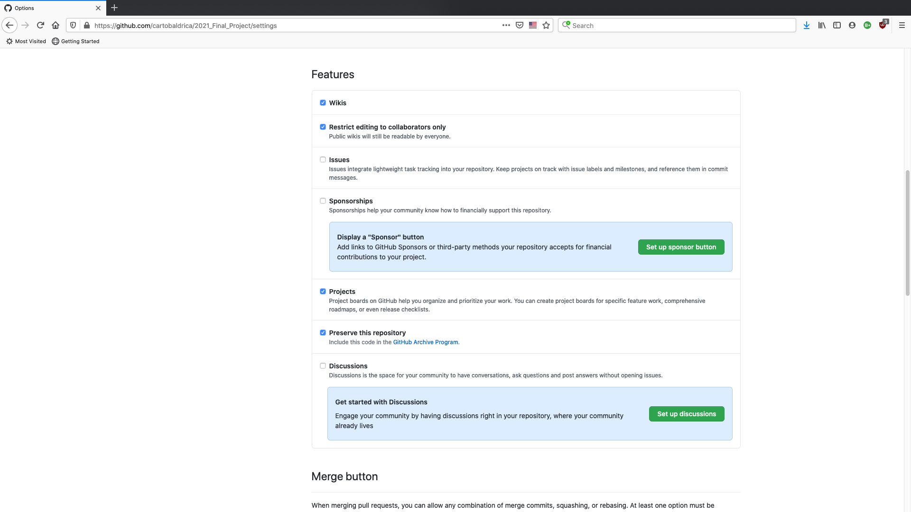

###### Figure 3.4: Adding milestones to your collaborative repo

Next, click "create milestone" and fill in the details from your proposal, potentially assigning the milestone to one or more team members (Figure 3.5).

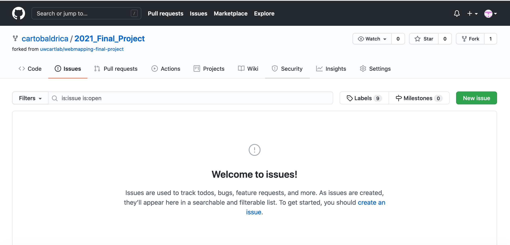

###### Figure 3.5: Creating a milestones

More [information about milestones](https://docs.github.com/en/github/managing-your-work-on-github/creating-and-editing-milestones-for-issues-and-pull-requests) is available in the GitHub help information.

**8\. Stay in Contact with Your Team**

Use Slack and video conference platforms to stay in contact with your team. Determine whether you prefer to work at the same time or independently. Virtual collaboration is difficult, so don't be afraid to overcommunicate until you figure out a workflow.

**9\. Consult Documentation**

In addition to discussing any issues with your team members, remember that GitHub has a number of instructional guides, such as [collaborating with issues and pull requests](https://docs.github.com/en/github/collaborating-with-issues-and-pull-requests) that may help resolve many common issues. You can also check online forums, like the [GitHub Support Community](https://github.community/) to see if anyone has asked a similar question before.

## Activity 7

1.  Clone the collaborative repository we created for you.
2.  Add your name to the top of the _readme.md_ file, using a commit message "Activity 7"
3.  Add an outline based on the group project proposal requirements.

_This work is licensed under a [Creative Commons Attribution 4.0 International License](http://creativecommons.org/licenses/by/4.0/).   For more information, please contact Robert E. Roth \(reroth@wisc.edu\)._

### [Return Home](../../../) | [Previous Chapter](../Chapter06) | [Next Chapter](../Chapter08)

