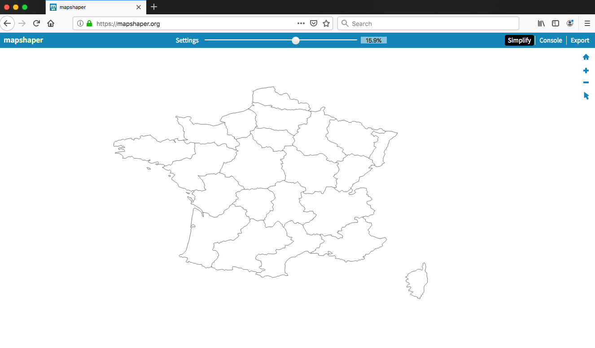
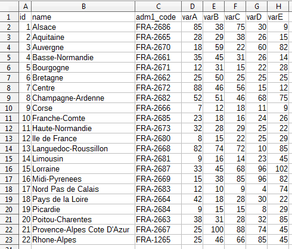
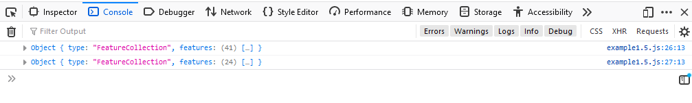
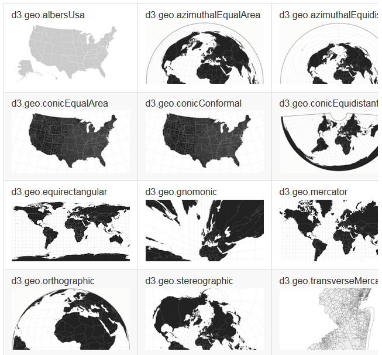
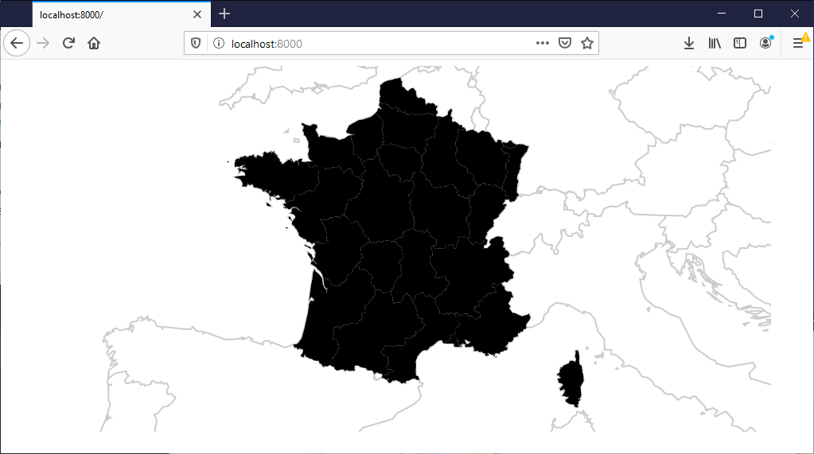

### [Return Home](../../../) | [Previous Chapter](../Chapter08) | [Next Chapter](../Chapter10)

Chapter 9: Mapping with D3
===========================

Now that you have a basic understanding of some foundational D3 concepts, it is time to make a map! Chapter 9 includes three shorter lessons (one optional) as you work on your final project proposal and ends with Activity 9, creating your first D3 map.

-   In Lesson 1, we cover some useful ancillary tools and techniques, including the TopoJSON data format, the MapShaper web application, and `Promise.all()` for combining multiple AJAX calls.
-   In Lesson 2, we tackle the somewhat complex but vital topic of D3 map projections, walking through D3's projection and path generators to map spatial data as vector linework in the browser.
-   In the optional Lesson 3, we add a background graticule to our web map to provide additional spatial context.

After this chapter, you should be able to:

-   Convert shapefile and GeoJSON data into TopoJSON format, import data from multiple files to the DOM, and translate TopoJSON data into GeoJSON for display in the browser.
-   Implement an appropriate projection for your choropleth map using a D3 projection generator, correctly manipulate its projection parameters, and draw geometries from spatial data and elements of a graticule using path generators.

Lesson 1: D3 Helper Tools and Techniques
----------------------------------------

### I. An Introduction to TopoJSON

_**[TopoJSON](https://github.com/mbostock/topojson/wiki)**_ is the first geospatial data format for the Web that encodes topology. As briefly introduced in Chapter 3, _**topology**_ describes the digital encoding of spatial relationships of connected/unconnected, adjacent/detached, inside/outside, etc., into data captures of geographic phenomena. We did not worry much about topology for Lab 1, as the map only drew points rather than lines or polygons (technically, the proportional symbols were polygonal SVGs, but centered on a single point spatial coordinate). Topology is important for rendering polygons for the Lab 2 choropleth map.

For desktop GIS software, [topology](http://webhelp.esri.com/arcgisserver/9.3/java/index.htm#geodatabases/topology_basics.htm) is encoded by coverage and geodatabase file formats but not in shapefiles. The advantages of topological data formats over "spaghetti model" data formats such as shapefiles and GeoJSON are threefold:

1.  Data integrity can be maintained when features are edited; in other words, editing feature boundaries will not result in gaps or overlaps between features.
    
2.  Spatial analysis using the relationships between features is easier to perform.
    
3.  File size is significantly reduced because overlapping vertices and feature edges are eliminated.
    

This last point is especially important for mapping vector data on the Open Web. While bandwidths and processors are constantly improving, datasets also are growing in size and a significant performance penalty remains for loading very large datasets into the browser, particularly on mobile networks. The GeoJSON format was designed based on the [Simple Features standard](http://www.opengeospatial.org/standards/sfa), and stores points, lines, and polygons as individual features in a `FeatureCollection`. Thus, in any polygon dataset, each line that forms an edge between two polygons is duplicated—it is stored separately for each feature that uses it.

The TopoJSON format, created by D3 creator Mike Bostock, eliminates all of this duplicate data by implementing topology using JSON syntax. TopoJSON files are a fraction of the size of the equivalent data as GeoJSON, making them much faster to draw in the browser. Rather than storing all of the vertices as coordinate arrays for each feature, TopoJSON stores a list of Arcs for each feature, a separate list of arc coordinates, and a mathematical transform to georeference those coordinates within the [EPSG:4326/WGS 84](https://spatialreference.org/ref/epsg/4326/) coordinate reference system.

Examples 1.1 and 1.2 show a single, relatively simple polygon feature stored as GeoJSON and TopoJSON, respectively. Compare these two examples and notice the differences in data structure.

###### Example 1.1: A single polygon feature stored as GeoJSON

    {
        "type":"FeatureCollection",
        "features":[
            {
                "type":"Feature",
                "properties":{
                    "adm1_code":"FRA-2669",
                    "name":"Midi-Pyrénées"
                },
                "geometry":{
                    "type":"Polygon",
                    "coordinates":[[[1.546190219702851,45.027639472483656],[1.799559766669859,44.93286489529868],[2.058717075132904,44.97511037934049],[2.18160363120262,44.63122955969641],[2.454713575870812,44.66156362576072],[2.726738314921306,44.93534536399733],[2.926571079291875,44.768585516808116],[2.925795932935955,44.69081248620722],[3.066252476370664,44.56420522708953],[3.140718215073548,44.420958157492976],[3.123354933283508,44.26339671468662],[3.249497105307171,44.19115306316331],[3.306444532589069,44.06914500623702],[3.442405225720563,44.000234483234806],[3.050904575285927,43.701467189958805],[2.775624220281543,43.61790639876125],[2.641368848593459,43.6330992702151],[2.656716749678253,43.460784207325275],[2.567523228414245,43.422827867112346],[2.261495396195585,43.442258206451015],[2.031690300966602,43.42256948469395],[1.742302280126125,43.32779490840829],[1.719047885851239,43.18341095635054],[1.952728712859823,43.095741889376654],[1.977223340584715,42.86374054628914],[2.086157261348546,42.73814097842342],[1.938310987761838,42.571794542384225],[1.466814411955511,42.64145518001254],[1.068182413787383,42.77612396285059],[0.656321248027155,42.838419902056785],[0.608158813078774,42.6879898078833],[0.275388428433189,42.66868866065312],[0.169167521264058,42.72646291113443],[-0.038933471502503,42.68514760397869],[-0.305134937527328,42.83081010690091],[-0.29002844865397,42.98760895428978],[-0.080687222437348,43.17250722872558],[0.023234084085686,43.339163723127285],[-0.047278407572435,43.5222274849105],[-0.267006598375815,43.62317739542044],[-0.195279709890713,43.738855089390825],[-0.16747779026781,43.93091054908257],[-0.00885698116474,43.92398590782335],[0.592501662122004,44.07281403334093],[0.65890587710453,44.037570705823384],[0.905919223593287,44.201023261114585],[1.051336704425353,44.3677831083038],[1.012992790584804,44.54756541571135],[1.287963088125991,44.71737417327944],[1.546190219702851,45.027639472483656]]]
                }
            }
        ]
    }

###### Example 1.2: The same polygon feature as in Example 1.1, stored as TopoJSON

    {
        "type":"Topology",
        "transform":{
            "scale":[0.0036525732585262097,0.0025214013656051654],
            "translate":[-0.305134937527328,42.571794542384225]
        },
        "arcs":[[[507,974],[69,-38],[71,17],[34,-136],[75,12],[74,108],[55,-66],[0,-31],[38,-50],[20,-57],[-4,-62],[34,-29],[16,-48],[37,-27],[-107,-119],[-76,-33],[-36,6],[4,-68],[-25,-15],[-83,7],[-63,-8],[-79,-37],[-7,-57],[64,-35],[7,-92],[30,-50],[-41,-66],[-129,28],[-109,53],[-113,25],[-13,-60],[-91,-8],[-29,23],[-57,-16],[-73,58],[4,62],[57,73],[29,66],[-19,73],[-61,40],[20,46],[8,76],[43,-3],[165,59],[18,-14],[68,65],[39,66],[-10,72],[75,67],[71,123]]],
        "objects":{
            "example":{
                "type":"GeometryCollection",
                "geometries":[
                    {
                        "arcs":[[0]],
                        "type":"Polygon",
                        "properties":{
                            "adm1_code":"FRA-2669",
                            "name":"Midi-Pyrénées"
                        }
                    }
                ]
            }
        }
    }

In Example 1.1, all data related to the polygon feature is stored in a single `"Feature"` object within the `"features"` array (lines 4-14). In Example 1.2, identifying data related to the polygon feature is stored in a `"Polygon"` object within the '"geometries"' array (lines 12-19), while the `"arcs"` used by that feature are stored in a separate array that contains other arrays with integers (line 7). Since each decimal must be stored in the computer's memory as an 8-bit character, storing integers rather than float values further reduces the file size in addition to the reduction achieved by eliminating line duplication. The `"transform"` (Example 1.2 lines 3-6)—like the information stored in the ._prj_ file of a shapefile—is a mathematical function applied to each integer to turn it into a geographic coordinate.

While Example 1.2 appears to contain more lines of code, keep in mind that the line breaks were added to improve human readability. If you were to save each example as a separate file, you would discover that the size of the GeoJSON file is 2.03 KB, whereas the TopoJSON is only 771 bytes—less than half the GeoJSON size, even without any shared feature edges to eliminate.

### II. Using Mapshaper to Simplify and Convert Spatial Data

The major downside to using TopoJSON is that it is under-supported by major desktop GIS software, making converting data to TopoJSON a bit tricky. There is a [command-line tool](https://github.com/topojson/topojson/blob/master/README.md#command-line-reference) available, but it can be difficult to install and work with. Fortunately, there are now at least two web applications that can do the work for us. You already know about one of them, [geojson.io](http://geojson.io/), from Chapter 3. In this tutorial, we will make use of the second: [MapShaper](http://mapshaper.org/).

_**MapShaper**_ is a line and polygon simplification tool developed and maintained by New York Times Graphics Editor (and UW-Madison alum!) Matthew Bloch. As discussed in lecture, geospatial data often need to be generalized for interactive web maps, sometimes at different scales for slippy web maps. Line generalization is especially important for mobile-first design to simplify overly-complex geometry. For the D3 map, you will want to balance keeping your geographic areas recognizable with minimizing the data size to maximize the speed of drawing and interaction in the browser. This tradeoff almost certaintly requires simplifying your chosen spatial data. MapShaper has the added benefit of converting from shapefiles, GeoJSON, or other "flat" files without topology (e.g., DBF and CSV) into TopoJSON as part of the generalization export process.

The following lessons make use of two GeoJSON files: [_EuropeCountries.geojson_](data/EuropeCountries.geojson "EuropeCountries.geojson") and [_FranceRegions.geojson_](data/FranceRegions.geojson "FranceRegions.geojson"). You should replace these with your own chosen geospatial datasets gathered for your D3 map as part of Activity 8. If you are still searching for polygonal linework, a good source for global- and country-scale data for D3 mapping is [Natural Earth](http://www.naturalearthdata.com/). Other sources may require that you first convert the coordinate system to EPSG:4326/WGS 84 using desktop GIS (try some Google Fu to determine how to do this in your preferred GIS software). If you are working with shapefiles, delete any extra attributes from your dataset to reduce the file size, leaving just the attribute field you will use for joining your multivariate CSV data prepared for Activity 8.

> **Find your polygon data, confirm it is in EPSG:4326 in desktop GIS, and strip extra attributes.**

The next step is to navigate to [mapshaper.org](http://mapshaper.org/) and import your geospatial dataset(s) by dragging them into the browser. Shapefiles should be dragged into the browser as a single, compressed _.zip_ file. If formatted correctly, your data should appear immediately as linework against a blank backdrop. If it does not appear, go back to your desktop GIS software and check that you have removed any projection information by assigning EPSG:4326 as the CRS.

Once you see your data, select "Simplify" in the upper-right-hand corner of the web page. You are presented with a choice of three simplification methods; their differences usually does not matter for simplified interactive web mapping, as they converge the more the linework is simplified. Click "Next" and then use the slider at the top of the page to simplify the linework (Figure 1.1). When you are satisfied with the appearance of the linework (use your cartographic judgement!), click on "Export" in the upper-right corner, then select "TopoJSON". Save the file in the _data_ folder of your _unit-3_ website directory and change the file extension from _.json_ to _.topojson._

###### Figure 1.1: Simplifying spatial data in MapShaper

> ### **Simplify your spatial data and convert it to TopoJSON format using mapshaper. Save the resulting TopoJSON in the _data_ folder of your _unit-3_ directory, changing the file extension to _.topojson_.**

Note: For Mac users, you may need to right click the file, go to "Get Info" and rename it in "Name & Extension" to change the file extension from .json to .topojson.

### III. Using Promises to Load Data into the DOM

At this point, you should have at least one TopoJSON file for your spatial data (this tutorial uses two) and one CSV file for your attribute data. The attribute CSV should be a table of geographic features that includes an identifying attribute shared with the spatial data (Figure 1.2, column C) and at least five quantitative attributes that are of interest to you (columns D-H). Replace the [dummy data](data/unitsData.csv "unitsData.csv") in Figure 1.2 with your own chosen dataset.

###### Figure 1.2: An example multivariate dataset

The next task is to load _all_ of our data files into the DOM using the AJAX concepts first introduced in Chapter 3. In particular, think about how AJAX callbacks work: after each data file is loaded, the data is passed to a callback function. It only can be accessed within that function because it is loaded asynchronously with the rest of the script. But what if you want to access data from multiple external files or continuous data streams? You could load the files in series, calling an AJAX method for the third file within the callback of the second file and calling the AJAX method for the second file within the callback of the first—in essence, nesting the callback functions and accessing the data from the innermost callback, or by using a string of `.then()` methods. However, it quickly becomes unwieldy to keep track of the scripts within these nested callback methods. Further, one dataset in the series may load but others may not, producing potential errors when rendering and interacting with the map.

There is a simpler _and_ more efficient way to load multiple datasets into the browser using JavaScript: promises. Recall from Chapter 03 that a **_promise_** is a placeholder JavaScript object that represents and eventually stores the completion of asynchronous processes, such as loading data. The [Promise.all()](https://developer.mozilla.org/en-US/docs/Web/JavaScript/Reference/Global_Objects/Promise/all) method supports multiple AJAX calls, firing a single callback function containing all loaded datasets once the final dataset is loaded.

Create a promise to load your datasets within a `setMap()` function in _main.js._ The `setMap()` function should contain a single, unnamed D3 block that uses a call to the `Promise.all()` method (Example 1.3).

###### Example 1.3: Loading data streams with `Promise.all()` in _main.js_

    //begin script when window loads
    window.onload = setMap();
    
    //set up choropleth map
    function setMap(){
        //use Promise.all to parallelize asynchronous data loading
        var promises = [d3.csv("data/unitsData.csv"),                    
                        d3.json("data/EuropeCountries.topojson"),                    
                        d3.json("data/FranceRegions.topojson")                   
                        ];    
        Promise.all(promises).then(callback);
    };

In Example 1.3, the methods [`d3.csv()`](https://github.com/d3/d3-request/blob/master/README.md#csv) and [`d3.json()`](https://github.com/d3/d3-request/blob/master/README.md#json) are AJAX methods similar to `fetch()`. D3 provides many convenient [AJAX methods](https://github.com/d3/d3-request/blob/master/README.md) that can be used individually or as part of a promise. These normally are called with a URL and callback as their own parameters, but `Promise.all()` only uses the AJAX method name and takes care of the rest.

Once we have set up our `Promise.all()` block, we can write the callback function. Place this function within `setMap()` so that it can make use of local variables that will be added later (Example 1.4).

###### Example 1.4: Adding a callback to `setMap()` in _main.js_

    //Example 1.3 line 4...set up choropleth map
    function setMap() {
        //use Promise.all to parallelize asynchronous data loading
    
        var promises = [
            d3.csv("data/unitsData.csv"),
            d3.json("data/EuropeCountries.topojson"),
            d3.json("data/FranceRegions.topojson"),
        ];
        Promise.all(promises).then(callback);
    
        function callback(data) {
            var csvData = data[0],
                europe = data[1],
                france = data[2];
            console.log(csvData);
            console.log(europe);
            console.log(france);
        }
    }

The `console.log()` statements print the results to separate lines of the console. As you can see in Figure 1.3, `d3.csv()` automatically formats the imported CSV data as an array, and `d3.json()` formats the spatial data as an object.

###### Figure 1.3: Results of Promise.all() callback

> ### **Load your datasets using a JavaScript promise and confirm the data are loading correctly using the console.**

### IV. Using Topojson.js to Translate TopoJSON

D3, Leaflet, and other web mapping libraries do not natively support TopoJSON data. Rather, to use our TopoJSON, we need to convert it _back_ to GeoJSON within the DOM. Accordingly, it may seem counterintuitive to use TopoJSON at all. However, we still saved the user's bandwidth and data plan by loading the smaller TopoJSON file, and still can make use of the topology in the original TopoJSON to speed more advanced spatial analyses in browser.

We will use Mike Bostock's small `topojson.js` library to convert TopoJSON to GeoJSON in browser.

> ### **Download [topojson.js](https://github.com/topojson/topojson/releases/tag/v3.0.2) (search for "latest release", and download the "topojson.zip"), and place it in your _lib_ folder. Add a script link in _index.html_.**

As explained in the `topojson.js` [API Reference](https://github.com/topojson/topojson/blob/master/README.md), the `topojson.feature()` method translates TopoJSON to GeoJSON. The `topojson.feature()` method takes two parameters: the variable holding the TopoJSON data (created from our callback in Example 1.4) and the object within that variable containing the TopoJSON formatted data we want to convert (Example 1.5).

###### Example 1.5: Converting TopoJSON to GeoJSON in _main.js_

        function callback(data){        
        		...
        		
            //translate europe TopoJSON
            var europeCountries = topojson.feature(europe, europe.objects.EuropeCountries),
                franceRegions = topojson.feature(france, france.objects.FranceRegions);
    
            //examine the results
            console.log(europeCountries);
            console.log(franceRegions);
        };

In Example 1.5, each TopoJSON object is passed as the first parameter to `topojson.feature()`. The second parameter is the object that holds the details unique to each dataset. In Example 1.2 (line 9), this object was named `"example"`; for our tutorial spatial data, it retains the name of the original file that was passed through MapShaper. Once the data has been translated and assigned to variables, we can examine those variables in the console and see that they are now GeoJSON `FeatureCollection`s:

###### Figure 1.4: GeoJSON data created in the DOM by topojson.js

> ### **In _main.js_, use `Promise.all()` to load your TopoJSON and CSV data into the DOM. Use _topojson.js_ to translate the imported data into GeoJSON format for mapping with D3.**

Lesson 2: D3 Projections and Path Generators
--------------------------------------------

### I. Creating a D3 Projection

Now that you have imported your geospatial data, the next step is to project it. Start by reviewing map projections, one of the more complex topics in cartography. 

A _**projection**_ is a mathematical translation from a 3D model of the Earth (called the _reference globe_) to a two-dimensional surface (called the _developable surface_). Projection equations stretch geographic coordinates based on a spheroid, ellipsoid, or geoid model of Earth so that they can be displayed on a planar (two-dimensional) surface, such as your computer screen.

Projections vary by the shape of the plane (_**class**_), by how many times the plane intersects the ellipsoid (_**case**_), and by rotation angle of the plane from north (_**aspect**_). Projections also vary in the topological property they preserve from the original 3D model, distorting others: areas, distances, directions, and/or angles (sometimes described as "shape", although no projection preserves shape). If this is unfamiliar to you, we recommend reviewing the [Map Projections](https://gistbok.ucgis.org/bok-topics/map-projections) entry in the GIS&T Body of Knowledge.

Figure 2.1 demonstrates the distortion that occurs in even the simplest of projections, the Plate Carrée, an equidistant cylindrical projection. This projection is produced by the set of equations \[x = λ, y = ϕ\], where x and y are horizontal and vertical coordinates on a two-dimensional Cartesian grid, λ (lamda) is longitude, and ϕ (phi) is latitude.

###### Figure 2.1: Projecting the globe onto a two-dimensional surface using the Plate Carrée projection ([original graphic](http://bl.ocks.org/mbostock/5731632) by Mike Bostock)

Fortunately for us, modern desktop GIS software does the dirty work of applying projections to our chosen spatial datasets, meaning we usually do not have to learn the complex math behind projections. We instead select the projection that is cartographically appropriate given the type and scale of the map we want to make. We recommend [Projection Wizard](https://projectionwizard.org/) to help inform an appropriate projection for your Lab 2 map, making sure it is equal-area given we are making a choropleth map!

Unfortunately for cartographers, with the advent of tile-based slippy maps—such as the one you created for your Leaflet map—one projection became dominant on the Web: so-called [Web Mercator](https://en.wikipedia.org/wiki/Web_Mercator). This projection was created and popularized by Google in the mid-2000's; before it was assigned an official EPSG code (now 3857), it was unofficially referenced using the code EPSG:900913—a clever pun. It was chosen by Google for its technical advantages: it is a relatively simple equation, a cylindrical projection that can be made infinitely continuous to the east and west, and approximately conformal so it preserves angles at high latitudes, making it good for navigation at local zoom levels anywhere on the planet. But for thematic mapping, it suffers from the disadvantage of severe area distortion at high latitudes, exaggerating the land area of the northern hemisphere (e.g., Greenland appears to be larger than Africa when in reality it is much smaller). While it is possible to make slippy map tilesets in other projections, it remains rare.

However, D3 presents an opportunity to break from Web Mercator, supporting supports hundreds of different map projections thanks to the collaboration between Mike Bostock and data visualization artist [Jason Davies](https://www.jasondavies.com/). Several common projections are included in D3 through the [Geo Projections](https://github.com/d3/d3-geo/blob/master/README.md#projections) portion of the library (Figure 2.2). But many others can be added through the [Extended Geographic Projections](https://github.com/d3/d3-geo-projection/) and [Polyhedral Geographic Projections](https://github.com/d3/d3-plugins/tree/master/geo/polyhedron) plugins. Not only can you choose which projection to use with your spatial data; you can change virtually any parameter that goes into each projection. D3 even enables you to smoothly transition between [different projections](http://bl.ocks.org/mbostock/3711652) and [projection parameters](https://www.jasondavies.com/maps/transition/).

###### Figure 2.2: Projections included in D3's Geo Projections module

In the script, D3 implements projections using projection generators. Recall from Chapter 8 that a D3 generator is a function that is returned by a D3 generator method and stored in a local variable. Any D3 projection method will return a _**projection generator**_, which must then be fed into the [`d3.geoPath()`](https://github.com/d3/d3-geo/blob/master/README.md#geoPath) method to produce _another_ generator: the path generator. Finally, the path generator is accessed within a selection block to draw the spatial data as path strings of the `d` attributes of SVG `<path>` elements. This process will become clearer as we build our generators below.

Let's start with the projection generator (Example 2.1). In this example, we will work with an [Albers equal-area conic projection](https://en.wikipedia.org/wiki/Albers_projection) centered on France. You may wish to follow the example at first, then choose a different projection and/or edit the parameters to make the projection appropriate for your data.

###### Example 2.1: Creating an Albers projection generator in _main.js_

    //Example 1.4 line 1...set up choropleth map
    function setMap(){
    
        //map frame dimensions
        var width = 960,
            height = 460;
    
        //create new svg container for the map
        var map = d3.select("body")
            .append("svg")
            .attr("class", "map")
            .attr("width", width)
            .attr("height", height);
    
        //create Albers equal area conic projection centered on France
        var projection = d3.geoAlbers()
            .center([0, 46.2])
            .rotate([-2, 0, 0])
            .parallels([43, 62])
            .scale(2500)
            .translate([width / 2, height / 2]);
    
        //use Promise.all to parallelize asynchronous data loading
        var promises = [];    
        promises.push(d3.csv("data/unitsData.csv")); //load attributes from csv    
        promises.push(d3.json("data/EuropeCountries.topojson")); //load background spatial data    
        promises.push(d3.json("data/FranceRegions.topojson")); //load choropleth spatial data    
        Promise.all(promises).then(callback);
    }

In Example 2.1, before we can create the projection, we first write a `map` block to append the `<svg>` container that will hold the map and give it dimensions of 960 pixels by 460 pixels (lines 4-13). To create the projection, we use the [`d3.geoAlbers()`](https://github.com/d3/d3-geo/blob/master/README.md#geoAlbers) projection method (line 16; note this is an alias of the `d3.geoConicEqualArea()` method shown in Figure 2.2). The four operators on lines 17-20 are D3's way of implementing mathematical [projection parameters](https://github.com/mbostock/d3/wiki/Geo-Projections#_projection):

-   [`.center()`](https://github.com/d3/d3-geo/blob/master/README.md#projection_center) specifies the \[longitude, latitude\] coordinates of the center of the developable surface.
    
-   [`.rotate()`](https://github.com/d3/d3-geo/blob/master/README.md#projection_rotate) specifies the \[longitude, latitude, and roll\] angles by which to [rotate the reference globe](http://bl.ocks.org/mbostock/4282586). 
    
-   [`.parallels()`](https://github.com/d3/d3-geo/blob/master/README.md#conic_parallels) specifies the two standard parallels of a conic projection. If the two array values are the same, the projection is a _**tangent**_ case (the plane intersects the globe at one line of latitude); if they are different, it is a _**secant**_ case (the plane intersects the globe at two lines of latitude, slicing through it).
    
-   [`.scale()`](https://github.com/d3/d3-geo/blob/master/README.md#projection_scale) is a factor by which distances between points are multiplied, increasing or decreasing the scale of the map.
    

The fifth parameter, [`.translate()`](https://github.com/d3/d3-geo/blob/master/README.md#projection_translate) (line 21), offsets the pixel coordinates of the projection's center in the `<svg>` container. Keep these as one-half the `<svg>` width and height to keep your map centered in the container.

Note that D3's projection parameters differ somewhat from the [projection parameters](http://help.arcgis.com/en/geodatabase/10.0/sdk/arcsde/concepts/geometry/coordref/coordsys/projected/mapprojections.htm) commonly used by desktop GIS software. Rather than treating the projection centering holistically, D3 breaks it down into the position of the reference globe and the developable surface. The first two values given to `.rotate()` specify the reference globe's central meridian and central parallel, while `.center()` specifies the latitude and longitude of the developable surface's center. For conic projections, in order to keep north "up" in the center of the map and minimize distortion in your area of focus, you should keep the `.center()` longitude and `.rotate()` latitude each as `0` and assign the center coordinates of your chosen area as the `.center()` latitude and `.rotate()` longitude (Example 1.4 lines 17-18). If the geometric reasons for this are hard to grasp, you can experiment with different parameter values and see their effects using the Albers projection demonstration web app linked below.

> ### **Experiment with the uwcart [D3 Albers Projection Demo](http://uwcart.github.io/d3-projection-demo/) web application to see how different D3 parameter values affect the Albers projection. Then, visit the [D3 Geo-Projections](https://github.com/d3/d3-geo/blob/master/README.md#projections) page and the [Extended Geographic Projections](https://github.com/d3/d3-geo-projection/) page and choose a projection to implement that is cartographically appropriate given your chosen data. Make sure the selected projection is <ins>_equal-area_</ins>! Write the projection block for your chosen projection in _main.js_.**

### II. Drawing Projected Data

Having created a projection function, we can now apply it to our spatial data to draw the represented geographies. In order to do this, we need to use `d3.geoPath()` to create a _**path generator**_ (Example 2.2).

###### Example 2.2: Creating a path generator in _main.js_

        //Example 2.1 line 15...create Albers equal area conic projection centered on France
        var projection = d3.geoAlbers()
            .center([0, 46.2])
            .rotate([-2, 0])
            .parallels([43, 62])
            .scale(2500)
            .translate([width / 2, height / 2]);
    
        var path = d3.geoPath()
            .projection(projection);

Creating the path generator is straightforward—we just create a two-line block, first calling `d3.geoPath()`, then using the `.projection()` operator to pass it our projection generator as the parameter (lines 9-10). The variable `path` now holds the path generator. Apply it to draw the geometries from our spatial data (Example 2.3).

###### Example 2.3: Drawing geometries from spatial data in _main.js_

    //Example 1.5 line 1
    function callback(data){               
        
         ...
            //translate europe TopoJSON
            var europeCountries = topojson.feature(europe, europe.objects.EuropeCountries),
                franceRegions = topojson.feature(france, france.objects.FranceRegions).features;
    
            //add Europe countries to map
            var countries = map.append("path")
                .datum(europeCountries)
                .attr("class", "countries")
                .attr("d", path);
    
            //add France regions to map
            var regions = map.selectAll(".regions")
                .data(franceRegions)
                .enter()
                .append("path")
                .attr("class", function(d){
                    return "regions " + d.properties.adm1_code;
                })
                .attr("d", path);
    };

In Example 2.3, we add two blocks: one for the background countries (lines 8-11) and one for the regions that will become our choropleth enumeration units (lines 14-21). Because the `countries` block takes the `europeCountries` GeoJSON `FeatureCollection` as a single datum, all of its spatial data is drawn as a single feature. A single SVG `<path>` element is appended to the map container, and its `d` attribute is assigned the `path` generator. This automatically passes the datum to the `path` generator, which returns an SVG path coordinate string to the `<path>` element's `d` attribute. (Do not confuse the `<path> d` attribute with the variable `d` that iteratively holds each datum in a `.data()` block, such as on line 18 of Example 2.3). To recall what a path coordinate string looks like, review Chapter 6 or see Figure 2.3.

To create our enumeration units, we use the `.selectAll().data().enter()` chain to draw each feature corresponding to a region of France separately (lines 14-16). Recall that `.data()` requires its parameter to be in the form of an array, whereas `topojson.feature()` converts the TopoJSON object into a GeoJSON `FeatureCollection` object. For our `regions` block to work, we need to pull the array of features out of the `FeatureCollection` and pass that array to `.data()`, so we tack on `.features` to the end of line 5 to access it. Once that is done, a new `<path>` element is appended to the map container for each region (line 17). Two class names are assigned to each `<path>`: the generic class name `regions` for all enumeration units and a unique class name based on the region's `adm1_code` attribute (lines 18-20). Each `<path>` is then drawn with the region geometry by the `path` generator (line 21).

Now we can see our geometries in the browser and use the inspector to distinguish each individual `<path>` element (Figure 2.3).

###### Figure 2.3: Spatial geometries drawn in the browser

If you think you have done everything right so far but you do _not_ see your geometries in the browser—particularly if you get a bunch of seemingly random lines or polygons, or just a black map container—it is likely that your geospatial data was projected into something other than EPSG:4326/WGS 84. In this case, D3 attempts to project the already projected data, resulting in visual chaos. If your data is projected, you will need to return to Lesson 1 and "reproject" your data to "unprojected" EPSG:4326/WGS 84 before you can continue.

Obviously, we do not want our map to be colored default black-and-white. We will color these regions dynamically to produce a choropleth and allow the user to reexpress the mapped attribute in Chapter 10. We can add an outline of the countries of Europe for reference, or similar context features for your Lab 2, by adding some simple styles to _style.css_ (Example 2.4).

###### Example 2.4: Styling country borders in _style.css_

    .countries {
        fill: #FFF;
        stroke: #CCC;
        stroke-width: 2px;
    }

Figure 2.4 shows the result of the styled surrounding country borders.

###### Figure 2.4: Styled country borders

Feel free to get more creative than this default style in your own D3 Lab 2 assignment.

> ### **Create a path generator and use it to draw your background geometry and enumeration units in the browser. Style your background geometry in _style.css_.**

Lesson 3: The D3 Graticule Generator
------------------------------------

### I. Drawing a Graticule

With our geometries drawn, we could add a flat background color to the `<svg>` map container. But on a small-scale map such as our example, it is helpful to include a graticule to represent the projection distortion and provide an indication of north. Providing a graticule is <ins>_**optional**_</ins> for your D3 map, and probably only makes sense if your mapped geography is abuts large water bodies.

If you want to include a graticule, D3 provides a convenient [`d3.geoGraticule()`](https://github.com/d3/d3-geo/blob/master/README.md#geoGraticule) method for creating a _**graticule generator**_. To use it, first create the graticule generator (Example 2.5).

###### Example 2.5: Creating a graticule generator in _main.js_

        //Example 2.3 line 1
        function callback(data){   
    
            ...
            
            //create graticule generator
            var graticule = d3.geoGraticule()
                .step([5, 5]); //place graticule lines every 5 degrees of longitude and latitude

The [`.step()`](https://github.com/d3/d3-geo/blob/master/README.md#graticule_step) operator (line 5) tells the generator to place a graticule line every five degrees of longitude and latitude. Next, use the `graticule` generator to give us the geospatial data for the graticule lines we will place on the map, and our `path` generator to draw the `<path>` element `d` strings for them (Example 2.6).

###### Example 2.6: Drawing graticule lines in _main.js_

            //Example 2.5 line 3...create graticule generator
            var graticule = d3.geoGraticule()
                .step([5, 5]); //place graticule lines every 5 degrees of longitude and latitude
    
            //create graticule lines
            var gratLines = map.selectAll(".gratLines") //select graticule elements that will be created
                .data(graticule.lines()) //bind graticule lines to each element to be created
                .enter() //create an element for each datum
                .append("path") //append each element to the svg as a path element
                .attr("class", "gratLines") //assign class for styling
                .attr("d", path); //project graticule lines

In Example 2.6, we use the `.selectAll().data().enter()` chain to create a separate `<path>` element for each line of the graticule. The data is provided by the [`graticule.lines()`](https://github.com/d3/d3-geo/blob/master/README.md#graticule_lines) method (line 7), which builds and returns a GeoJSON features array with all of the graticule lines selected by the `.step()` operator (line 3). To actually see the lines instead of a default black fill, we need to add another set of styles to _style.css_ (Example 2.7).

###### Example 2.7: Graticule line styles in _style.css_

    .gratLines {
        fill: none;
        stroke: #999;
        stroke-width: 1px;
    }

We should now be able to see our graticule lines (Figure 2.5).

###### Figure 2.5: Europe with background graticule lines.

Finally, we can add contrast between land and water by coloring the background of the graticule. For this, we can use the [`graticule.outline()`](https://github.com/d3/d3-geo/blob/master/README.md#graticule_outline) method to create a single GeoJSON polygon the size of the graticule extent (most of the Earth's surface) and build an SVG `<path>` element for that polygon (Example 2.8).

###### Example 2.8: Drawing a graticule background in _main.js_

            //Example 2.6 line 1...create graticule generator
            var graticule = d3.geoGraticule()
                .step([5, 5]); //place graticule lines every 5 degrees of longitude and latitude
    
            //create graticule background
            var gratBackground = map.append("path")
                .datum(graticule.outline()) //bind graticule background
                .attr("class", "gratBackground") //assign class for styling
                .attr("d", path) //project graticule
    
            //Example 2.6 line 5...create graticule lines
            var gratLines = map.selectAll(".gratLines") //select graticule elements that will be created
                .data(graticule.lines()) //bind graticule lines to each element to be created
                .enter() //create an element for each datum
                .append("path") //append each element to the svg as a path element
                .attr("class", "gratLines") //assign class for styling
                .attr("d", path); //project graticule lines

We can then style the `gratBackground <path>` element to symbolize water (Example 2.9). Note that the `.rotate()` latitude of your projection has to be set as `0` for this to work.

###### Example 2.9: Graticule background style in _style.css_

    .gratBackground {
        fill: #D5E3FF;
    }

Note that separating the `gratBackground` and `gratLines` blocks allows us to reorder the drawing of our graticule and spatial data if we so choose. If we wanted our graticule lines to appear on top of our other geometries, we could leave the `gratBackground` block where it is and move the `gratLines` block below the `countries` and `regions` blocks. The interpreter will add the `<path>` elements from each of these blocks in the order they appear in the script.

One final touch we will add to the map background is a frame to neaten the map (Example 2.9).

###### Example 2.9: Framing the map in _style.css_

    .map {
        border: medium solid #999;
    }

Figure 2.6 shows the resulting basemap, ready to receive the choropleth symbolization next chapter!

###### Figure 2.6: D3 map of France

You may choose to add your own stylistic touches to your overall map. Do not feel limited by the rather simple approach we have taken in this example. Consider whether your geometries warrant the kind of background reference and framing we have added here, or if they can [stand on their own](http://bost.ocks.org/mike/map/) within your design.

> ### **Add a graticule (optional).**

## Activity 9

1.  Simplify your spatial data and convert it to TopoJSON format.
2.  Use `Promise.all()` to load your spatial data TopoJSON files and multivariate attribute CSV file into your _main.js_ script.
3.  Choose a projection to use with your choropleth map and create the appropriate D3 projection generator.
4.  Add appropriate styles in _style.css_, which may include a graticule.
5.  Commit and sync your _unit-3_ directory (including the TopoJSON) with the commit message "Activity 9".

_This work is licensed under a [Creative Commons Attribution 4.0 International License](http://creativecommons.org/licenses/by/4.0/).   For more information, please contact Robert E. Roth \(reroth@wisc.edu\)._

### [Return Home](../../../) | [Previous Chapter](../Chapter08) | [Next Chapter](../Chapter10)
