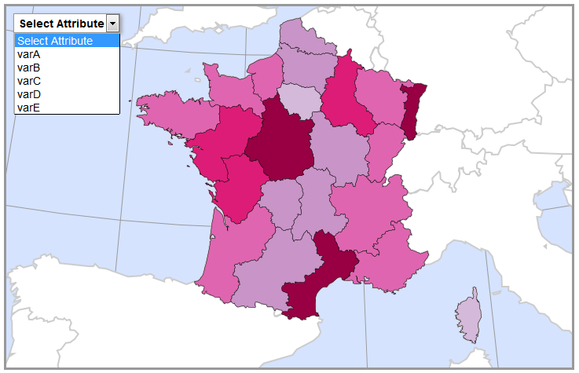
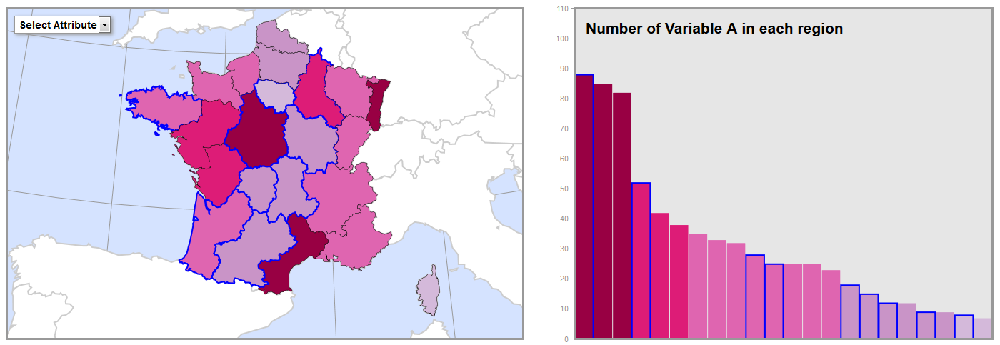
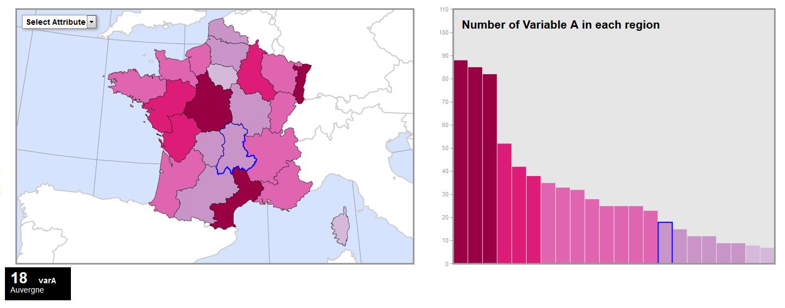

### [Return Home](../../../) | [Previous Chapter](../Chapter10)

Chapter 11: Coordinated Interactions
=================================

Welcome to Chapter 11, the final set of lessons in the Web Mapping workbook! In Chapter 11, we discuss coordinating interactions in D3 between your choropleth map and linked visualization. Chapter 11 includes two lessons and concludes with your final D3 coordinated visualization: 

*   In Lesson 1, we implement the _reexpress_ operator for changing the visualized attribute using the menu selection interface style. Lesson 1 also introduces you to D3 transitions that add visual feedback as the user interacts with the coordinated visualizations.
*   In Lesson 2, we implement a _retrieve_ operator linked between the map and visualization.

After this chapter, you should be able to:

*   Implement the _reexpress_ operator using menu selection to change the attribute in both the map and linked visualization.
*   Implement the _retrieve_ operator using direct manipulation to link enumeration units on the map to elements in the linked visualization.

Lesson 1: Dynamic Attribute Selection
-------------------------------------

### I. Menu Selection

So far, we have worked with one attribute in D3 to create the map and data visualization. However, your dataset includes at least five attributes, and we want the user to be able to _reexpress_ among these attributes. In this lesson, we discuss how to implement the _reexpress_ operator using the menu selection interface style.

For your Leaflet map, you implemented the _**direct manipulation**_ interface style for your interaction operators, enabling the user to probe, drag, or click/tap graphic (non-text) interface controls or the map itself. Specifically, _retrieve_ was implemented with direct manipulation of individual map features, _pan_ and _zoom_ were implemented with direct manipulation of the entire map, and _sequence_ (and possibly _zoom_) was implemented with direct manipulation of a non-map, non-legend, non-isomorphic interface widget (i.e., the slider control).

For your D3 map, we use _menu selection_ to select one of your multivariate attributes from a list. Menu selection is considered "slightly less direct than direct", as it typically uses text rather than graphics as the _visual affordance_ for list items. However, menu selection can include graphics alongside text, such as icons representing different list items (common for mobile), or replace text entirely with graphics (e.g., a map preview). Menu selection has the advantages of lower pointing mileage and greater pointing efficiency while also constraining user interaction to a subset of options (versus the more free form fill-in).

Menu selection has the added advantage of being easy to implement compared to direct manipulation. We make use of a simple HTML `<select>` element for _reexpress_, which provides a dropdown menu for attribute selection. Start by adding a [`<select>`](http://www.w3schools.com/tags/tag_select.asp) dropdown menu to the DOM. Note that the `<select>` element is merely a container for the menu; we also need to add each value we want in the menu as an [`<option>`](http://www.w3schools.com/tags/tag_option.asp) child element. By now, you probably have some idea of how to accomplish both of these tasks using D3 selections. Example 1.1 illustrates one possible set of selection blocks.

###### Example 1.1: Adding a dropdown menu in _main.js_

    //function to create a dropdown menu for attribute selection
    function createDropdown(){
        //add select element
        var dropdown = d3.select("body")
            .append("select")
            .attr("class", "dropdown");
    
        //add initial option
        var titleOption = dropdown.append("option")
            .attr("class", "titleOption")
            .attr("disabled", "true")
            .text("Select Attribute");
    
        //add attribute name options
        var attrOptions = dropdown.selectAll("attrOptions")
            .data(attrArray)
            .enter()
            .append("option")
            .attr("value", function(d){ return d })
            .text(function(d){ return d });
    };

In Example 1.1, we create a new function, `createDropdown()`, which is called from the end of the `callback()` function (not shown). The first block appends the `<select>` element to the `<body>` (lines 4-6). The `titleOption` block creates an `<option>` element with no `value` attribute and instructional text to serve as an affordance alerting users that they should interact with the dropdown menu (lines 9-12). Disabling the title option ensures that the user cannot mistakenly select it (line 11). Finally, the `attrOptions` block uses the `.selectAll().data().enter()` sequence with the `attrArray` pseudo-global variable that holds an array of our attribute names, creating one `<option>` element for each attribute (lines 15-18). Each option element is assigned a `value` attribute that holds the name of the attribute, and its text content (what the user sees as the visual affordance) is also assigned the name of the attribute (lines 19-20).

Once we have created the dropdown menu, we need to do a little styling so that it does not simply appear below the previous element on the page (Example 1.2).

###### Example 1.2: Styling the dropdown in _style.css_

    .dropdown {
        position: absolute;
        top: 30px;
        left: 40px;
        z-index: 10;
        font-family: sans-serif;
        font-size: 1em;
        font-weight: bold;
        padding: 2px;
        border: 1px solid #999;
        box-shadow: 2px 2px 4px #999;
    }
    
    option {
        font-weight: normal;
    }

In Example 1.2, we position the menu `<select>` element absolutely so that it is not affected by other elements on the page (line 2). We then use `top` and `left` styles to offset the menu `<select>` element from the top-left corner of the page (lines 3-4). Adding a `z-index` of 10 ensures that the menu `<select>` element floats to the top of all other elements on the page (line 5). We then add `font` styles and `padding` around the text (lines 6-9). Finally, a `border` and `box-shadow` make the `<select>` element visually float above the map, making it more obvious to the user (lines 10-11). The `option` style simply reduces the text of the `<option>` elements in the menu to normal weight so they are not emboldened by the `font-weight` of the `<select>` element (lines 14-16).

We can now see our dropdown menu with each of our attribute options atop the map (Figure 1.1).

###### Figure 1.1: Attribute selection dropdown menu

### II. Menu Selection Feedback

Once implemented, we need to enable our _reexpress_ menu selection by adding an event listener to the script to listen for a user interaction and an event handler function to respond by changing the expressed attribute, thus giving _visual feedback_ to the user. Start by pseudocoding the feedback tasks (Example 1.3).

###### Example 1.3: Pseudo-code for attribute change listener

    // ON USER SELECTION:
    // Step 1. Change the expressed attribute
    // Step 2. Recreate the color scale with new class breaks
    // Step 3. Recolor each enumeration unit on the map
    // Step 4. Sort each bar on the bar chart
    // Step 5. Resize each bar on the bar chart
    // Step 6. Recolor each bar on the bar chart

Steps 1-3 are relatively simple to take care of within an event handler function (Example 1.4).

###### Example 1.4: Adding a change listener and handler function in _main.js_

    //Example 1.1 line 1...function to create a dropdown menu for attribute selection
    function createDropdown(csvData){
        //add select element
        var dropdown = d3.select("body")
            .append("select")
            .attr("class", "dropdown")
            .on("change", function(){
                changeAttribute(this.value, csvData)
            });
    
        //OPTIONS BLOCKS FROM EXAMPLE 1.1 LINES 8-19
    };
    
    //dropdown change event handler
    function changeAttribute(attribute, csvData) {
        //change the expressed attribute
        expressed = attribute;
    
        //recreate the color scale
        var colorScale = makeColorScale(csvData);
    
        //recolor enumeration units
        var regions = d3.selectAll(".regions").style("fill", function (d) {
            var value = d.properties[expressed];
            if (value) {
                return colorScale(d.properties[expressed]);
            } else {
                return "#ccc";
            }
        });
    }

In Example 1.4, we add a [`.on()`](https://github.com/d3/d3-selection#handling-events) operator to the end of the `dropdown` block to listen for a `"change"` interaction on the `<select>` element (line 7). In this context, `.on()` is a D3 method, but it works similarly to Leaflet's `.on()` method. We pass it an anonymous function, within which we call our new event handler, `changeAttribute()` (lines 7-9). The parameters of `changeAttribute()` are the `value` of the `<select>` element (referenced by `this`), which holds the attribute selected by the user, as well as our `csvData`. The `csvData` will be used to recreate the color scale. Note that we also need to add it as a parameter to the `createDropdown()` function (line 2) and its function call within the `callback()` (not shown).

Within `changeAttribute()`, we complete Step 1 in our pseudocode by simply assigning the user-selected attribute to the `expressed` pseudo-global variable (line 17). For Step 2, we repeat the call to `makeColorScale()`, passing the scale generator our `csvData` and assigning the returned scale to a new `colorScale` variable (line 20). For Step 3, we create a selection of all enumeration units (line 23). Since the enumeration units already have our GeoJSON data attached to them as a property in the DOM, we can re-use their GeoJSON `properties` with the new `colorScale` function to reset each enumeration unit's `fill` attribute (lines 24-30).

The map should now recolor itself when a new attribute is selected from the dropdown menu (Figure 1.2).

###### Figure 1.2: Dynamic attribute selection changes the choropleth

Restyling the dynamic visualization (Steps 4-6) is more challenging, but we can use the same principle of recycling a multi-element selection we used for recoloring the enumeration units on the map in Steps 1-3. The new block should contain a selection of all visualization elements (bars in the bar chart) and each operator that affects an aspect of the element we want to change when a new attribute is selected. For sorting the bars (Step 4), we need `.sort()` and the `x` attribute. For resizing the bars (Step 5), we need the `height` and `y` attributes. Finally, for recoloring the bars (Step 6), we need the `fill` style (Example 1.5).

###### Example 1.5: Manipulating the chart bars on attribute change in _main.js_

    //Example 1.4 line 14...dropdown change event handler
    function changeAttribute(attribute, csvData){
        //change the expressed attribute
        expressed = attribute;
    
        //recreate the color scale
        var colorScale = makeColorScale(csvData);
    
        //recolor enumeration units
        var regions = d3.selectAll(".regions")
            .style("fill", function(d){            
                var value = d.properties[expressed];            
                if(value) {            	
                    return colorScale(value);            
                } else {            	
                    return "#ccc";            
                }    
            });
        //Sort, resize, and recolor bars
        var bars = d3.selectAll(".bar")
            //Sort bars
            .sort(function(a, b){
                return b[expressed] - a[expressed];
            })
            .attr("x", function(d, i){
                return i * (chartInnerWidth / csvData.length) + leftPadding;
            })
            //resize bars
            .attr("height", function(d, i){
                return 463 - yScale(parseFloat(d[expressed]));
            })
            .attr("y", function(d, i){
                return yScale(parseFloat(d[expressed])) + topBottomPadding;
            })
            //recolor bars
            .style("fill", function(d){            
                var value = d[expressed];            
                if(value) {            	
                    return colorScale(value);            
                } else {            	
                    return "#ccc";            
                }    
        });
    };

In Example 1.5, we use `.sort()` to sort the data values for the new attribute from greatest to least (lines 18-20), then reset the `x` attribute of each bar to position the bars in the new order of the data (lines 21-23). To resize the bars, we reset the `height` attribute using our `yScale` with the new expressed attribute values (lines 25-27), then position the bars vertically by resetting the `y` attribute (lines 28-30). Finally, we recolor the bars by resetting the `fill` just as we did for the choropleth enumeration units in Example 1.4.

Note that much of this code is duplicated in the `setChart()` function we created in Chapter 10. The problem with simply copy+pasting this code for dynamic _reexpress_ is that most of the anonymous functions within the operators access variables that are local to `setChart()`, including the dimension variables and our `yScale`. To make these variables accessible to the `changeAttribute()` function, we need to move them to the top of our wrapper function, declaring them as pseudo-global variables (Example 1.6).

###### Example 1.6: Moving chart variables to make them pseudo-global in _main.js_:

    //Top of main.js...wrap everything in a self-executing anonymous function to move to local scope
    (function(){
    
    //pseudo-global variables
    var attrArray = ["varA", "varB", "varC", "varD", "varE"]; //list of attributes
    var expressed = attrArray[0]; //initial attribute
    
    //chart frame dimensions
    var chartWidth = window.innerWidth * 0.425,
        chartHeight = 473,
        leftPadding = 25,
        rightPadding = 2,
        topBottomPadding = 5,
        chartInnerWidth = chartWidth - leftPadding - rightPadding,
        chartInnerHeight = chartHeight - topBottomPadding * 2,
        translate = "translate(" + leftPadding + "," + topBottomPadding + ")";
    
    //create a scale to size bars proportionally to frame and for axis
    var yScale = d3.scaleLinear()
        .range([463, 0])
        .domain([0, 110]);
    
    //begin script when window loads
    window.onload = setMap();
    
    //...the rest of the script

Once we have done this, these variables are available for use by _any_ function in the script. Since we copy-pasted the `bars` block from `setChart()`, we now have a number of repetitive lines in our _main.js_ script. We can clean up the script by moving these lines into their own function, called from both `setChart()` and `changeAttribute()` (Example 1.7).

###### Example 1.7: Consolidating repetitive chart script in _main.js_:

        //in setChart()...set bars for each province
        var bars = chart.selectAll(".bar")
            .data(csvData)
            .enter()
            .append("rect")
            .sort(function(a, b){
                return b[expressed]-a[expressed]
            })
            .attr("class", function(d){
                return "bar " + d.adm1_code;
            })
            .attr("width", chartInnerWidth / csvData.length - 1);
    
        //CHARTTITLE, YAXIS, AXIS, AND CHARTFRAME BLOCKS
    
        //set bar positions, heights, and colors
        updateChart(bars, csvData.length, colorScale);
    }; //end of setChart()
    
        //...
    
        //in changeAttribute()...Example 1.5 line 15...Sort bars
        var bars = d3.selectAll(".bar")
            //Sort bars
            .sort(function(a, b){
                return b[expressed] - a[expressed];
            });
    
        updateChart(bars, csvData.length, colorScale);
    }; //end of changeAttribute()
    
    //function to position, size, and color bars in chart
    function updateChart(bars, n, colorScale){
        //position bars
        bars.attr("x", function(d, i){
                return i * (chartInnerWidth / n) + leftPadding;
            })
            //size/resize bars
            .attr("height", function(d, i){
                return 463 - yScale(parseFloat(d[expressed]));
            })
            .attr("y", function(d, i){
                return yScale(parseFloat(d[expressed])) + topBottomPadding;
            })
            //color/recolor bars
            .style("fill", function(d){            
                var value = d[expressed];            
                if(value) {                
                    return colorScale(value);            
                } else {                
                    return "#ccc";            
                }    
        });
    };

In Example 1.7, the positioning, sizing, and coloring of the bars has been moved into a new `updateChart()` function, which is called from within both `setChart()` and `changeAttribute()` (lines 17 and 29). This function receives the `bars` selection, the length of the `csvData` that corresponds to the number of bars, and the `colorScale`. Note that although it is still repeated in `updateChart()` and `changeAttribute()`, we did not move the `.sort()` operator into `updateChart()` because it necessarily comes before the `class` and `width` attribute assignments in `setChart()`, which should not be repeated when the attribute is changed (lines 6-12 and 25-27).

The final step to updating the chart is to change the chart title. For this, we can move the `.text()` operator from the `chartTitle` block in `setChart()` into `updateChart()` (Example 1.8).

###### Example 1.8: Turning the chart title into visual feedback in _main.js_

        //at the bottom of updateChart()...add text to chart title
        var chartTitle = d3.select(".chartTitle")
            .text("Number of Variable " + expressed[3] + " in each region");

We now have a fully interactive choropleth map and linked visualization, with the affordance of a dropdown menu selection interface and the feedback of updated enumeration units and bars (Figure 1.3).

###### Figure 1.3: Interactive choropleth map and chart

> ### **Implement a visual affordance that allows the user to change the expressed attribute and visual feedback that updates your choropleth map and data visualization in response to user input.**

### III. Transitions

Although our map and visualization now change their state in response to user input, that change is not always noticeable when the attributes are correlated and thus maintain relatively similar class breaks. To make the change more noticeable, we can add additional visual feedback to the user in the form of a D3 [transition](https://github.com/d3/d3-transition#d3-transition). _**Transitions**_ take advantage of the [animation capabilities](http://www.w3.org/TR/SVG/animate.html) built into the SVG specification to animate between visual states. Animated transitions guide the user's eye from one visual state to another, allowing time for the change to register cognitively. It also improves the aesthetic appeal of the graphics by making them appear to react and flow smoothly in response to user input.

We will cover only basic transitions here. You may wish to explore more deeply into transition options such as different types of [easing](https://github.com/d3/d3-ease#d3-ease) and [interpolation](https://github.com/d3/d3-interpolate#d3-interpolate). Each of these options has a default behavior that D3 implements automatically on any transition if they are not set manually.

The simplest and most common way to create a D3 transition is to call the `.transition()` method in a selection block with no parameters. Every `.attr()` and `.style()` applied to the selection after calling `.transition()` is implemented through the transition; that is, the current values for those element attributes and styles are replaced gradually with the new values according to the default easing function or a different easing function that is specified by the `.ease()` operator. Values in between are created by an interpolator to form the animation.

Let's start by implementing a transition on the choropleth map (Example 1.9).

###### Example 1.9: Implementing a choropleth transition in _main.js_

        //Example 1.5 line 9...recolor enumeration units
        var regions = d3.selectAll(".regions")
            .transition()
            .duration(1000)
            .style("fill", function(d){            
                var value = d.properties[expressed];            
                if(value) {            	
                    return colorScale(value);           
                } else {            	
                    return "#ccc";            
                }    
        });

In Example 1.9, we modify the `regions` block in the `changeAttribute()` function, adding a `.transition()` operator and a `.duration()` operator above the `.style()` operator (lines 3-4). The [`.duration()`](https://github.com/d3/d3-transition#transition_duration) operator specifies a duration in milliseconds; hence the transition will last 1000 milliseconds or 1 second. The effect is to smoothly animate between colors when the color of each enumeration units is changed in response to user input.

The bars of our bar chart also can be animated within `changeAttribute()` (Example 1.10).

        //Example 1.7 line 22...Sort, resize, and recolor bars
        var bars = d3.selectAll(".bar")
            //Sort bars
            .sort(function(a, b){
                return b[expressed] - a[expressed];
            })
            .transition() //add animation
            .delay(function(d, i){
                return i * 20
            })
            .duration(500);
    
        updateChart(bars, csvData.length, colorScale);

In Example 1.10, we add a `.transition()` after the data has been sorted according to the new expressed attribute (line 7). We then add a [`.delay`](https://github.com/d3/d3-transition#transition_delay) operator with an anonymous function that delays the start of animations 20 additional milliseconds for each bar in the sequence (lines 8-10). This gives the appearance that the bars consciously rearrange themselves. The `.duration()` operator gives each bar half a second to complete its transition (line 11). When the `bars` selection is passed to `updateChart()`, the transition is passed with it, so that each of the changing attributes and the `fill` style are animated when the attribute changes (Figure 1.4).

###### Figure 1.4: Animated transitions between attributes on choropleth map and chart

> ### **Implement transitions in response to attribute change on your choropleth map and on your data visualization if appropriate.**

Lesson 2: Linked Retrieve Interactions
--------------------------------------

### I. Highlighting

The final components of your D3 map are linked highlighting and dynamic labels, both components of the _retrieve_ interaction operator. _**Highlighting**_ is visual feedback provided across views when selecting or "brushing" elements of the visualization. **_Linking_** is the coupling of any interaction operator performed on one view to feedback given in all views. Linking is a distinguising feature of coordinated visualizations that allows the user to easily compare data across different types of visualizations.

_**Dynamic labels**_, or popups as discussed in Chapter 5 for the Leaflet map, are brief labels with critical information about the selected feature that follow the cursor. We tackle adding these in the third section of this lesson. You may choose to implement other forms of the _retrieve_ operator as well, such as an information window or panel.

In order to highlight the enumeration units on our map and the bars in our bar chart, we need two separate functions: a `highlight()` function that changes the style of the linked features and a `dehighlight()` function that returns the elements to their original style. In the examples below, the highlighting strategy we implement is to add a blue stroke to each feature. You should choose the highlighting strategy that is most appropriate for your design.

First, write the `highlight()` function, which restyles each enumeration unit and bar (Example 2.1).

###### Example 2.1: Adding a `highlight()` function in _main.js_

    //function to highlight enumeration units and bars
    function highlight(props){
        //change stroke
        var selected = d3.selectAll("." + props.adm1_code)
            .style("stroke", "blue")
            .style("stroke-width", "2");
    };

In Example 2.1, `props` is the properties object of the selected element from the GeoJSON data or the attributes object from the CSV data, depending on whether the selected element is an enumeration unit on the map or a bar on the chart (line 2). Since the `adm1_code` attribute should be the same for the matching region and bar, our class selector in the `.selectAll()` method should select both matching elements (line 4). We then can apply a wider blue stroke to both elements with two `.style()` adjustments, one for the stroke color and one for the stroke width (lines 5-6).

In order to make this function work, we need to call it from `"mouseover"` event listeners attached to our `regions` block and our `bars` block (Example 2.2), a common solution for coordinated visualizations, but one that is not mobile-friendly.

###### Example 2.2: Adding mouseover event listeners in _main.js_

        //in setEnumerationUnits()...add France regions to map
        var regions = map.selectAll(".regions")
            .data(franceRegions)
            .enter()
            .append("path")
            .attr("class", function(d){
                return "regions " + d.properties.adm1_code;
            })
            .attr("d", path)
            .style("fill", function(d){            
                var value = d.properties[expressed];            
                if(value) {            	
                    return colorScale(value);            
                } else {            	
                    return "#ccc";            
                }       
             })
            .on("mouseover", function(event, d){
                highlight(d.properties);
            });
    
        //...
    
        //in setChart()...set bars for each province
        var bars = chart.selectAll(".bar")
            .data(csvData)
            .enter()
            .append("rect")
            .sort(function(a, b){
                return b[expressed]-a[expressed]
            })
            .attr("class", function(d){
                return "bar " + d.adm1_code;
            })
            .attr("width", chartInnerWidth / csvData.length - 1)
            .on("mouseover", function(event, d){
                highlight(d);
            });

In Example 2.2, the event listener added to the `regions` block uses an anonymous function to call the `highlight()` function so that the `properties` object can be passed to it without passing the entire GeoJSON feature (lines 13-15). The listener on the `bars` block, on the other hand, uses `csvData`, and therefore only passes the datum (`d`) as it is already equivalent to the `properties` object within the GeoJSON feature.

If we now test our highlighting, we can see it working (Figure 2.1). The brushed features are highlighted when probed, but they still retain their blue borders after the mouse is removed, quickly making a mess of the visualization! This is why we need a `dehighlight()` function as well as a `highlight()` function.

###### Figure 2.1: Linked highlighting

> ### **Implement highlighting on your choropleth map and linked visualization.**

### II. Dehighlighting

The `dehighlight()` function is more challenging to implement than the `highlight()` function because the enumeration units and bars have different original border styles. One solution is to use the exact same style for both map and chart; this may not be possible depending on the type of linked visualization you chose to implement. Another choice is to hardcode each style as a global variable and create separate selections for map elements and chart elements to restyle each.

The implementation shown here uses a third method: it takes advantage of the SVG [`<desc>`](https://developer.mozilla.org/en-US/docs/Web/SVG/Element/desc) element, a simple element that only holds text content, remains invisible to the user, and can be appended to any other kind of SVG element. We can add a `<desc>` element containing a text description of the original style to each of our map's `<path>` elements and our chart's `<rect>` elements (Example 2.3).

###### Example 2.3: Adding `<desc>` elements with style descriptors in _main.js_

        //below Example 2.2 line 16...add style descriptor to each path
        var desc = regions.append("desc")
            .text('{"stroke": "#000", "stroke-width": "0.5px"}');
    
        //...
    
        //below Example 2.2 line 31...add style descriptor to each rect
        var desc = bars.append("desc")
            .text('{"stroke": "none", "stroke-width": "0px"}');

In Example 2.3, note that each style descriptor string adheres to a JSON format (lines 3 and 9). This makes the information easier to parse in the `dehighlight()` function. Be aware that JSON formatting uses even stricter syntax than regular JavaScript: each property and value _must_ be encased by _double-quotes_. The JSON parser will fail if single quotes are used, if necessary quotes are left out, or if there are excess or missing punctuation marks.

Using the inspector, we can see that each `<path>` element and each `<rect>` element now have child `<desc>` elements with our pseudo-object string (Figure 2.2).

###### Figure 2.2: Inspecting the `<desc>` elements

We now can make use of the contents of these `<desc>` elements in our `dehighlight()` function. It still takes a bit of doing to retrieve the information stored in the `<desc>` elements, so we step carefully through the `dehighlight()` example below (Example 2.4).

###### Example 2.4: Adding a `dehighlight()` function in _main.js_

    //function to reset the element style on mouseout
    function dehighlight(props){
        var selected = d3.selectAll("." + props.adm1_code)
            .style("stroke", function(){
                return getStyle(this, "stroke")
            })
            .style("stroke-width", function(){
                return getStyle(this, "stroke-width")
            });
    
        function getStyle(element, styleName){
            var styleText = d3.select(element)
                .select("desc")
                .text();
    
            var styleObject = JSON.parse(styleText);
    
            return styleObject[styleName];
        };
    };

In Example 2.4, the `dehighlight()` function begins much the same as the `highlight()` function, creating a `selected` block that restyles the `stroke` and `stroke-width` styles (lines 3-9). However, we cannot pass one value for each style, since we are resetting both enumeration units and bars, which have different styles. Instead, each style calls an anonymous function, which in turn calls a separate `getStyle()` function to retrieve the information stored in the `<desc>` element for that style. The `getStyle()` function takes as parameters the current element in the DOM—represented by the keyword `this`—and the style property being manipulated (lines 5 and 8). The results returned by `getStyle()` are passed along to the style object and in turn to the `.style()` operator, which applies them to each element.

Within the `getStyle()` function, we retrieve the `<desc>` content by creating a selection of the current DOM element, selecting its `<desc>` element, and returning the text content using the `.text()` operator with no parameters (lines 14-16). We then parse the JSON string to create a JSON object (line 18) and return the correct style property's value (line 20).

This completes the `dehighlight()` function, which needs its own event listeners to call (Example 2.5).

###### Example 2.5: Adding `mouseout` event listeners in _main.js_

            //Example 2.2 line 12...regions event listeners
            .on("mouseover", function(event, d){
                highlight(d.properties);
            })
            .on("mouseout", function(event, d){
                dehighlight(d.properties);
            });
    
            //...
    
            //Example 2.2 line 30...bars event listeners
            .on("mouseover", function(event, d){
                highlight(d);
            })
            .on("mouseout", function(event, d){
                dehighlight(d);
            });

We now have working linked highlighting and dehighlighting, allowing only one feature to be selected at a time (Figure 2.3).

###### Figure 2.3: Linked highlighting and dehighlighting

> ### **Implement dehighlighting on your choropleth map and linked visualization.**

### III. Dynamic Labels

The final task in support of the _retrieve_ interaction operator is implementing a dynamic label (or popup) showing the attribute values for each region of France. For this tutorial, we implement a simple label that moves with the cursor. To create the dynamic label, write a new `setLabel()` function that makes use of the feature properties (Example 2.6).

###### Example 2.6: Creating the dynamic label in _main.js_

    //function to create dynamic label
    function setLabel(props){
        //label content
        var labelAttribute = "<h1>" + props[expressed] +
            "</h1><b>" + expressed + "</b>";
    
        //create info label div
        var infolabel = d3.select("body")
            .append("div")
            .attr("class", "infolabel")
            .attr("id", props.adm1_code + "_label")
            .html(labelAttribute);
    
        var regionName = infolabel.append("div")
            .attr("class", "labelname")
            .html(props.name);
    };

In Example 2.6, within the `setLabel()` function, first create an HTML string containing an `<h1>` element with the selected attribute value and a `<b>` element with the attribute name (lines 4-5). If these elements needed attributes, it quickly becomes unwieldy to include them in an HTML string, but since they do not, writing an HTML string is a handy shortcut. Next, create the actual label `
` element, giving it `class` and `id` attributes and assigning our HTML string with the `.html()` operator (lines 8-12). Finally, add a child `
` to the label to contain the name of the selected region.

Since we want our label to show up whenever the user highlights a region or bar, now can call `setLabel()` from within `highlight()`, passing it the `props` variable as a parameter. To make sure our labels do not stack up in the DOM, we need to remove each new label on `dehighlight()` as well (Example 2.7).

###### Example 2.7: Removing the info label on dehighlight in _main.js_

        //below Example 2.4 line 21...remove info label
        d3.select(".infolabel")
            .remove();

Without any styles applied to it, the label will look pretty messy. Let's style it in _style.css_ (Example 2.8).

###### Example 2.8: Label styles in _style.css_

    .infolabel {
        position: absolute;
        height: 50px;
        min-width: 100px;
        color: #fff;
        background-color: #000;
        border: solid thin #fff;
        padding: 5px 10px;
    }
    
    .infolabel h1 {
        margin: 0 20px 0 0;
        padding: 0;
        display: inline-block;
        line-height: 1em;
    }

These styles create a simple black label with white text (Figure 2.4).

###### Figure 2.4: Styled info label

The next step, of course, is to  reposition the label to the cursor. D3 provides a handy object, [`event`](https://github.com/d3/d3-selection/blob/master/README.md#handling-events), that holds the position of the mouse whenever an event is fired on the page. We can use [`event`](https://github.com/d3/d3-selection/blob/master/README.md#handling-events) to set the position of our info label in a function that is called on any `mousemove` event (Example 2.8).

###### Example 2.8: Adding movement to the info label in _main.js_

    //function to move info label with mouse
    function moveLabel(){
        //use coordinates of mousemove event to set label coordinates
        var x = event.clientX + 10,
            y = event.clientY - 75;
    
        d3.select(".infolabel")
            .style("left", x + "px")
            .style("top", y + "px");
    };

In Example 2.8, we retrieve the coordinates of the `mousemove` event and manipulate them to set the bottom-left corner of the label above and to the right of the mouse (lines 4-5). We then pass those coordinate values to the `left` and `top` styles of the label, which we use instead of `margin-left` and `margin-top` because the label's position is set to `absolute` instead of `relative` (lines 7-9). We now need to call this function as an event handler for a `mousemove` event on both the map and chart (Example 2.9).

###### Example 2.9. Adding `mousemove` event listeners in _main.js_

            //Example 2.5 line 1...regions event listeners
            .on("mouseover", function(event, d){
                highlight(d.properties);
            })
            .on("mouseout", function(event, d){
                dehighlight(d.properties);
            })
            .on("mousemove", moveLabel);
    
            //...
    
            //Example 2.5 line 11...bars event listeners
            .on("mouseover", function(event, d){
                highlight(d);
            })
            .on("mouseover", function(event, d){
                dehighlight(d);
            });
            .on("mousemove", moveLabel);

This should cause our info label to follow our mouse. However, there are two minor issues we need to resolve. First, if the mouse gets too high or too far to the right, the label may overflow the page. Second, depending on your browser speed, you may notice that sometimes the label is added to the page before the position styles take affect, causing it to flash briefly in the corner.

To tackle the first problem, we need to test whether the label has moved off the page, and if so, switch which side of the mouse it appears on. For the vertical (`y`) coordinate, we can test whether the event Y coordinate is less than our desired distance between mouse and upper-left label corner; if it is, then we need to use a vertical coordinate for the label that switches which side of the mouse it is on vertically (Example 2.10).

For the horizontal (`x`) coordinate, since the label is to the right of the mouse by default, we need to check to see if the label overflows the right side of the page. To do this, we need to access the browser window's `innerWidth` property and subtract the width of the label and a desired buffer from it. If the event X coordinate is greater than this number, the label will overflow the right side of the page and should therefore be switched to the left side of the mouse (Example 2.10).

###### Example 2.10: Dynamically switching label position to avoid page overflow in _main.js_

    //Example 2.8 line 1...function to move info label with mouse
    function moveLabel(){
        //get width of label
        var labelWidth = d3.select(".infolabel")
            .node()
            .getBoundingClientRect()
            .width;
    
        //use coordinates of mousemove event to set label coordinates
        var x1 = event.clientX + 10,
            y1 = event.clientY - 75,
            x2 = event.clientX - labelWidth - 10,
            y2 = event.clientY + 25;
    
        //horizontal label coordinate, testing for overflow
        var x = event.clientX > window.innerWidth - labelWidth - 20 ? x2 : x1; 
        //vertical label coordinate, testing for overflow
        var y = event.clientY < 75 ? y2 : y1; 
    
        d3.select(".infolabel")
            .style("left", x + "px")
            .style("top", y + "px");
    };

In Example 2.10, to get the width of the label, we select the label then use the [`.node()`](https://github.com/d3/d3-selection/blob/master/README.md#selection_node) operator to return its DOM node (lines 4-5). From there, we can use the native JavaScript [`.getBoundingClientRect()`](https://developer.mozilla.org/en-US/docs/Web/API/Element/getBoundingClientRect) method to return an object containing the size of the label, from which we access its `width` property (lines 6-7). We use this value to set the backup x coordinate that will shift the label to the left of the mouse when it approaches the right side of the page (line 12). After setting our default coordinates (`x1` and `y1`) and backup coordinates (`x2` and `y2`), we perform each overflow test, assigning the backup coordinates if the defaults would overflow the page, and the default coordinates if not (lines 16 and 18).

Finally, the flicker issue is not really worth solving in the script; instead we can sort of sweep it under the rug by assigning the label a default position that moves it off the page entirely (Example 2.11 line 9).

###### Example 2.11: Adding a default `top` style to hide the label in _style.css_

    .infolabel {    margin: 0 20px 0 0;    position: absolute;
        height: 50px;
        min-width: 100px;
        color: #fff;
        background-color: #000;
        border: solid thin #fff;
        padding: 5px 10px;
        top: -75px;
    }

We now have a label that follows the mouse and switches sides to avoid overflow (Figure 2.5).

###### Figure 2.5: Dynamic label

> ### **Implement a dynamic label on your choropleth map and linked visualization.**

### IV. Extending Your Coordinated Visualization

Here ends the tutorials related to constructing your multivariate coordinated visualization...but your work is not over! If you chose to begin by following the tutorial examples, it is now time to implement your own custom UI/UX design. You should use the principles of cartographic design and interaction that you have learned up to this point to push beyond the basic requirements of the D3 map and make your final product visually stunning and an experience your users will remember.

Consider implementing the following components that have not been covered in these chapters:

*   A dynamic choropleth legend that updates on attribute sequencing
    
*   Other interaction operators that make sense given your dataset (_zoom, pan, search, filter, reexpress, overlay, resymbolize, reproject, arrange,_ or _calculate_)
    
*   Additional coordinated data visualizations
    
*   Metadata and other supplementary information about the topic of your coordinated visualization
    
*   Any other tools or features that add to the utility, usability, and/or aesthetics of the coordinated visualization
    

There is only so much you can learn from following along with written tutorials. You have probably already grappled with making use of online examples, documentation, and help forums to do something awesome. We have tried to open the door for you; to become a professional-level web mapper, you need to dive in and figure out the rest on your own. If you have made it this far, you should feel highly confident in your ability to do so!

> ### **Add logical additional features to your coordinated visualization and finalize its user interface design.**

_This work is licensed under a [Creative Commons Attribution 4.0 International License](http://creativecommons.org/licenses/by/4.0/).   For more information, please contact Robert E. Roth \(reroth@wisc.edu\)._

### [Return Home](../../../) | [Previous Chapter](../Chapter10)
