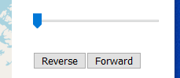
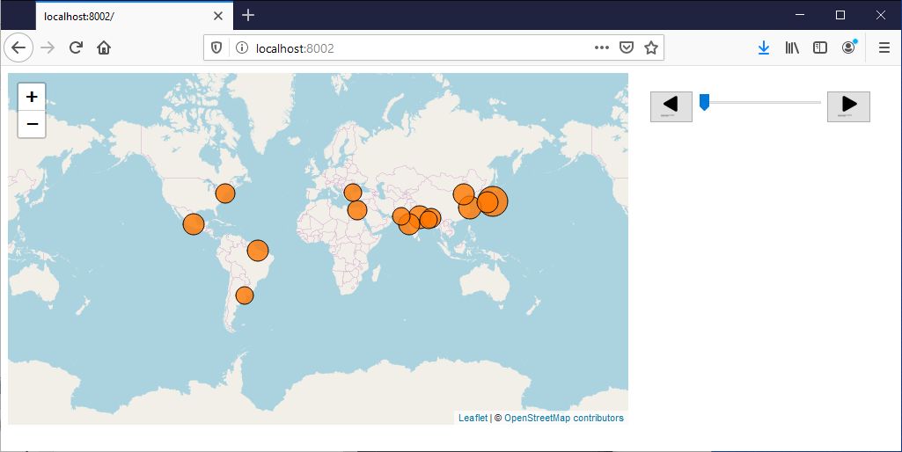
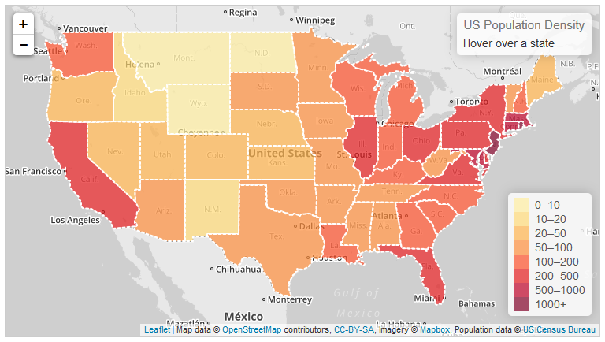

Chapter 6: Dynamic Mapping with Leaflet
======================================

Congratulations on making your first interactive web map with Leaflet last chapter! Chapter 6 continues to build on your first lab assignment by introducing Leaflet interaction operators. Chapter 6 includes four lab lessons and ends with Activity 6 requiring you to implement _pan_, _zoom_, _retrieve_, and _sequence_ on scaled proportional symbols.

*   In Lesson 1, we introduce pseudocoding in support of scaling your proportional point symbols to your spatiotemporal dataset.
*   In Lesson 2, we introduce the _pan_, _zoom_, and _retrieve_ operators that are well-supported in Leaflet.
*   In Lesson 3, we describe the more involved process for implementing the _sequence_ controls to view your spatiotemporal data.
*   In Lesson 4, we provide some background for implementing the remaining interaction operators introduced in class in a Leaflet slippy map. This material is <ins>_for your reference only_</ins>, as only _pan_, _zoom_, _retrieve_, and _sequence_ are required for Activity 6 and thus your Leaflet lab assignment. However, we encourage you to return to this lesson for the design scenario points in the Leaflet lab rubric or your final project if using Leaflet as the base technology.

After this chapter, you should be able to:

*   Create proportional symbols on your Leaflet map based on your spatiotemporal data
*   Implement _pan_, _zoom_, and _retrieve_ with styled popups
*   _Sequence_ through your spatiotemporal data with step and slider UI controls

Lesson 1: Making Leaflet Layers Dynamic
---------------------------------------

### I. Pseudocoding

For Activity 5, you used the Leaflet `pointToLayer` function to convert the point features in your custom GeoJSON file into circle markers placed atop a slippy basemap of your choice. While this code uses the _spatial_ data in your GeoJSON, it does not yet utilize the _temporal_ sequence of _attributes_ you collected for your Leaflet lab.

The next step in developing your Leaflet lab is to scale dynamically the radius of those circle markers based on your GeoJSON file, turning them into proportional symbols that represent the attribute data through the visual variable size. Although we continue to work with the _MegaCities.geojson_ dataset in the following examples, you should apply these instructions to your own dataset.

Before starting on the proportional symbols, take a second to think through the task at hand. ***Pseudocoding*** describes the higher-level outlining of computational steps necessary to perform the task. Pseudocoding before coding clarifies the logic behind potential coding solutions, breaking down big, abstract problems into small, manageable pieces. You then can use the console to confirm that your code is "working" at each of these smaller stages to reduce unexpected bugs. Example 1.1 provides one possible pseudocoding outline for implementing proportional symbols; as with all programming, there always are a number of sometimes equally viable pseudocoded solutions for achieving a goal.

###### Example 1.1: Proportional symbol pseudocode

    //GOAL: Proportional symbols representing attribute values of mapped features
    //STEPS:
    //Step 1. Create the Leaflet map--already done in createMap()
    //Step 2. Import GeoJSON data--already done in getData()
    //Step 3. Add circle markers for point features to the map--already done in AJAX callback
    //Step 4. Determine the attribute for scaling the proportional symbols
    //Step 5. For each feature, determine its value for the selected attribute
    //Step 6. Give each feature's circle marker a radius based on its attribute value
    

Note that in the pseudocode above, we already have accomplished the first three steps in Chapter 5. Thus, we can assess that we are about half way to completing the proportional symbol scaling. Accordingly, pseudocoding also helps to assess workload and progress on a development project, such as your final project.

As we complete the remaining three steps, we leave our pseudocode in our script as comments describing the tasks within it.

### II. Creating Proportional Symbols

While we could keep adding script to the AJAX callback function to create the proportional symbols, the formatting might get a little unwieldy as we lengthen the anonymous callback function. Instead, let's modularize our code by creating a new function that creates proportional symbols, called from within the callback (Example 1.2).

###### Example 1.2: _main.js_ script to create circle markers

    //Step 3: Add circle markers for point features to the map
    function createPropSymbols(data){
        //create marker options
        var geojsonMarkerOptions = {
            radius: 8,
            fillColor: "#ff7800",
            color: "#000",
            weight: 1,
            opacity: 1,
            fillOpacity: 0.8
        };
    
        //create a Leaflet GeoJSON layer and add it to the map
        L.geoJson(data, {
            pointToLayer: function (feature, latlng) {
                return L.circleMarker(latlng, geojsonMarkerOptions);
            }
        }).addTo(map);
    };
    
    //Step 2: Import GeoJSON data
    function getData(){
        //load the data
        $.getJSON("data/MegaCities.geojson", function(response){
                //call function to create proportional symbols
                createPropSymbols(response);
        });
    };
    

Currently, the code within `createPropSymbols()` applies the same, static options to create the `L.circleMarker` layer as the [_Using GeoJSON with Leaflet_](http://leafletjs.com/examples/geojson.html) tutorial from Chapter 5. Note that one of these options is the radius of the circle, which we can resize dynamically in the `createPropSymbols()` function to scale the point symbols. 

Step 4 of our pseudocode determines the attribute for scaling the proportional symbols. We describe how to sequence through all of your attributes in Lesson 3, but for now just pick one attribute and assign it to a local `attribute` variable to hold the name of the GeoJSON attribute used for dynamic scaling (e.g., `"Pop_2015"` in Example 1.3).

###### Example 1.3: Assigning an attribute to visualize in _main.js_

    //Example 1.2 line 1...Step 3: Add circle markers for point features to the map
    function createPropSymbols(data){
    
        //Step 4. Determine the attribute for scaling the proportional symbols
        var attribute = "Pop_2015";
    

Step 5 is a little trickier, iterating through each feature in your GeoJSON to get its value for the `Pop_2015` attribute. The `pointToLayer` anonymous function already iterates through each feature to turn the marker into a circle. Thus, we can determine the value of each feature's `Pop_2015` attribute within the `pointToLayer` function (Example 1.4).

###### Example 1.4: Accessing each feature's `Pop_2015` value in _main.js_

    //Example 1.3 line 1...Step 3: Add circle markers for point features to the map
    function createPropSymbols(data){
        //Step 4: Determine which attribute to visualize with proportional symbols
        var attribute = "Pop_2015";
    
    ...
    
        //Example 1.2 line 13...create a Leaflet GeoJSON layer and add it to the map
        L.geoJson(data, {
            pointToLayer: function (feature, latlng) {
                //Step 5: For each feature, determine its value for the selected attribute
                var attValue = Number(feature.properties[attribute]);
    
                //examine the attribute value to check that it is correct
                console.log(feature.properties, attValue);
    
                //create circle markers
                return L.circleMarker(latlng, geojsonMarkerOptions);
            }
        }).addTo(map);
    };

In Example 1.4, we assign the attribute value for a specific feature to the new variable `attValue`, using JavaScript's `Number()` method to force-type any string values to numbers, which is the required data type for the `radius` option. If you use `console.log()` to look at each `feature` object, you will see that the attribute we want lies within the feature's `properties` object. Since our chosen attribute name (`"Pop_2015"`) is stored in the `attribute` variable, we use this variable to access the value of that attribute in the `feature.properties` object.

Before moving onto the next step in the pseudocode, use a `console.log` statement to compare each feature's `properties` object with the value assigned to `attValue` (Figure 1.1), reducing the possibility of an error at this stage.

###### Figure 1.1: The Firefox console showing each feature's properties object followed by the `Pop_2015` value

Finally, Step 6 in our pseudocoding sets the circle marker radius based on the selected attribute. Proportional symbol maps represent each feature's attribute value as the area of that feature's circle. Thus, we must derive our symbol radius from the area of the circle.

However, this calculation results in **_mathematical scaling_**, or a direct relationship between the feature attribute to the symbol area. We know from Geography 370 that we want to use ***perceptual scaling*** to account for our systematic underestimation of sizes as they grow larger using the [Flannery scaling ratio](http://wiki.gis.com/wiki/index.php/Proportional_symbol_map).

Example 1.5 illustrates the steps needed to implement Flannery scaling for our symbols. Because Flannery scaling requires the minimum value of our data, we first call the new function `calcMinValue()` from our callback function, passing in our `response` from `getJSON()`. In `calcMinValue()`, we loop through our array of cities, adding all of our data values  to a single flat array and calculating the minimum. We then call  a new function `calcPropRadius()` function from from our `calcPropSymbols()` function, using the Flannery formula to calculate the radius based on each cities' population. We use a couple new methods here, including `Math.min()`, `String()`, and `destructuring()`. Refer to the [W3Schools](http://www.w3schools.com/jsref/default.asp) or [Mozilla Developer Network](https://developer.mozilla.org/en-US/docs/Web/JavaScript/Reference) documentation for additional information on these methods..

###### Example 1.5: Dynamically calculating a each circle marker radius in _main.js_

    //declare vars globally so all functions have access  
    var map;  
    var minValue;  
    
    //step 1 create map  
    function createMap(){  
          
         //create the map  
        map = L.map('map', {  
             center: \[0, 0\],  
              zoom: 2  
        });  
            
        //add OSM base tilelayer  
        L.tileLayer('http://{s}.tile.openstreetmap.org/{z}/{x}/{y}.png', {  
                attribution: '&copy; <a href="http://www.openstreetmap.org/copyright">OpenStreetMap contributors</a>'  
        }).addTo(map);  
    
         //call getData function  
        getData(map);  
    };  
    
    function calcMinValue(data){  
           
         //create empty array to store all data values  
         var allValues = \[\];  
           
         //loop through each city  
         for(var city of data.features){  
              //loop through each year  
              for(var year = 1985; year <= 2015; year+=5){  
                    //get population for current year  
                   var value = city.properties\["Pop\_"+ String(year)\];  
                   //add value to array  
                   allValues.push(value);  
               }  
         }  
           
         //get minimum value of our array  
         var minValue = Math.min(...allValues)  
    
         return minValue;  
    }  
    
    //calculate the radius of each proportional symbol  
    function calcPropRadius(attValue) {  
           
         //constant factor adjusts symbol sizes evenly  
         var minRadius = 5;  
           
        //Flannery Appearance Compensation formula  
         var radius = 1.0083 \* Math.pow(attValue/minValue,0.5715) \* minRadius  
    
         return radius;  
    };  
    
    //Step 3: Add circle markers for point features to the map  
    function createPropSymbols(data){  
    
         //Step 4: Determine which attribute to visualize with proportional symbols  
         var attribute = "Pop\_2015";  
    
         //create marker options  
         var geojsonMarkerOptions = {  
              fillColor: "#ff7800",  
              color: "#fff",  
              weight: 1,  
              opacity: 1,  
              fillOpacity: 0.8,  
              radius: 8  
          };  
    
          L.geoJson(data, {  
            pointToLayer : function (feature, latlng) {  
                
              //Step 5: For each feature, determine its value for the selected attribute  
              var attValue = Number(feature.properties\[attribute\]);  
    
              //Step 6: Give each feature's circle marker a radius based on its attribute value  
              geojsonMarkerOptions.radius = calcPropRadius(attValue);  
    
              //create circle markers  
              return L.circleMarker(latlng, geojsonMarkerOptions);  
              }  
         }).addTo(map);  
    };  
    
    //Step 2: Import GeoJSON data  
    function getData(map){  
           
         //load the data  
         $.getJSON("data/MegaCities.geojson", function(response){  
               
              //calculate minimum data value  
              minValue = calcMinValue(response);  
                
              //call function to create proportional symbols  
              createPropSymbols(response);  
         });  
    };  
    
    $(document).ready(createMap);

The areas of the circles on the map are now proportional to our data (Figure 1.2)!

###### Figure 1.2: Leaflet map with circle markers scaled into proportional symbols

> ### **Using your own data, create proportional symbols based on one of the attributes in the dataset.**

Lesson 2: Zoom, Pan, and Retrieve Interactions
----------------------------------------------

### I. Zoom and Pan Operators

With the proportional symbols correctly scaling based on your GeoJSON file, we now can make your slippy map interactive! The first two of these operators—_zoom_ and _pan_—are automatically implemented by default on any Leaflet map. As introduced in lecture, **_zoom_** describes a change in map scale, typically accompanied with a change in map detail, and ***pan*** describes a change in the map centering.

The _zoom_ operator has a high level of flexibility by default in Leaflet: it can be performed with the zoom control buttons on the map, with a mouse wheel, by pinching on a touch-enabled device, by double-clicking on the map, by holding the Shift key while clicking and dragging the mouse across the map (i.e., a rubberband zoom), or by using the + and - buttons on a keyboard. However, the zoom operator has limited freedom, constrained to 20 interlocking scales with the current scale defined by Leaflet's the `zoom` property introduced last chapter. The strategy of 20 preset scales enables a tileset to approximate a user experience of a "map of everywhere", as each additional scale would require additional processing and storage.

The _pan_ operator is less flexible by default in Leaflet, performed by clicking and dragging the map with a mouse (grab & drag), dragging the map with a finger on a touch-enabled device, or using the arrow keys on a keyboard. However, the pan operator is completely free (hence the term "slippy" map), enabling the map to be recentered on any location.

Leaflet's _zoom_ and _pan_ interactions can be modified from the default behavior using the `L.map` object's [interaction options](http://leafletjs.com/reference.html#map-options). For the _zoom_ operator, the `touchZoom`, `scrollWheelZoom`, `doubleClickZoom`, `boxZoom`, `zoomControl`, and `keyboard` options can each be set to `false` in the map options object to disable them when the map is instantiated, constraining _zoom_ interaction. The _pan_ operator just has one dedicated map option—`dragging`—which may be set to false to disable panning except by keyboard (setting `keyboard` to `false` disables both zooming and panning by keyboard). Unlike _zoom_, _pan_ does not come with its own UI control in Leaflet, although there are several [plug-ins](http://leafletjs.com/plugins.html#interactive-panzoom) that implement additional Leaflet UI controls for panning and zooming.

### II. Retrieve Operator with Leaflet Popups

**_Retrieve_** describes the request for details on demand about a map feature of interest. As discussed in lecture, _retrieve_ can be implemented in multiple ways, including a dynamic label (not mobile-friendly), an information window within the map, or an information panel to the side of the map. Because the UI controls for our Leaflet map are relatively simple, we recommend implementing _retrieve_ with the mobile-friendly information panel using the Leaflet `Popup` class.

You already used Leaflet popups within the `onEachFeature` function in the [_Using GeoJSON with Leaflet_](http://leafletjs.com/examples/geojson.html) tutorial. Since the `pointToLayer` function also iterates through every feature, we can use the same logic to bind popups to each `L.circleMarker` layer created in the `pointToLayer` anonymous function in Example 1.5. To avoid having too much code within the `pointToLayer` anonymous function, let's move the code for creating the circle markers (including the `attribute` variable and `options` variable) to a separate function called `pointToLayer()` so that we can add _retrieve_ popups directly after creating each new circle marker (Example 2.1). Replace the anonymous function within the `createPropSymbols()` function with a call to the new `pointToLayer()` function.

###### Example 2.1: Implementing popups in a named `pointToLayer()` function in _main.js_

    //function to convert markers to circle markers
    function pointToLayer(feature, latlng){
        //Determine which attribute to visualize with proportional symbols
        var attribute = "Pop_2015";
    
        //create marker options
        var options = {
            fillColor: "#ff7800",
            color: "#000",
            weight: 1,
            opacity: 1,
            fillOpacity: 0.8
        };
    
        //For each feature, determine its value for the selected attribute
        var attValue = Number(feature.properties[attribute]);
    
        //Give each feature's circle marker a radius based on its attribute value
        options.radius = calcPropRadius(attValue);
    
        //create circle marker layer
        var layer = L.circleMarker(latlng, options);
    
        //build popup content string
        var popupContent = "
<b>City:</b> " + feature.properties.City + "

<b>" + attribute + ":</b> " + feature.properties[attribute] + "
";
    
        //bind the popup to the circle marker
        layer.bindPopup(popupContent);
    
        //return the circle marker to the L.geoJson pointToLayer option
        return layer;
    };
    
    //Add circle markers for point features to the map
    function createPropSymbols(data, map){
        //create a Leaflet GeoJSON layer and add it to the map
        L.geoJson(data, {
            pointToLayer: pointToLayer
        }).addTo(map);
    };
    

You then can use JavaScript String methods to format the information in the popup, making it more human-readable and matching your map style (Example 2.2).

###### Example 2.2: Formatting the popups in _main.js_

        //build popup content string starting with city...Example 2.1 line 24
        var popupContent = "
<b>City:</b> " + feature.properties.City + "
";
    
        //add formatted attribute to popup content string
        var year = attribute.split("_")[1];
        popupContent += "
<b>Population in " + year + ":</b> " + feature.properties[attribute] + " million
";
    

Figure 2.1 previews the popup in the browser. Each popup is created by Leaflet using HTML `
` elements. Accordingly, you can use the inspector to determine how to access and style the popup using CSS.

###### Figure 2.1: Firebug inspector and HTML tab showing popup elements

The popup content has the class name `leaflet-popup-content`, so we can use this class in our _style.css_ stylesheet to change the popup content style to our liking. For instance, Example 2.3 reduces the default margins of the `
` elements within the popups.

###### Example 2.3: Adjusting popup content margins in _style.css_

    .leaflet-popup-content p {
        margin: 0.2em 0;
    }
    

###### Figure 2.2: The reformatted popup

You also may want to offset the popup based on its `radius` so that it does not cover the proportional symbol when activated, inhibiting reading of the original symbol size (Example 2.4). Do not offset it too far, however, as you will lose graphic association between the information window and the selected feature (Figure 2.3).

###### Example 2.4: Adding an offset to each circle marker

        layer.bindPopup(popupContent, {
            offset: new L.Point(0,-options.radius) 
        });
    

###### Figure 2.3: A vertically offset popup

> ### **Implement styled _retrieve_ popups for the features on your Leaflet map.**

Lesson 3: Sequence Interaction
------------------------------

### I. Pseudo-coding the Sequence Operator

Now that you have a handle on using attribute data to dynamically symbolize map features and populate popups for a _single_ attribute, we now can _sequence_ across _every_ attribute in the dataset. The ***sequence*** operator generates an ordered set of related map states displaying different information (i.e., the _sequence_) and then changes the currently shown state within the sequence. To implement _sequence_, we need to create custom UI controls that allow the user to step through the sequence. Let's think through the steps necessary to implement _sequence_ with pseudocode (Example 3.1).

###### Example 3.1: Pseudocode for the _sequence_ operator

    //GOAL: Allow the user to sequence through the attributes and resymbolize the map 
    //   according to each attribute
    //STEPS:
    //Step 1. Create UI affordances for sequencing
    //Step 2. Listen for user input via affordances
    //Step 3. Respond to user input by changing the selected attribute
    //Step 4. Resize proportional symbols according to each feature's value for the new attribute
    

There are a number of different types of UI affordances that can be used as controls. We have selected two types of tools with native HTML elements to implement: a slider widget and step buttons. Both allow the user to adjust the sequence in either direction (forward or backward). Note that these widgets work best for depictions of linear time rather than cyclical time, following a timeline metaphor rather than a clock metaphor.

Adding _sequence_ flexibility requires that we provide consistent affordances for both UI solutions, such that when the user clicks a step button, the slider's position is updated accordingly, along with the map symbols. To keep track of the sequence order of our attributes, we need an array of all attribute names. We then can update the sequence using the index value of this array, incremented or decremented in response to step buttons or jumping to a new index position using the slider widget. When the user reaches the end of the sequence, the next step should take them back to the beginning of the sequence (and vice-versa for reverse order).

With these UI design requirements in mind, we can expand our pseudocode (Example 3.2).

###### Example 3.2: More detailed pseudocode for the _sequence_ operator

    //GOAL: Allow the user to sequence through the attributes and resymbolize the map 
    //   according to each attribute
    //STEPS:
    //Step 1. Create slider widget
    //Step 2. Create step buttons
    //Step 3. Create an array of the sequential attributes to keep track of their order
    //Step 4. Assign the current attribute based on the index of the attributes array
    //Step 5. Listen for user input via affordances
    //Step 6. For a forward step through the sequence, increment the attributes array index; 
    //   for a reverse step, decrement the attributes array index
    //Step 7. At either end of the sequence, return to the opposite end of the sequence on the next step
    //   (wrap around)
    //Step 8. Update the slider position based on the new index
    //Step 9. Reassign the current attribute based on the new attributes array index
    //Step 10. Resize proportional symbols according to each feature's value for the new attribute
    

That's quite a few steps, so let's get started on the code!

### II. Sequence UI Controls

Step 1 in the pseudocode is creating a slider widget. For now, we can place our sequence controls outside of the map in a separate HTML `
` element with id `#panel` beneath the `#map` element in our _index.html_ file (Example 3.3). We will move these onto the map in Chapter 7.

###### Example 3.3: Adding a `
` panel for the sequence controls in _index.html_

    <body>    
        

        

Next, specify the position of the `#panel` relative to the `#map` using CSS in _style.css_ (Example 3.4). Note that this type of a panel also can be used for the _retrieve_ operator is an information panel is preferred over a information window due to a large amount of detail content.

###### Example 3.4: Positioning the panel in _style.css_

    #map {    
        height: 400px;    
        width: 80%;
        display: inline-block;
        }
        
        #panel {    
            width: 16%;    
            padding: 20px;
            display: inline-block;
            vertical-align: top;
            text-align: center;
            line-height: 42px;
        }

It makes sense to start a new function called `createSequenceControls()` for creating our sequence controls. Since the controls need access to the GeoJSON data, call the `createSequenceControls()` function from within the AJAX callback (Example 3.5). Within the function, we can make a simple slider using an HTML `<input>` element with the `type` attribute set to [`range`](http://www.w3schools.com/jsref/dom_obj_range.asp). We also give it a class name `range-slider` to access the slider in our stylesheet and with jQuery.

###### Example 3.5: Creating an HTML `range` slider in _main.js_

    //Step 1: Create new sequence controls
    function createSequenceControls(){
        //create range input element (slider)
        $('#panel').append('<input class="range-slider" type="range">');
    };
    
    //Import GeoJSON data
    function getData(map){
        //load the data
        $.ajax("data/MegaCities.geojson", {
            dataType: "json",
            success: function(response){
                minValue = calcMinValue(response);            
                //add symbols and UI elements
                createPropSymbols(response);
                createSequenceControls();
    
            }
        });
    };
    

Besides setting the `type` attribute to `range`, we also need to give our slider `max` and `min` values based on the number of attributes in the sequence. Since our _MegaCities.geojson_ data has seven attributes, the `min` value should be `0` (the index of the first attribute) and the `max` value is `6` (the index of the seventh attribute). We also need to set an initial value using the `value` attribute; if we want our slider to start at the first attribute in the sequence, `value` should be `0`. The element's underlying value starts at whatever the `value` attribute is set to, but changes when the user moves the slider. Thus, we use `value` to reset the currently shown attribute in the sequence when the slider is moved. Finally, the slider's value increments or decrements by 1 with each _sequence_ interaction, so we will set the `step` attribute to `1` (Example 3.6).

###### Example 3.6: Adding slider attributes in _main.js_

        //Example 3.5...create range input element (slider)
        $('#panel').append('<input class="range-slider" type="range">');
    
        //set slider attributes
        $('.range-slider').attr({
            max: 6,
            min: 0,
            value: 0,
            step: 1
        });
    

Figure 3.1 shows the resulting panel and slider created from the `createSequenceControls()` function. The slider is centered horizontally in the panel by adding `text-align: center;` to the `#panel` styles in _style.css_ (see Example 3.4).

###### Figure 3.1: Side panel with a `range` slider

Step 2 of the pseudocode creates the forward and reverse step buttons. For these, we can use HTML `<button>` elements (Example 3.7).

###### Example 3.7: Adding step buttons in _main.js_

        //below Example 3.6...add step buttons
        $('#panel').append('<button class="step" id="reverse">Reverse</button>');
        $('#panel').append('<button class="step" id="forward">Forward</button>');
    

Give our buttons both a `class` attribute (`"step"`) and an `id` attribute (`"forward"` and `"reverse"`). We can use the `class` attribute to style both buttons together, and the `id` attribute to style them individually and to attach individual event listeners. Figure 3.2 shows the resulting step buttons.

###### Figure 3.2: Step buttons

Normally _sequence_ UI controls use icons rather than words. You can find and download free icons at [The Noun Project](https://thenounproject.com/) and save them as raster images in your _unit-2/img_ folder. We then can references these icons for our buttons using jQuery's `html()` method (Example 3.8).

###### Example 3.8: Replacing button content with images in _main.js_

        //replace button content with images
        $('#reverse').html('');
        $('#forward').html('');
    

Finally, we can adjust the _sequence_ UI styles to make the controls more usable (Example 3.9).

###### Example 3.9: Styles for slider and buttons in _style.css_

    #panel {  
        width: 25%;  
        padding: 20px;  
        display: inline-block;  
        vertical-align: top;  
        text-align: center;  
        line-height: 42px;  
    }  
    
    .range-slider {  
        width: 55%;  
    }  
    
    .step {  
        width: 20%;  
    }  
    
    .step img {  
        width: 100%;  
    }  
    
    
    #forward {  
        float: right;  
    }  
    
    #reverse {  
        float: left;  
    }

Figure 3.3 shows the styled _sequence_ UI controls.

###### Figure 3.3: Final slider and step buttons

> ### **In your _main.js_ script, create a slider and step buttons for sequencing your Leaflet map.**

### III. Changing Attributes

Step 3 of our _sequence_ pseudocode creates an array to hold all of the attribute names, which defines the sequence order. Because this step requires some processing of the GeoJSON data, call a new function `processData()` within the AJAX callback function. We will use this array in our code for other purposes, so define a variable called `attributes` to store the array returned by `processData()` (Example 3.10). We then add this `attributes` array as a parameter to the `createPropSymbols()` and `createSequenceControls()` functions defined earlier for subsequent use.

###### Example 3.10: Creating a variable to hold the attributes array in _main.js_

        //Example 3.5 line 8...load the data
        $.ajax("data/MegaCities.geojson", {
            dataType: "json",
            success: function(response){
                //create an attributes array
                var attributes = processData(response);
                            calcMinValue(response);
                createPropSymbols(response, attributes);
                createSequenceControls(attributes);
            }
        });
    

We then create and return the array within the `processData()` function. Start with an empty array, then loop through the attribute names from the `properties` object of the first feature in the dataset, and push each attribute name that contains the characters `"Pop"` into our array. Your dataset likely uses other attributes keys than those in _MegaCities.geojson_, perhaps only a given year (e.g., `"1985"` instead of `"Pop_1985")`, so reformat your attribute keys to include a common prefix string for each of the attributes you wish to include in the spatiotemporal sequence. After successfully building the array, `return` the array to the callback function (Example 3.11).

###### Example 3.11: Building the attributes array in _main.js_

    //Above Example 3.10...Step 3: build an attributes array from the data
    function processData(data){
        //empty array to hold attributes
        var attributes = [];
    
        //properties of the first feature in the dataset
        var properties = data.features[0].properties;
    
        //push each attribute name into attributes array
        for (var attribute in properties){
            //only take attributes with population values
            if (attribute.indexOf("Pop") > -1){
                attributes.push(attribute);
            };
        };
    
        //check result
        console.log(attributes);
    
        return attributes;
    };
    

Figure 3.4 shows the `console.log()` statement of the the the `attributes` array, confirming that the attribute names are in the correct order for the sequence. 

###### Figure 3.4: The completed attributes array

Step 4 of our pseudocode assigns the current attribute based on an index value, initially set to `0` but incremented by our _sequence_ UI controls. As the code stands, our current attribute is assigned a static string value within the `pointToLayer()` function (initially defined in Example 2.1). In order to change this string to an array value, we need to pass our `attributes` array into our `pointToLayer()` function called by the `L.geoJson() pointToLayer` option in the `createPropSymbols()` function.

Currently, we assign the function name to the the `L.geoJson() pointToLayer` option, and the parameters `feature` and `latlng` are automatically passed to `pointToLayer()`. If we want to pass a third parameter—our `attributes` array—we need to change our strategy. Instead of passing the function name `pointToLayer` (therefore referencing this function directly), we can assign an anonymous function to the option, within which to properly call the `pointToLayer()` function with the parameters of our choice.

Recall that the `pointToLayer` option expects us to return a Leaflet layer to it, so we must add our `pointToLayer()` function call as part of a `return` statement to pass each circle marker through to the `L.geoJson()` method (Example 3.12).

###### Example 3.12: Calling `pointToLayer()` with three parameters in _main.js_

    //Example 2.1 line 34...Add circle markers for point features to the map
    function createPropSymbols(data, attributes){
        //create a Leaflet GeoJSON layer and add it to the map
        L.geoJson(data, {
            pointToLayer: function(feature, latlng){
                return pointToLayer(feature, latlng, attributes);
            }
        }).addTo(map);
    };
    

Then we can assign our first `attribute` to symbolize as the `attributes` array value at index `0` (Example 3.13).

###### Example 3.13: Dynamically assign first attribute in _main.js_

    //Example 2.1 line 1...function to convert markers to circle markers
    function pointToLayer(feature, latlng, attributes){
        //Step 4: Assign the current attribute based on the first index of the attributes array
        var attribute = attributes[0];
        //check
        console.log(attribute);
    

Not only have we successfully assigned the first value in our array to the `attribute` variable, but our map looks a bit different because we are using the "Pop-1985" attribute in the `0` index of the `attributes` array instead of the previously hard coded the "Pop-2015" attribute (Figure 3.5).

###### Figure 3.5: Leaflet map visualizing the first attribute in the dataset

Step 5 of our pseudocode listens for user interaction with the slider and step buttons. We can add `.click` listeners to the step buttons, using the jQuery alias syntax introduced in Chapter 3. The slider `<input>` element has an [`input`](http://www.w3schools.com/jsref/event_oninput.asp) event that fires when the user moves the slider thumb or clicks on the slider bar.

The _sequence_ listeners should be placed within the `createSequenceControls()` function, after the elements have been added to the DOM (Example 3.14). For now, the contents of the anonymous functions called by both event listeners is a placeholder comment that eventually will include the logic to update the proportional symbols according to the user input.

###### Example 3.14: Adding event listeners for sequence inputs in _main.js_

        //Below Example 3.6 in createSequenceControls()
        //Step 5: click listener for buttons
        $('.step').click(function(){
            //sequence
        });
    
        //Step 5: input listener for slider
        $('.range-slider').on('input', function(){
            //sequence
        });
    

In Step 6 of the pseudocode, we change the attribute index based on the user interaction. The slider makes this easy: we can obtain the current slider value using `$(this).val()`. Returning to the basics of jQuery, `$(this)` references the element that fired the event and[`.val()`](http://api.jquery.com/val/) retrieves the slider's current value (Example 3.15). You can watch the index value change in real time by adding a `console.log()` statement and manipulating the slider. 

###### Example 3.15: Retrieving the value of the slider in _main.js_

        //Example 3.14 line 7...Step 5: input listener for slider
        $('.range-slider').on('input', function(){
            //Step 6: get the new index value
            var index = $(this).val();        
            console.log(index);    
        });
    

The step buttons are a bit more complicated. To coordinate the step buttons with the slider, we can obtain the current index using `$('.range-slider').val()` and increment or decrement this value depending on which button the user clicked (increment for `'forward'`, decrement for `'reverse'`). We then update the slider with the new value so it continues to track the current index (Example 3.16).

###### Example 3.16: Changing the index value and updating the slider when a button is clicked in _main.js_

        //Example 3.14 line 2...Step 5: click listener for buttons
        $('.step').click(function(){
            //get the old index value
            var index = $('.range-slider').val();
    
            //Step 6: increment or decrement depending on button clicked
            if ($(this).attr('id') == 'forward'){
                index++;
                //Step 7: if past the last attribute, wrap around to first attribute
                index = index > 6 ? 0 : index;
            } else if ($(this).attr('id') == 'reverse'){
                index--;
                //Step 7: if past the first attribute, wrap around to last attribute
                index = index < 0 ? 6 : index;
            };
    
            //Step 8: update slider
            $('.range-slider').val(index);
        });
    

Note that in Example 3.16, we implemented Step 7 in our pseudocode using simplified conditional syntax to assign the index `0` if it is incremented past `6`, and to assign it `6` if it is decremented past `0`. This prevents our sequence from going beyond the boundaries of our attribute array and allows it to wrap continuously. We also implemented Step 8 in our pseudocode by simply setting our new `index` as the value of the slider, which automatically updates its position.

Step 9 of our pseudocode reassigns the current attribute based on the new index and Step 10 finally resizes our proportional symbols according to the newly assigned attribute. We can accomplish both tasks by defining a new `updatePropSymbols()` function to update the symbols and passing it the `attributes` array value at the new index as a  parameter (Example 3.17). Call this function at the end of _both_ the button `click` handler and the slider `input` handler.

###### Example 3.17: Calling a function to update the proportional symbols in _main.js_

            //Called in both step button and slider event listener handlers
            //Step 9: pass new attribute to update symbols
            updatePropSymbols(attributes[index]);
    

Within the `updatePropSymbols()` function, we can use Leaflet's `L.map() eachLayer()` method to access all of the Leaflet layers currently on the map. These layers include the `L.tileLayer`, so we need to select only our `L.circleMarker` layers that contain the features we want to update using an `if` statement. The `if` statement below tests both for the existence of a feature in the layer _and_ the existence of the selected attribute in the layer's feature properties, ensuring the script will not encounter any `undefined` values (Example 3.18).

###### Example 3.18: Using `eachLayer()` to update each circle marker in _main.js_

    //Step 10: Resize proportional symbols according to new attribute values
    function updatePropSymbols(attribute){
        map.eachLayer(function(layer){
            if (layer.feature && layer.feature.properties[attribute]){
                //update the layer style and popup
            };
        });
    };
    

Finally, we update each circle marker's radius based on the new attribute values and update the popup content with the new data (Example 3.19).

###### Example 3.19: Resetting each circle marker's radius and popup in _main.js_

            //Example 3.18 line 4
            if (layer.feature && layer.feature.properties[attribute]){
                //access feature properties
                var props = layer.feature.properties;
    
                //update each feature's radius based on new attribute values
                var radius = calcPropRadius(props[attribute]);
                layer.setRadius(radius);
    
                //add city to popup content string
                var popupContent = "
<b>City:</b> " + props.City + "
";
    
                //add formatted attribute to panel content string
                var year = attribute.split("_")[1];
                popupContent += "
<b>Population in " + year + ":</b> " + props[attribute] + " million
";
    
                //update popup content            
                popup = layer.getPopup();            
                popup.setContent(popupContent).update();
            };
    

The script in our `if` statement assigns each feature's `properties` object to a variable to keep the code tidy. It then resets the layer radius using `calcPropRadius()` and the Leaflet layer's `setRadius()` method. Finally, we get a reference to our popup, replace its content, and update it.

We now can _sequence_ through every attribute in the GeoJSON file, resymbolizing the proportional symbols and changing the _retrieve_ popup information using our sequencing controls (Figure 3.6).

###### Figure 3.6: Leaflet map with the _sequence_ operator active

> ### **Integrate your sequencing controls with your map to resymbolize the features correctly and change the popup or information panel content on each _retrieve_ interaction.**

Lesson 4: Additional Interaction Operators
------------------------------------------

### I. Adapting Additional Interaction Examples

With what you have learned the past two chapters, you should have the tools to adapt examples and solutions of additional interaction operators for your Leaflet lab. This final lesson provides some general strategies and examples for implementing the remaining work operators Leaflet. This material is <ins>_for your reference only_</ins>, as only _pan_, _zoom_, _retrieve_, and _sequence_ are required for Activity 6 and thus your Leaflet lab assignment.

### II. Reexpress

***Reexpress*** sets or changes the visual isomorph used to display the mapped data. In the context of the Leaflet lab, this could involve allowing the user to change the visual variable, for instance using symbol _color value_ instead of _size_. A more common use of _reexpress_ for interactive web maps is toggling among thematic map types, for instance between a proportional symbol and choropleth map if you mapped enumerated data.

The Leaflet website includes an _[Interactive Choropleth Map](http://leafletjs.com/examples/choropleth.html)_ tutorial, allowing you to adapt the sample code to your GeoJSON data (e.g., Figure 4.1). If you implement a choropleth map, you will need to link your GeoJSON attributes to a polygon dataset. Leaflet choropleth maps generally are not recommended for small cartographic scales (i.e., when "zoomed out") because of the area distortion imposed by the Web Mercator projection.

###### Figure 4.1: example map from the _Interactive Choropleth Map_ Leaflet tutorial

### III. Overlay

**_Overlay_** adjusts the feature types included in the map, allowing the user to toggle layers on and off. You can implement this operator to provide context in support of a story (limited to several clarifying overlays) or enable exploration of relationships between multiple attributes (potentially dozens of overlays).

The Leaflet website includes a [_Layer Groups and Layers Control_](http://leafletjs.com/examples/layers-control.html) tutorial for using its out-of-the-box _overlay_ control (`L.control.layers`). The `L.control.layers` control applies radio buttons (one selected at a time) for basemap tilesets and checkboxes (compound selection) for vector overlays. Figure 4.2 shows a simple implementation of the Leaflet layers control, while Figure 4.3 shows a more complicated example from the [National Park Service](https://www.nps.gov/viis/planyourvisit/virgin-islands-marine-visitor-use-information.htm) geared more toward exploration. Note that to complete the Overlay operator, you need to provide a second data layer, _not_ just another underlying tileset.

###### Figure 4.2: Example map from the _Layer Groups and Layers Control_ tutorial

###### Figure 4.3: National Park Service map with many _overlay_ checkboxes

### IV. Resymbolize

***Resymbolize*** sets or changes the design parameters of a map without changing the thematic map type (compared to _reexpress_). For instance, you could allow the user to change the scaling ratio between proportional and perceptual scaling, or change between proportional symbols and graduated (classed) symbols. You also could allow the user to change the symbol color, the symbol shape, the size of the minimum symbol, and so on. You can implement these _resymbolize_ options by providing a simple `<input>` controls and adjusting the `layer.setRadius()` or `later.setStyle()` methods within an `eachLayer()` function in the event handler.

[Carto](https://carto.com/) is an alternative web mapping platform to Mapbox that is also based on Leaflet. Carto allows the user to both _resymbolize_ and _reexpress_ the data through its symbol wizard (shown in Figure 4.4, below).

###### Figure 4.4: CartoDB interface with its Map Layer Wizard

### V. Reproject

**_Reproject_** sets or changes the map projection beyond the scale (_zoom_) and centering (_pan_). Due to the nature of continuous slippy map tilesets, _reproject_ generally does not make sense for interactive web maps using Leaflet. The most likely scenario for _reproject_ in Leaflet is to allow the user to switch between a tileset that is Web Mercator projection (EPSG:3857/EPSG:900913) and one in Plate Carrée (EPSG:4326/WGS84/unprojected). The script required to do this is challenging and there are few stable online examples.

Custom projection and the _reproject_ operator is possible with D3, and an important (but complex) task when getting started with your D3 map in Chapter 10 is setting your projection parameters computationally.

### VI. Filter

The _filter_ operator can be implemented using the filter option of GeoJSON defines a conditional rule for including a feature in the resulting GeoJSON object, as covered in the [_Using GeoJSON with Leaflet_](http://leafletjs.com/examples/geojson.html) tutorial. While the tutorial shows a filter applied before adding the GeoJSON file to the Leaflet map object, it also can be applied to the GeoJSON object added to the map, enabling filtering based on user interaction events.

### VII. Search

**_Search_** alters the map to add or highlight a particular feature of interest, and is the conceptual inverse of _filter_. Luckily, the _search_ operator can be implemented through the [Leaflet Search Control](https://github.com/stefanocudini/leaflet-search) plugin. An example plugin implementation is shown in Figure 4.5, below.

###### Figure 4.5: Leaflet Search Control plugin example

You can implement the plugin to enable users to search for mapped features corresponding to particular attributes in your dataset (such as city name), supporting autocomplete and recentering on the selected feature. The plugin also supports unconstrained address or city search using one of many available geocoder APIs.

### VIII. Arrange

**_Arrange_** manipulates the layout of the map and linked views. _Arrange_ generally is not common on maps for presentation, and thus is rarely implemented with the mobile-friendly Leaflet library.

_Arrange_ is more common for the highly-exploratory coordinated multiview visualization possible with D3, with a Leaflet map perhaps one window among coordinated views. Figure 4.7 shows a [final project](http://www.youtube.com/watch?v=Dlt3vU0ZBZ4&list=PLz9yX13m-GeL9tbxNN1tuOuMyx6wgkwb3) by a former Geography 575 student using the jQuery UI library's [Draggable](https://jqueryui.com/draggable/) functionality.

###### Figure 4.7: G575 2013 final project making use of _arrange_

### IX. Calculate

**_Calculate_** derives new informatoin about a map feature of interest. One way to implement _calculate_ would be to enable your users to perform mathematical operations on your spatiotemporal data, such as mapping the change between two years or calculating the average across years.

A common calculation on slippy maps is distance and area measurement, which can be implemented on Leaflet maps using the [Leaflet Draw](https://github.com/Leaflet/Leaflet.draw) plugin. This set of tools is included in [geojson.io](http://geojson.io), which we used in Chapter 4. Figure 4.8 shows the plugin example, demonstrating measurement with the Leaflet Draw controls.

###### Figure 4.8: Leaflet Draw plugin example

### [Return Home](../../../) | [Previous Chapter](../Chapter5) | [Next Chapter](../Chapter7)

_Copyright Robert E. Roth 2020. Do not share or redistribute. All rights reserved._