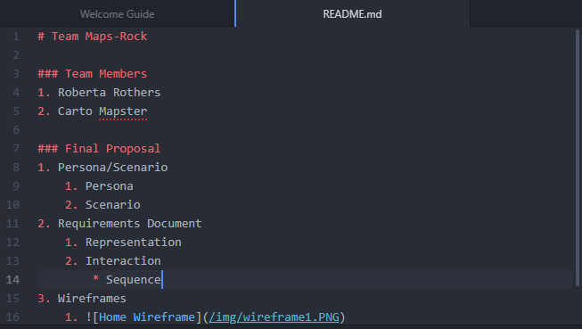
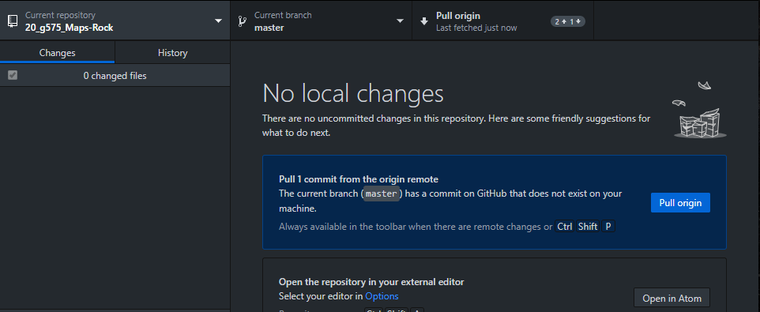
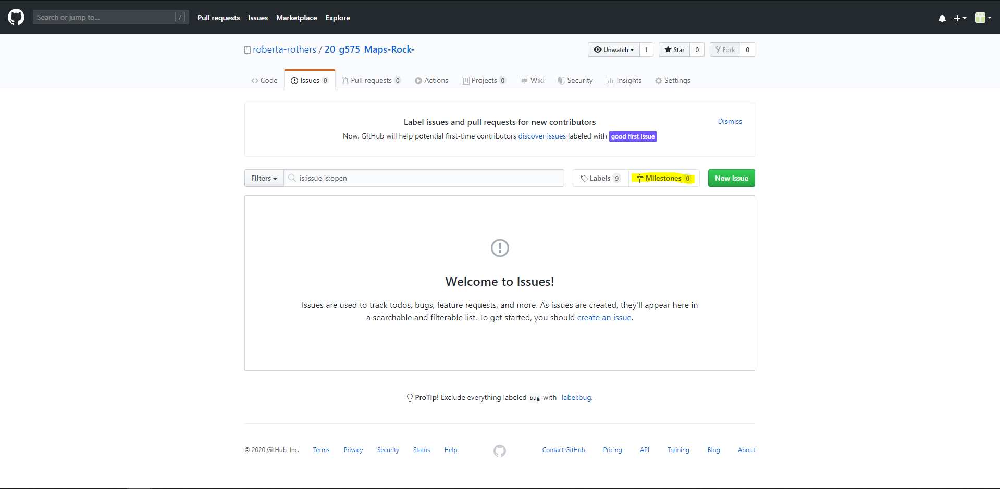

Chapter 8: Collaborating with Github
===================================

You have been working individually with GitHub for six chapters now, and are in the process of wrapping your first major interactive map with Leaflet that will be hosted through GitHub! Chapter 8 provides additional guidance for working _collaboratively_ with GitHub that supports your group final project. Chapter 8 includes three relatively short lessons and an activity to set-up a collaborative repository that will house your final project proposal and (eventually) your final project interactive.

*   In Lesson 1, we briefly refresh your memory on GitHub concepts and terminology.
*   In Lesson 2, we provide instructions for setting-up your final project collaborative repository, as well as overview on using markdown to build a readme file for your repository that will be used for your proposal.
*   In Lesson 3, we summarize best practices for collaboratively coding with GitHub.

After this chapter, you should be able to:

*   Access and commit to a collaborative GitHub repo
*   Write a readme file in markdown
*   Use GitHub as a platform for collaborative coding

Lesson 1: GitHub Refresher
==========================

As introduced in Chapter 2, _**[GitHub](https://github.com/)**_ is a website and project hosting service that uses the _**[Git](http://git-scm.com/)**_ version control system to take snapshots of your files at a given time, creating a backup that can be shared collaborative when multiple developers are coding at the same time (e.g., your final project). 

You have been using GitHub to commit your chapter activities throughout semester, but before discussing GitHub as a collaborative coding tool, it is helpful to refresh some [core GitHub terminology](https://help.github.com/en/github/getting-started-with-github/github-glossary):

*   _**[Repository](https://help.github.com/en/github/getting-started-with-github/github-glossary#repository):**_ A repository is the most basic element of GitHub. They are easiest to imagine as a project's folder. A repository contains all of the project files (including documentation), and stores each file's revision history. Repositories can have multiple collaborators and can be either public or private.
*   _**[Clone](https://help.github.com/en/github/getting-started-with-github/github-glossary#clone):**_ A clone is a copy of a repository that lives on your computer instead of on a website's server somewhere, or the act of making that copy. With your clone you can edit the files in your preferred editor and use Git to keep track of your changes without having to be online. It is, however, connected to the remote version so that changes can be synced between the two.
*   _**[Fork](https://help.github.com/en/github/getting-started-with-github/github-glossary#fork):**_ A fork is a personal copy of another user's repository that lives on your account. Forks allow you to freely make changes to a project without affecting the original. Forks remain attached to the original, allowing you to submit a pull request to the original's author to update with your changes. You can also keep your fork up to date by pulling in updates from the original.
*   _**[Branch](https://help.github.com/en/github/getting-started-with-github/github-glossary#branch):**_ A branch is a parallel version of a repository. It is contained within the repository, but does not affect the primary or `master` branch allowing you to work freely without disrupting the "live" version. When you've made the changes you want to make, you can merge your branch back into the `master` branch to publish your changes.
*   _**[Commit](https://help.github.com/en/github/getting-started-with-github/github-glossary#commit):**_ A commit, or "revision", is an individual change to a file (or set of files). It's like when you _save_ a file, except with Git, every time you save it creates a unique ID (a.k.a. the "SHA" or "hash") that allows you to keep record of what changes were made when and by who. Commits usually contain a commit message which is a brief description of what changes were made.
*   _**[Push](https://help.github.com/en/github/getting-started-with-github/github-glossary#push):**_ Pushing refers to sending your committed changes to a remote repository, such as a repository hosted on GitHub. For instance, if you change something locally, you then _push_ those changes so that others may access them.
*   _**[Fetch](https://help.github.com/en/github/getting-started-with-github/github-glossary#fetch):**_ Fetching refers to getting the latest changes from an online repository without merging them in. Once these changes are fetched you can compare them to your local branches (the code residing on your local machine).
*   _**[Merge](https://help.github.com/en/github/getting-started-with-github/github-glossary#merge):**_ Merging takes the changes from one branch (in the same repository or from a fork), and applies them into another. This often happens as a pull request (which can be thought of as a request to merge), or via the command line. A merge can be done automatically via a pull request via the GitHub web interface if there are no conflicting changes, or can always be done via the command line. 
*   _**[Pull](https://help.github.com/en/github/getting-started-with-github/github-glossary#pull):**_ Pull refers to when you are fetching _in_ changes _and_ merging them. For instance, if someone has edited the remote file you're both working on, you'll want to _pull_ in those changes to your local copy so that it's up to date.
*   _**[Pull request](https://help.github.com/en/github/getting-started-with-github/github-glossary#pull-request):**_ Pull requests are proposed changes to a repository submitted by a user and accepted or rejected by a repository's collaborators.

You should be conformable with cloning, committing, and pushing through Chapter 7. A large focus for this chapter is on the additional features of GitHub, particularly forking, merging, and pulling.

Lesson 2: Setting Up Your Team's Final Project Repository
=========================================================

### I. Working Collaboratively in GitHub

Working in a team on GitHub is similar to other collaborative projects. First your team should assign roles to each team member. For example, someone may focus on Javascript mechanics, someone may focus on visual styling, etc. It helps to assign a "leader" or "facilitator" who will merge major code conflicts (more below). Keep in mind that it is OK if roles change a bit and that you should be helping your other teammates as they get stuck. Second, you should assign specific development tasks to each role. We will use GitHub _**milestones**_ to formalize these tasks after approval of your final project proposal. Third, your team should strive for good communication to coordinate efforts and ensure that each team member is working on a separate part of the code to maximize efficiency. It is recommended to form some sort of group communication via email, text messaging, or [slack](https://slack.com/features)—a work messaging platform. 

To ensure that we have access to the final projects in case you lose your files, we created a repository for each team under the [uwcartlab](https://github.com/uwcartlab) GitHub account. We then added each member of your team as a _**collaborator**_ role with write permission levels. **_Write_** permissions enable collaborators to make updates to your final project, giving each student on your team the power to push, pull, merge, etc. while preventing access to sensitive and destructive actions such as deleting the repo.

To access your team's repo, login to the email associated with your GitHub account to find the invitation to your team’s repo. If you cannot find the email, check your spam folder, or search "20\_g575" and the email should show up.  Click “view invitation” and, when redirected, “accept invitation”.

### II. Cloning Your Team's Repo

Now that you have access to the repository, you need to clone it to your desktop server. Open GitHub Desktop and login. Select the repository for your final project “20\_g575\_\[team name\]” located under the header **uwcartlab**. Figure 2.1 illustrates cloning an existing course repo.

###### Figure 2.1: Cloning your team's repo

Select "clone" and follow the remaining instructions to clone your team's repo locally.

> ### **Confirm access to and clone your team's repo.**

### III. Making Your First Commit with Markdown

With your team repository cloned, let's add a first commit and push to the _readme.md_ file we have created as part of the repo. A _**readme**_ file acts as the metadata of software, datasets, or other coding libraries. Readme files often include information about authors and licensing as well as documentation and background description about the project. Per the final project instructions, you will use the _readme.md_ file to write your final project proposal. 

The _.md_ extension standards for **_markdown_**, as simple text format similar to ._doc_, ._rtf_ and ._txt_ that makes it easy to format text on the web. The _readme.md_ file at the root level of the repo is rendered as styled text on a GitHub repo page beneath the directory structure, and thus serves as the repo's visual website. Markdown is useful for web development beyond GitHub as well; for instance, we wrote these lessons in markdown with Github applying our styles automatically upon upload!

Using markdown is much like using HTML (the M standing for "markup"), with [slightly nuanced syntax](https://github.com/adam-p/markdown-here/wiki/Markdown-Cheatsheet) to covert from plain text into HTML elements rather than vice versa. Common syntax includes:

*   Markdown styles header using the pound/number key (`#`) to indicate its importance with one (`#`) being `h1`, three (`#` `#` `#`) being `h3`, etc. 
*   Markdown also affords emphasis styles including traditional _italics_ and **bold**. To italicize something, surround it in either a single asterisk (`*`) or underscore (`_`). To bold something, surround it in two asterisks (`*` `*`) or two underscores (`_` `_`) 
*   You also can add unordered and ordered lists. Unordered lists use a single asterisk (`*`) in front of the list elements. You can also add sub-items by adding an indent to the list item. Ordered lists simply use the number one plus a period (`1.`) in front of the list elements. Again, you can add sub-items by adding an indent to the list item. 
*   If you want the text to be in paragraph form, you can simply type in what you want without adding any additional syntax.
*   Finally, you can insert an images or external links using brackets (`[]`) for the hyperlink text and parentheses (`()`) for the link itself. If you insert an image, the image must be synced to your remote repository.

Now that you know a bit about markdown, let’s start working on the final project proposal. In your code editor, open the _readme.md_ file from your cloned team repository. Add your name as an ordered list element and commit your changes with “Activity 7” in the commit summary (Figure 2.2).

###### Figure 2.2: Adding your name in markdown to _readme.md_

> ### **Add your name to your cloned team repository. Commit and push your changes.**

### IV. Dealing with Merge Conflicts

Sooner or later, you will run into merge _**conflicts**_ between your local code and the code in the remote repository after updates from your team members. Efficiently management of merge conflicts is essential for successful collaborative coding. Luckily, Git provides a framework for identifying and resolving conflicts between code when merging.

The first conflict you will need to resolve is integrating all team member names. After you have committed and pushed your name, fetch origin of the repository to check for updates. If your teammates have added their names, GitHub desktop will prompt you to resolve conflicts in the _readme.md_ file before you can merge the code (Figure 2.3).

###### Figure 2.2: An error warning triggered by a merge conflict

When you reopen the _readme.md_ file, you will see that your teammates' names are now in the file as well, creating a conflict. In most text editors, these conflicts will be marked within the file with a random binary ID (Figure 2.3). For our purposes, the location of the conflict is more important than the ID assigned to it.

###### Figure 2.3: A conflict created when adding your team member names

Accept the new additions to the code and merge the main branch with your local copy. GitHub desktop will no longer show any conflicts (Figure 2.5).

###### Figure 2.5: The revised message when conflicts are resolved, allowing a merge

Now that you know a bit about markdown, work in your team during lab to insert a basic outline for your _readme.md_ file based on the [final project proposal guidelines](https://canvas.wisc.edu/courses/180498/pages/final-project-assignment "Final Project Assignment"). The final project proposal should include sections for your title + team members, your personas and scenarios (perhaps with subheadings separating the personas and scenarios), your requirements document as an numbered list (again separated by representation and interaction requirements), and your wireframes, embedded as images linked from an _img_ folder in your directory (Figure 2.6). It is worth experimenting with the collaborative coding process in class now, while your team is in the same location.

###### Figure 2.6: The final project proposal outline

As you collaboratively write and edit your proposal, you again will create conflicts that you will need to resolve before merging. For instance, Figure 2.7 shows a _search_ operator added by a teammate to the interaction requirements. Before adding a description to your _sequence_ operator, resolve this conflict so that your teammates can see your description to inform their own (Figure 2.8). The final project proposal is designed to get you in the habit of committing, pushing, and merging using the lower risk framework of markdown as practice for collaborative coding with JavaScript on the actual final project interactive.

###### Figure 2.7: A merge conflict in the interaction requirements

###### Figure 2.8. Resolving the merge conflict in the interaction requirements

> ### **Work with your team to add a the proposal outline that you will complete over the next two chapters, merging and resolving all conflicts.**

Lesson 3: Best Practices for Collaborative Coding
=================================================

Using GitHub for collaborative coding is a skill in itself that takes experience (and some trial and error). However, it is an extremely valuable skill and often expected by many employers. As you get started, keep in mind the following best practices for collaborative coding with GitHub.

**1\. Fetch Origin Before Starting Your Work**

When working in a group, you want to make sure that you are working on the most updated version before writing new code. Failure to do this can lead to headaches, such as merge conflicts that span a number of lines and therefore are tricky to resolve as well as duplication of coding effort. Every time you begin a programming work session, **_fetch origin_** of the current branch of your code to check if new changed have been made. Figure 3.1 shows the fetch origin panel when no changes have been made.

###### Figure 3.1: The fetch origin dialog when no changes have been made to the current branch

**2\. Pull the Repository Changes Before Starting your Work AND Before Pushing your Commits** 

If you fetch origin and there changes were made since you last worked on the branch, you need to pull these changes before starting to code. Figure 3.2 shows the fetch origin panel when changes do exist, requiring a pull request.

###### Figure 3.2: The fetch origin dialog when a pull request is required

**3\. Commit (Fairly) Often**

GitHub allows you to make a commit after something as small as a single character is changed. We do <ins>**_not_**</ins> recommend committing this often. Choosing how often to commit takes practice and changes with experience. To determine if it is time to commit, ask yourself the following questions:

*   If you were trying to fix something that was not working, did you eliminate, or at least resolve part of the issue?
*   Did you add a new feature to the code that is at least partially working or add a chunk of code necessary for a larger feature?
*   Did you fix a typo or rename any files?

If the answer to any of these questions is yes, then commit your changes! You can think of commits as the save button on word processors. You do not save after every word, but you should probably save when you finish a paragraph or two.

**4\. Provide Meaningful Commit Summaries**

When you make a commit, you are provided with a form fill-in interface allowing you to add a summary of the changes (Figure 3.3). These summaries are critical to collaborative coding, as they indicate to your team what you accomplished as well as provide a brief history of changes in case the team needs to revise or undo any work.

###### Figure 3.3: Adding a meaningful commit summary is essential for collaborative coding

The top fill-in area is for the title of your commit message and the bottom is for the description of the commit. _**Never**_ commit with the default summary listed such as “Changed main.js”, as this making locating a specific commit difficult if you need to revert to it later. Instead, write a concise summary of what changes were made. We recommend using the following action verbs:  "Fix", "Add", or "Change": "Fix the calculateRadius function", "Add the legend feature"; "Change the initial zoom level"

**5\. Add a Short Description to Your Commits**

In the description, it is good practice to elaborate briefly on your summary. You can talk about why the change was needed, what parts of the code were affected, what is different about the code logic, etc.

**6\. Pull the Origin, Then Push Your Changes After Making Commits**

Pull again after you’ve committed, but before you’ve tried pushing your changes to the current branch.

After every commit, it is good practice to pull the remote repo to see if there were changes made _and then_ push your changes to the remote repo. Why do this? First, if something goes wrong with your computer and you just committed an update, you are at risk of losing it since it is not backed up to the remote repo. Second, pushing after each commit helps reduce merge conflicts because your teammates can pull your changes often and make sure that they are working on the most up to date stuff.

**7\. Use Milestones to Monitor Progress**

The GitHub online site offers many features not included on the GitHub desktop client. Notably, GitHub online offers a project management feature called "milestones". _**Milestones**_ are used to track progress on project goals and feature development. In this class, you should create a milestone for every feature of your functional scope. For instance, some milestones could include: "Search Box", "Sequencing slider", "Legend", etc. Milestones can be ranked to prioritize the order tasks should be completed. _**Note:**_ You are required to add all functional requirements as milestones _after_ approval of the final project proposal to make the collaborative work transparent to us.

To create milestones for your final project, open your final project repository using GitHub online. Select the "issues" tab, and click the "milestones" button (Figure 3.4). 

###### Figure 3.4: Adding milestones to your collaborative repo

Next, click "create milestone" and fill in the details from your proposal, potentially assigning the milestone to a one or more team members (Figure 3.5).

###### Figure 3.5: Creating a milestones

More [information about milestones](https://help.github.com/en/enterprise/2.18/user/github/managing-your-work-on-github/creating-and-editing-milestones-for-issues-and-pull-requests%C2%A0) is available in the GitHub help information.

_Copyright Robert E. Roth 2020. Do not share or redistribute. All rights reserved._